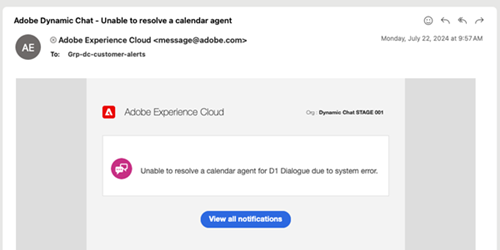

# Meeting-Liste {#meeting-list}

Hier werden alle Termine angezeigt, die von Besuchenden der Website über Ihre verschiedenen Dialoge geplant wurden. Hier finden Sie die E-Mail-Adresse der Person, die den Termin gebucht hat, den Agenten, bei dem sie den Termin gebucht haben, wann der Termin geplant ist und ob die geplante Besprechungszeit abgelaufen ist oder nicht.

>[!NOTE]
>
>Wenn ein Meeting über den Kalender eines Agenten gebucht wird, erhält der Agent eine E-Mail-Benachrichtigung über die Buchung, einschließlich detaillierter Informationen über die Dynamic Chat-Interaktion des Besuchers.

## Benachrichtigungen zu fehlgeschlagenen Aktionen {#failed-action-notifications}

Wenn eine Aktion wie eine Besprechungsbuchung oder ein Live-Chat fehlschlägt, werden die Benutzer per E-Mail benachrichtigt.

