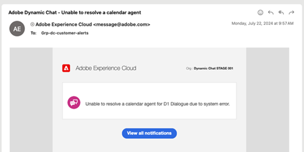

# Sitzungsliste {#meeting-list}

Hier sehen Sie alle Termine, die von Besuchern der Website über Ihre verschiedenen Dialoge geplant wurden. Hier finden Sie die E-Mail-Adresse der Person, die den Termin gebucht hat, den Agenten, mit dem sie den Termin gebucht haben, wann der Termin geplant ist und ob die geplante Besprechungszeit abgelaufen ist oder nicht.

>[!NOTE]
>
>Wenn eine Besprechung im Kalender eines Agenten gebucht wird, erhält der Agent eine E-Mail-Benachrichtigung über die Buchung, einschließlich detaillierter Informationen über die Dynamic Chat-Interaktion des Besuchers.

## Fehlgeschlagene Aktionsbenachrichtigungen {#failed-action-notifications}

Wenn eine Aktion wie die Buchung eines Meetings oder ein Live-Chat fehlschlägt, werden die Benutzer per E-Mail benachrichtigt.

