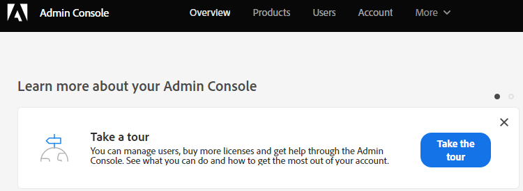

# Hinzufügen oder Entfernen von Chat-Benutzern {#add-or-remove-chat-users}

Gehen Sie wie folgt vor, um Chat-Benutzer hinzuzufügen oder zu entfernen.

>[!NOTE]
>
>Standardmäßig werden allen Marketo Engage-Administratoren Administratorrechte in Dynamic Chat gewährt.

## Chat-Benutzer hinzufügen {#add-a-chat-user}

1. Melden Sie sich bei der [Adobe Admin Console](https://adminconsole.adobe.com/){target="_blank"} an.

   

1. Auf **[!UICONTROL Dynamic Chat]**.

   

   >[!NOTE]
   >
   >Wenn Sie über mehr als ein Marketo-Abonnement verfügen, wählen Sie vor dem nächsten Schritt das gewünschte aus.

1. Klicken Sie auf **[!UICONTROL Registerkarte]** Benutzer“.

   

1. Klicken Sie auf **[!UICONTROL Schaltfläche]** Benutzer hinzufügen“.

   

1. Geben Sie [!UICONTROL  Namen, die Benutzergruppe oder die E]Mail-Adresse des Benutzers ein, den Sie hinzufügen möchten. Vor- und Nachname sind optional.

   

1. Klicken Sie auf das Symbol **+** und wählen Sie das gewünschte Produktprofil aus.

   

1. Klicken Sie auf **[!UICONTROL Speichern]**.

   

   >[!NOTE]
   >
   >Nachdem Sie einen Benutzer in der Adobe Admin Console hinzugefügt haben, kann es bis zu zwei Stunden dauern, bis er auf der Seite „Verwaltung von Dynamic Chat-Agenten“ angezeigt wird.

## Dynamic Chat-Zugriff auf Marketo-Rolle hinzufügen {#add-dynamic-chat-access-to-marketo-role}

Wenn die Marketo-Rolle des neu hinzugefügten Chat-Benutzers noch nicht über [!DNL Dynamic Chat] Berechtigung verfügt, erfahren Sie hier, wie Sie sie hinzufügen.

1. Klicken Sie in Marketo auf **[!UICONTROL Admin]** und wählen Sie **[!UICONTROL Benutzer und Rollen]** aus.

   

1. Klicken Sie auf die **[!UICONTROL Rollen]**.

   

1. Wählen Sie aus der Liste die Rolle aus, die Sie ändern möchten, und klicken Sie auf **[!UICONTROL Rolle bearbeiten]**.

   

1. Wählen Sie **[!UICONTROL Zugriff auf Dynamic Chat]** und klicken Sie auf **[!UICONTROL Speichern]**.

   

## Einen Chat-Benutzer entfernen {#remove-a-chat-user}

1. Melden Sie sich bei der [Adobe Admin Console](https://adminconsole.adobe.com/){target="_blank"} an.

   

1. Auf **[!UICONTROL Dynamic Chat]**.

   

   >[!NOTE]
   >
   >Wenn Sie über mehr als ein Marketo-Abonnement verfügen, wählen Sie vor dem nächsten Schritt das gewünschte aus.

1. Klicken Sie auf **[!UICONTROL Registerkarte]** Benutzer“.

   

1. Wählen Sie den Benutzer aus, den Sie entfernen möchten.

   

1. Klicken Sie auf die **[!UICONTROL Benutzer entfernen]**.

   

1. Klicken Sie **[!UICONTROL Benutzer entfernen]** zur Bestätigung.

   

>[!MORELIKETHIS]
>
>* [Adobe Admin Console-Benutzer](https://helpx.adobe.com/de/enterprise/using/users.html){target="_blank"}
>* [Benutzer einzeln verwalten](https://helpx.adobe.com/de/enterprise/using/manage-users-individually.html){target="_blank"}
