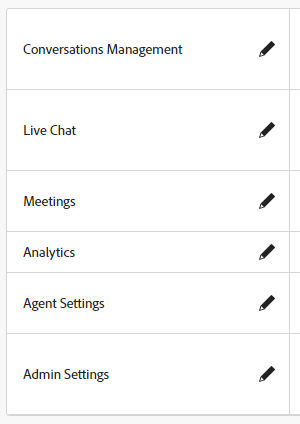

# Berechtigungen {#permissions}

Es gibt fünf Standardprofile mit vordefinierten Berechtigungen, die Sie im Dynamic Chat bearbeiten können. Sie können auch ein benutzerdefiniertes Profil mit benutzerdefinierten Berechtigungen erstellen. Lass uns über beide gehen.

## Bestehende Berechtigungen bearbeiten {#edit-existing-permissions}

1. Im [Adobe Admin Console](https://adminconsole.adobe.com/){target="_blank"}klicken **Dynamic Chat**.

   

1. Im **Produktprofile** wählen Sie das zu bearbeitende Profil aus. In diesem Beispiel wählen wir **Live Agent**.

   

1. Klicken Sie auf **Berechtigungen** Registerkarte.

   

1. Wählen Sie den Bereich des Profils aus, den Sie bearbeiten möchten. In diesem Beispiel wählen wir &quot;Live Chat&quot;. Klicken Sie auf das Stiftsymbol.

   

1. Die verfügbaren Berechtigungselemente sind auf der linken Seite aufgeführt. Sie können festlegen, ob Berechtigungen einzeln oder auf einmal hinzugefügt werden sollen. In diesem Beispiel ist nur eine verfügbar, also fügen wir diese hinzu. Klicken Sie auf **+** signieren.

   

   >[!NOTE]
   >
   >Durch die Aktivierung der automatischen Einfügung werden alle Berechtigungselemente zur eingeschlossenen Liste hinzugefügt. Wenn neue Berechtigungselemente verfügbar werden, werden sie automatisch für dieses Produktprofil einbezogen.

1. Klicken Sie auf **Speichern**.

   

Sie können diesen Vorgang jetzt für alle/alle anderen Dynamic Chat-Bereiche wiederholen.

## Profil erstellen {#create-a-profile}

1. Im [Adobe Admin Console](https://adminconsole.adobe.com/){target="_blank"}klicken **Dynamic Chat**.

   

1. Im **Produktprofile** Registerkarte, klicken **Neues Profil**.

   

1. **Name** Ihr Produktprofil. Optional können Sie ihr einen Anzeigenamen und/oder eine Beschreibung geben und festlegen, dass Benutzer benachrichtigt werden sollen, wenn sie hinzugefügt/entfernt werden. Klicks **Speichern** wann geschehen.

   

1. Ihr neues Profil wird auf der Registerkarte Produktprofile angezeigt. Wählen Sie es aus.

   

1. Führen Sie nun die Schritte 3 bis 6 aus der [Abschnitt oben](#edit-existing-permissions) für jeden gewünschten Bereich.

## Liste der Berechtigungen {#list-of-permissions}

Unten finden Sie eine Liste aller verfügbaren Berechtigungen für jeden Bereich.

<table>
<thead>
  <tr>
    <th style="width:25%">Dynamic Chat-Bereich</th>
    <th>Berechtigungen</th>
  </tr>
</thead>
<tbody>
  <tr>
    <td>Konferenzverwaltung</td>
    <td><li>Dialogfelder anzeigen</li>
    <li>Dialogfelder verwalten (erstellen, löschen)</li>
    <li>Veröffentlichungsdialogfelder</li>
    <li>Anzeigen von Konversationsflüssen</li>
    <li>Konversationsflüsse verwalten (erstellen, löschen)</li>
    <li>Veröffentlichen von Konversionsflüssen</li></td>
  </tr>
  <tr>
    <td>Live-Chat</td>
    <td><li>Meine Unterhaltungen anzeigen</li>
    <li>Alle Unterhaltungen anzeigen</li>
  </tr>
  <tr>
    <td>Meetings</td>
    <td><li>Alle Sitzungen verwalten</li>
  </tr>
  <tr>
    <td>Analytics</td>
    <td><li>Globale Leistungsberichte anzeigen</li>
    <li>Live-Chat-Berichte anzeigen</li>
    <li>Anzeigen von Sitzungsberichten</li>
    <li>Berichte exportieren</li></td>
  </tr>
  <tr>
    <td>Agenteneinstellungen</td>
    <td><li>Verfügbarkeit von Live Chat verwalten</li>
    <li>Kalender verbinden</li>
    <li>Kalenderverfügbarkeit verwalten</li></td>
  </tr>
  <tr>
    <td>Admin-Einstellungen</td>
    <td><li>Round-Robin anzeigen</li>
    <li>Anzeigen benutzerdefinierter Regeln</li>
    <li>Verwalten benutzerdefinierter Regeln (hinzufügen, bearbeiten, löschen)</li>
    <li>Kontoliste anzeigen <b>*</b></li>
    <li>Konten verwalten (hinzufügen, bearbeiten, löschen) <b>*</b></li>
    <li>Verwalten von Chatbot-Einstellungen</li>
    <li>Einstellungen für Konversationsflüsse verwalten</li>
    <li>Datenschutz und Sicherheit verwalten</li>
    <li>Integrationen verwalten</li>
    <li>Verwalten von Agenten</li>
    <li>Anzeigen von Agententeams <b>*</b></li>
    <li>Verwalten von Agententeams (hinzufügen, bearbeiten, löschen) <b>*</b></li></td>
  </tr>
</tbody>
</table>

**&#42;** Aktuell nur für Dynamic Prime-Benutzer verfügbar

## Standardprofilberechtigungen {#default-profile-permissions}

Im Folgenden finden Sie die fünf Standardprofile und die Berechtigungen, die standardmäßig aktiviert sind.

<table>
<thead>
  <tr>
    <th style="width:25%">Profil</th>
    <th>Standardberechtigungen</th>
  </tr>
</thead>
<tbody>
  <tr>
    <td>Marketingbenutzer</td>
    <td><i>Konferenzverwaltung</i>
    <li>Dialogfelder anzeigen</li>
    <li>Dialogfelder verwalten (erstellen, löschen)</li>
    <li>Veröffentlichungsdialogfelder</li>
    <li>Anzeigen von Konversationsflüssen</li>
    <li>Konversationsflüsse verwalten (erstellen, löschen)</li>
    <li>Veröffentlichen von Konversionsflüssen</li>
     
    <i>Live-Chat</i>
    <li>Nicht zutreffend</li>
     
    <i>Sitzungen</i>
    <li>Nicht zutreffend</li>
     
    <i>Analytics</i>
    <li>Globale Leistungsberichte anzeigen</li>
    <li>Live-Chat-Berichte anzeigen</li>
    <li>Anzeigen von Sitzungsberichten</li>
     
    <i>Agenteneinstellungen</i>
    <li>Nicht zutreffend</li>
     
    <i>Admin-Einstellungen</i>
    <li>Round-Robin anzeigen</li>
    <li>Anzeigen benutzerdefinierter Regeln</li>
    <li>Kontoliste anzeigen <b>*</b></li>
    <li>Anzeigen von Agententeams <b>*</b></li>
    </td>
  </tr>
  <tr>
    <td><b>Live Agent</b></td>
    <td><i>Konferenzverwaltung</i>
    <li>Dialogfelder anzeigen</li>
    <li>Anzeigen von Konversationsflüssen</li>
     
    <i>Live-Chat</i>
    <li>Meine Unterhaltungen anzeigen</li>
     
    <i>Sitzungen</i>
    <li>Nicht zutreffend</li>
     
    <i>Analytics</i>
    <li>Globale Leistungsberichte anzeigen</li>
    <li>Live-Chat-Berichte anzeigen</li>
    <li>Anzeigen von Sitzungsberichten</li>
     
    <i>Agenteneinstellungen</i>
    <li>Verfügbarkeit von Live Chat verwalten</li>
    <li>Kalender verbinden</li>
    <li>Kalenderverfügbarkeit verwalten</li>
     
    <i>Admin-Einstellungen</i>
    <li>Round-Robin anzeigen</li>
    <li>Anzeigen benutzerdefinierter Regeln</li>
    <li>Kontoliste anzeigen <b>*</b></li>
    <li>Anzeigen von Agententeams <b>*</b></li>
    </td>
  </tr>
  <tr>
    <td><b>Kalenderagent</b></td>
    <td><i>Konferenzverwaltung</i>
    <li>Dialogfelder anzeigen</li>
    <li>Anzeigen von Konversationsflüssen</li>
     
    <i>Live-Chat</i>
    <li>Nicht zutreffend</li>
     
    <i>Sitzungen</i>
    <li>Nicht zutreffend</li>
     
    <i>Analytics</i>
    <li>Globale Leistungsberichte anzeigen</li>
    <li>Live-Chat-Berichte anzeigen</li>
    <li>Anzeigen von Sitzungsberichten</li>
     
    <i>Agenteneinstellungen</i>
    <li>Kalender verbinden</li>
    <li>Kalenderverfügbarkeit verwalten</li>
     
    <i>Admin-Einstellungen</i>
    <li>Round-Robin anzeigen</li>
    <li>Anzeigen benutzerdefinierter Regeln</li>
    <li>Kontoliste anzeigen <b>*</b></li>
    <li>Anzeigen von Agententeams <b>*</b></li>
    </td>
  </tr>
  <tr>
    <td><b>Marketing-Admin</b></td>
    <td><i>Konferenzverwaltung</i>
    <li>Dialogfelder anzeigen</li>
    <li>Dialogfelder verwalten (erstellen, löschen)</li>
    <li>Veröffentlichungsdialogfelder</li>
    <li>Anzeigen von Konversationsflüssen</li>
    <li>Konversationsflüsse verwalten (erstellen, löschen)</li>
    <li>Veröffentlichen von Konversionsflüssen</li>
     
    <i>Live-Chat</i>
    <li>Nicht zutreffend</li>
     
    <i>Sitzungen</i>
    <li>Nicht zutreffend</li>
     
    <i>Analytics</i>
    <li>Globale Leistungsberichte anzeigen</li>
    <li>Live-Chat-Berichte anzeigen</li>
    <li>Anzeigen von Sitzungsberichten</li>
    <li>Berichte exportieren</li>
     
    <i>Agenteneinstellungen</i>
    <li>Nicht zutreffend</li>
     
    <i>Admin-Einstellungen</i>
    <li>Round-Robin anzeigen</li>
    <li>Anzeigen benutzerdefinierter Regeln</li>
    <li>Verwalten benutzerdefinierter Regeln (hinzufügen, bearbeiten, löschen)</li>
    <li>Kontoliste anzeigen <b>*</b></li>
    <li>Konten verwalten (hinzufügen, bearbeiten, löschen) <b>*</b></li>
    <li>Verwalten von Chatbot-Einstellungen</li>
    <li>Einstellungen für Konversationsflüsse verwalten</li>
    <li>Datenschutz und Sicherheit verwalten</li>
    <li>Integrationen verwalten</li>
    <li>Anzeigen von Agententeams <b>*</b></li>
    </td>
  </tr>
  <tr>
    <td><b>Vertriebsadministrator</b></td>
    <td><i>Konferenzverwaltung</i>
    <li>Dialogfelder anzeigen</li>
    <li>Anzeigen von Konversationsflüssen</li>
     
    <i>Live-Chat</i>
    <li>Meine Unterhaltungen anzeigen</li>
    <li>Alle Unterhaltungen anzeigen</li>
     
    <i>Sitzungen</i>
    <li>Alle Sitzungen verwalten</li>
     
    <i>Analytics</i>
    <li>Globale Leistungsberichte anzeigen</li>
    <li>Live-Chat-Berichte anzeigen</li>
    <li>Anzeigen von Sitzungsberichten</li>
    <li>Berichte exportieren</li>
     
    <i>Agenteneinstellungen</i>
    <li>Verfügbarkeit von Live Chat verwalten</li>
    <li>Kalender verbinden</li>
    <li>Kalenderverfügbarkeit verwalten</li>
     
    <i>Admin-Einstellungen</i>
    <li>Round-Robin anzeigen</li>
    <li>Anzeigen benutzerdefinierter Regeln</li>
    <li>Verwalten benutzerdefinierter Regeln (hinzufügen, bearbeiten, löschen)</li>
    <li>Kontoliste anzeigen <b>*</b></li>
    <li>Konten verwalten (hinzufügen, bearbeiten, löschen) <b>*</b></li>
    <li>Verwalten von Agenten</li>
    <li>Anzeigen von Agententeams <b>*</b></li>
    <li>Verwalten von Agententeams <b>*</b></li>
    </td>
  </tr>
</tbody>
</table>

**&#42;** Aktuell nur für Dynamic Prime-Benutzer verfügbar
