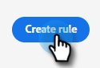

# Routing {#routing}

In Dynamic Chat gebuchte Meetings können auf zwei Arten durchgeführt werden. Runden Sie die Aktivität ab oder verwenden Sie eine benutzerdefinierte Regel.

Round robin: Sitzungen werden den Agenten nacheinander zugewiesen. Wenn Sie also fünf Agenten und Agenten haben, die drei das letzte Meeting hatten, wird Agent vier das nächste bekommen, gefolgt von Agent fünf, dann zurück zum Agenten eins.

Benutzerdefinierte Regel: Sie können bestimmte Agenten auswählen, um Sitzungen basierend auf von Ihnen ausgewählten Attributen zu erhalten.

>[!NOTE]
>
>Die Kontoweiterleitung hat die höchste Priorität. Wenn ein Besucher den Punkt im Gespräch erreicht, um entweder ein Meeting zu buchen oder einen Live-Chat zu starten, [Konto-Routing](#account-routing) wird zuerst überprüft, bevor andere Routing-Optionen in Betracht gezogen werden.

## Erstellen einer benutzerspezifischen Regel {#create-a-custom-rule}

In diesem Beispiel senden wir alle Sitzungen aus den angeblichen Bundesstaaten CA, OR und WA an John.

1. Klicken Sie unter &quot;Konfiguration&quot;auf **Routing-Regeln**.

   

1. Klicken Sie auf **Benutzerspezifische Regeln** Registerkarte.

   

1. Klicks **Regel erstellen**.

   

1. Benennen Sie Ihre Regel. Optional können Sie eine Beschreibung hinzufügen und ihre Prioritätsstufe festlegen. Klicken Sie auf **Weiter**.

   

1. Wählen Sie die gewünschten Agenten aus.

   

1. Ziehen Sie über die gewünschten Attribute.

   

1. Suchen und wählen Sie die gewünschten Werte aus.

   

1. Klicken Sie bei Auswahl aller gewünschten Werte auf **Speichern**.

   

## Konto-Routing {#account-routing}

Identifizieren und laden Sie Ihr Zielkonto und die entsprechenden Vertriebseigentümer hoch und leiten Sie Besucher, die von diesen Konten kommen, direkt zum entsprechenden Kontoinhaber weiter.

### Hinzufügen eines Kontos {#add-an-account}

In diesem Beispiel leiten wir alle Mitarbeiter von Lego direkt zum Agenten Steven weiter.

1. Klicken Sie auf der Registerkarte Konto-Routing auf **+ Konto hinzufügen**.

   

   >[!TIP]
   >
   >Sie können mehrere Konten gleichzeitig erstellen, indem Sie auf **Kontoliste hochladen** und das Hochladen einer CSV-Datei.

1. Geben Sie den Namen und die Domäne des Unternehmens ein und wählen Sie den gewünschten Agenten aus.

   
