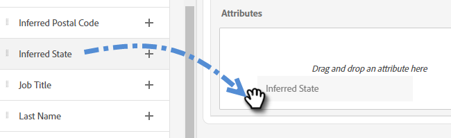

# Routing {#routing}

In Dynamic Chat gebuchte Meetings können auf zwei Arten weitergeleitet werden. Round Robin oder unter Verwendung einer benutzerdefinierten Regel.

Round Robin: Meetings werden Agenten sequenziell zugewiesen. Wenn Sie also fünf Agenten haben, und Agent drei hat das letzte Meeting genommen, dann bekommt Agent vier den nächsten, gefolgt von Agent fünf, dann zurück zu Agent eins.

Benutzerdefinierte Regel: Sie können bestimmte Agenten auswählen, die basierend auf ausgewählten Attributen Meetings empfangen sollen.

>[!NOTE]
>
>Das Konto-Routing hat die höchste Priorität. Wenn ein Besucher den Punkt im Gespräch erreicht, um entweder ein Meeting zu buchen oder einen Live-Chat zu initiieren[ wird ](#account-routing)Konto-Routing“ zuerst überprüft, bevor andere Routing-Optionen berücksichtigt werden.

## Erstellen einer benutzerdefinierten Regel {#create-a-custom-rule}

In diesem Beispiel senden wir alle Besprechungen aus den abgeleiteten Zuständen von CA, OR und WA an Agent John.

1. Klicken Sie unter Konfiguration auf **Routing-Regeln**.

   

1. Klicken Sie auf **Registerkarte** Benutzerdefinierte Regeln“.

   

1. Klicken Sie **Regel erstellen**.

   

1. Benennen Sie Ihre Regel. Optional können Sie eine Beschreibung hinzufügen und deren Prioritätsstufe festlegen. Klicken Sie auf **Weiter**.

   

1. Wählen Sie Ihren gewünschten Agenten aus.

   

1. Ziehen Sie das/die gewünschte(n) Attribut(e).

   

1. Suchen Sie die gewünschten Werte und wählen Sie sie aus.

   

1. Wenn Sie alle gewünschten Werte ausgewählt haben, klicken Sie auf **Speichern**.

   

## Konto-Routing {#account-routing}

Identifizieren und hochladen Ihres Zielkontos und der jeweiligen Vertriebsinhaber und leiten Sie Besucher, die aus diesen Konten kommen, direkt an den jeweiligen Kontoinhaber weiter.

### Konto hinzufügen {#add-an-account}

In diesem Beispiel leiten wir alle Mitarbeiter von Lego direkt zu Agent Steven weiter.

1. Klicken Sie auf der Registerkarte Konto-Routing auf **+ Konto hinzufügen**.

   

   >[!TIP]
   >
   >Sie können mehrere Konten gleichzeitig erstellen, indem Sie auf **Kontoliste hochladen** und eine CSV-Datei hochladen.

1. Geben Sie den Namen und die Domain des Unternehmens ein und wählen Sie den gewünschten Agenten aus.

   
