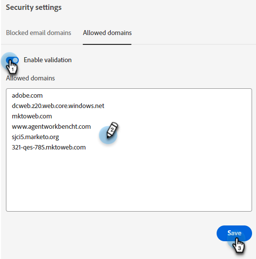

# Sicherheitseinstellungen {#security-settings}

In den Sicherheitseinstellungen können Sie einer blockierten oder -Zulassungsliste Domains hinzufügen.

## Blockierte E-Mail-Domains {#blocked-email-domains}

Wenn es Besucher mit E-Mail-Domains gibt, mit denen Ihre Agenten nicht interagieren sollen (z. B. ein Wettbewerber), fügen Sie der Blockierungsliste ihre E-Mail-Domain hinzu.

1. Wählen Sie den **Validierung aktivieren**, um Ihre Blockierungsliste zu aktivieren. Geben Sie bis zu 50 Domains ein und klicken Sie auf **Speichern**.

   

## Zulässige Domains {#allowed-domains}

Durch das Hinzufügen von zulässigen Domains wird sichergestellt, dass Dritte das JavaScript nicht von Ihrer Site abschöpfen und zu ihren eigenen hinzufügen können.

1. Wählen Sie den **Validierung aktivieren**, um Ihre Zulassungsliste zu aktivieren. Geben Sie die zulässigen Domains ein und klicken Sie auf **Speichern**.

   
