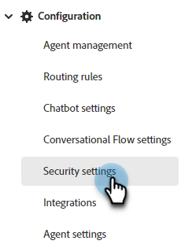
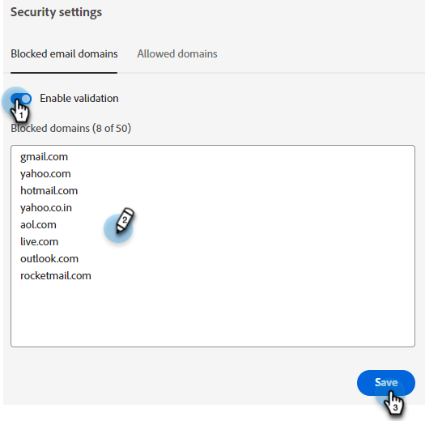
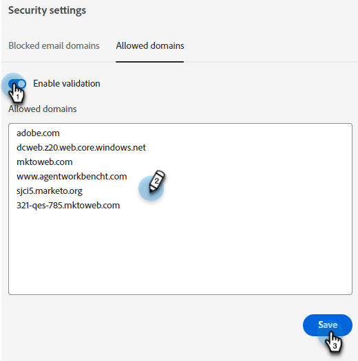

# Sicherheitseinstellungen {#security-settings}

In den Sicherheitseinstellungen können Sie einer blockierten oder -Zulassungsliste Domains hinzufügen.

>[!IMPORTANT]
>
>Die Filterung E-Mail-Domain blockieren und zulassen gilt nur, wenn ein Besucher seine E-Mail-Adresse direkt in Dynamic Chat eingibt, entweder im Chat-Bot oder im Gesprächsfluss. Sie gilt nicht für E-Mail-Adressen, die Dynamic Chat von integrierten Produkten wie Marketo Engage erhält. Weitere Informationen finden Sie in der folgenden Tabelle.

| Szenario | Gilt die Filterung? |
|---|---|
| Der Besucher gibt seine E-Mail-Adresse direkt in den Dynamic Chat-Chatbot ein | Ja |
| Besucher geben ihre E-Mail direkt in einen Dynamic Chat-Gesprächsfluss ein | Ja |
| Die E-Mail wird vorab aus einer Marketo-Formularübermittlung ausgefüllt (der Konversionsfluss wird nach dem Ausfüllen des Formulars angezeigt) | Nein |
| E-Mail wird von jedem anderen integrierten System an Dynamic Chat übergeben | Nein |

## Blockierte E-Mail-Domains {#blocked-email-domains}

Wenn es Besucher mit E-Mail-Domains gibt, mit denen Ihre Agenten nicht interagieren sollen (z. B. ein Wettbewerber), fügen Sie der Blockierungsliste ihre E-Mail-Domain hinzu.

1. Wählen Sie den **Validierung aktivieren**, um Ihre Blockierungsliste zu aktivieren. Geben Sie bis zu 50 Domains ein und klicken Sie auf **Speichern**.

   

## Zulässige Domains {#allowed-domains}

Durch das Hinzufügen von zulässigen Domains wird sichergestellt, dass Dritte das JavaScript nicht von Ihrer Site abschöpfen und zu ihren eigenen hinzufügen können.

1. Wählen Sie den **Validierung aktivieren**, um Ihre Zulassungsliste zu aktivieren. Geben Sie die zulässigen Domains ein und klicken Sie auf **Speichern**.

   
