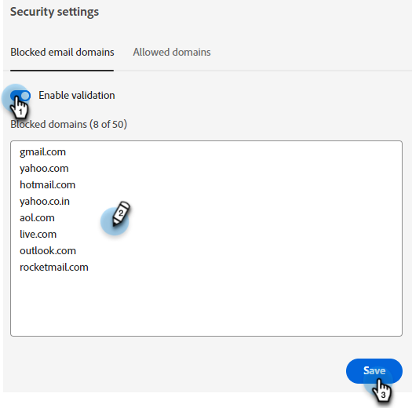

# Sicherheitseinstellungen {#security-settings}

In den Sicherheitseinstellungen können Sie einer blockierten oder blockierten Zulassungsliste Domänen hinzufügen.

## Blockierte E-Mail-Domänen {#blocked-email-domains}

Wenn es Besucher mit E-Mail-Domänen gibt, mit denen Ihre Agenten nicht interagieren sollen (z. B. Konkurrenten), fügen Sie ihre E-Mail-Domäne zur Blockierungsliste hinzu.

1. Wählen Sie die **Validierung aktivieren** aktivieren, um Ihre Blockierungsliste zu aktivieren. Geben Sie bis zu 50 Domänen ein und klicken Sie auf **Speichern**.

   

## Zulässige Domänen {#allowed-domains}

Durch das Hinzufügen zulässiger Domänen wird sichergestellt, dass Drittanbieter das JavaScript nicht von Ihrer Site löschen und zu ihrer eigenen hinzufügen können.

1. Wählen Sie die **Validierung aktivieren** aktivieren, um Ihre Zulassungsliste zu aktivieren. Geben Sie die zulässigen Domänen ein und klicken Sie auf **Speichern**.

   
