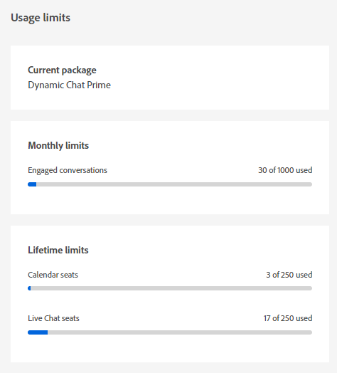

# Nutzungs-Limits {#usage-limits}

Auf der Seite „Nutzungsbeschränkungen“ finden Sie wichtige Informationen wie Paketinformationen und den Status von Nutzungsbeschränkungen.

1. Klicken Sie unter Konfiguration auf **[!UICONTROL Nutzungsbeschränkungen]**.

   

1. Zeigen Sie Ihr aktuelles Paket, den monatlichen Limit-Status für interaktive Unterhaltungen und den Limit-Lebensdauerstatus für Kalender-/Live-Chat-Lizenzen an.

   

>[!NOTE]
>
>Die monatlichen Limits werden automatisch am 1. jedes Monats zurückgesetzt.
