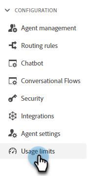

# Nutzungsbeschränkungen {#usage-limits}

Besuchen Sie die Seite Nutzungsbeschränkungen , um wichtige Informationen wie Paketinformationen und Nutzungsbegrenzungsstatus anzuzeigen.

1. Klicken Sie unter &quot;Konfiguration&quot;auf **[!UICONTROL Nutzungsbeschränkungen]**.

   

1. Sehen Sie sich Ihr aktuelles Paket, den monatlichen Limit-Status für interaktive Unterhaltungen und den Lebenszeitbegrenzungsstatus für Kalender-/Live-Chat-Plätze an.

   

>[!NOTE]
>
>Die monatlichen Beschränkungen werden automatisch am 1. jedes Monats zurückgesetzt.
