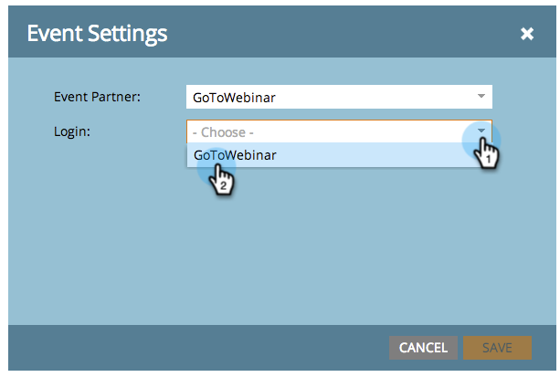
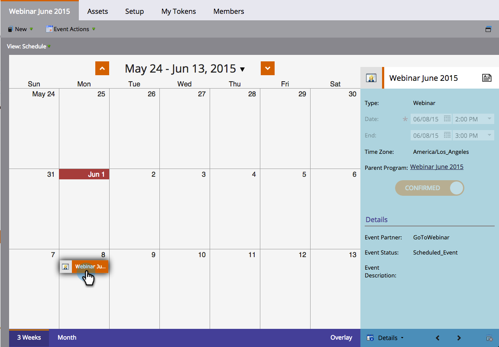

# Erstellen eines Ereignisses mit [!DNL GotoWebinar] {#create-an-event-with-gotowebinar}

>[!PREREQUISITES]
>
>* [Add [!DNL GoToWebinar] as a [!DNL LaunchPoint] service](/help/marketo/product-docs/administration/additional-integrations/add-gotowebinar-as-a-launchpoint-service.md)
>* [Erstellen eines neuen Veranstaltungsprogramms](/help/marketo/product-docs/demand-generation/events/understanding-events/create-a-new-event-program.md)
>* Legen Sie die entsprechenden [Fluss-Aktionen](/help/marketo/product-docs/core-marketo-concepts/smart-campaigns/flow-actions/add-a-flow-step-to-a-smart-campaign.md) fest, um die Interaktion zu verfolgen

Erstellen Sie zunächst Ihr Webinar in [!DNL GoToWebinar]. Bestimmte Einstellungen bei der Erstellung Ihrer [!DNL GoToWebinar] werden von Marketo verwendet, andere nur von [!DNL GoToWebinar].

Nachdem Sie eine Marketo-Veranstaltung erstellt und die [!DNL GoToWebinar] damit verknüpft haben, können die Systeme Registrierungs- und Anwesenheitsinformationen freigeben.

Nachstehend finden Sie eine Liste der von Marketo verwendeten Einstellungen.

## Titel und Beschreibung {#title-and-description}

**[!UICONTROL Titel]** - Geben Sie den Namen für das Webinar ein. Dieser Name wird in Marketo angezeigt.

**[!UICONTROL Beschreibung]** (optional) - Geben Sie eine Beschreibung für das Webinar ein. Die Beschreibung wird in Marketo angezeigt.

## Datum und Uhrzeit {#date-time}

Geben Sie die folgenden Informationen für Ihr Webinar ein. Dieses wird dann über den Adapter in Marketo übernommen. Wenn Sie Änderungen an diesen Informationen vornehmen möchten, müssen Sie auf den Link &quot;**[!UICONTROL Vom Webinar-Anbieter aktualisieren]** unter **[!UICONTROL Ereignisaktionen]** klicken, damit die Änderungen in Marketo angezeigt werden.

**[!UICONTROL Startdatum]** - Geben Sie Ihr Startdatum ein. Dieser wird in Marketo angezeigt.

**[!UICONTROL Startzeit]** - Geben Sie Ihre Startzeit ein. Dieser wird in Marketo angezeigt.

**[!UICONTROL Endzeit]** - Geben Sie Ihre Endzeit ein. Dieser wird in Marketo angezeigt.

**[!UICONTROL Webinar-]**: Wählen Sie die entsprechende Zeitzone aus. Er wird in Marketo angezeigt.

**[!UICONTROL Type]** - auf **[!UICONTROL One Session]** festgelegt.

>[!NOTE]
>
>Marketo unterstützt derzeit keine wiederkehrenden Webinare. Zwischen jedem Marketo-Event und [!DNL GoToWebinar] Webinar muss eine Einzelsitzung eingerichtet werden.

>[!TIP]
>
>Wenn Sie zusätzliche [!DNL GoToWebinar] benötigen, besuchen Sie bitte deren [Hilfewebsite](https://support.logmeininc.com/gotowebinar).

Lassen Sie uns jetzt zu Marketo springen!

1. Ereignis auswählen. Klicken Sie auf **[!UICONTROL Ereignisaktionen]** und wählen Sie **[!UICONTROL Ereigniseinstellungen]**.

   

   >[!NOTE]
   >
   >Der Kanaltyp des ausgewählten Ereignisses muss „Webinar **sein**.

1. Wählen Sie **[!UICONTROL GoToWebinar]** aus der Liste **[!UICONTROL Veranstaltungspartner]** aus.

   

1. Wählen Sie das Konto aus.

   

1. Webinar auswählen.

   

1. Klicken Sie auf **[!UICONTROL Speichern]**.

   

1. Ausgezeichnet! Jetzt wird das Ereignis synchronisiert und von **[!DNL GoToWebinar]** geplant.

   

   >[!NOTE]
   >
   >Die von Marketo gesendeten Felder sind: Vorname, Nachname, E-Mail-Adresse. Diese Felder sind erforderlich und dürfen nicht leer sein.

   >[!TIP]
   >
   >Um Ihre Bestätigungs-E-Mail mit dieser eindeutigen URL zu füllen, verwenden Sie das folgende Token in Ihrer E-Mail: `{{member.webinar url}}`. Wenn die Bestätigungs-URL gesendet wird, wird dieses Token automatisch zur eindeutigen Bestätigungs-URL der Person aufgelöst.
   >
   >Legen Sie Ihre Bestätigungs-E **Mail auf** Betriebsbereit“ fest, um sicherzustellen, dass Personen, die sich registrieren und möglicherweise abgemeldet werden, weiterhin ihre Bestätigungsinformationen erhalten.

   

   >[!CAUTION]
   >
   >Vermeiden Sie verschachtelte E-Mail-Programme, um Ihre Bestätigungs-E-Mails zu senden. Verwenden Sie stattdessen die intelligente Kampagne des Ereignisprogramms , wie oben gezeigt.

   >[!TIP]
   >
   >Es kann bis zu 48 Stunden dauern, bis die Daten in Marketo angezeigt werden. Wenn Sie nach so langer Wartezeit immer noch nichts sehen, wählen Sie **[!UICONTROL Vom Webinar-Anbieter aktualisieren]** aus dem Menü [!UICONTROL Ereignisaktionen] auf der Registerkarte **[!UICONTROL Zusammenfassung]** Ihres Ereignisses aus.

Personen, die sich für Ihr Webinar anmelden, werden über den Flussschritt [!UICONTROL Programmstatus ändern] an Ihren Webinar-Anbieter weitergeleitet, wenn [!UICONTROL Neuer Status] auf „Registriert“ gesetzt ist. Kein anderer Status überträgt die Person. Stellen Sie außerdem sicher, dass [!UICONTROL Programmstatus ändern] Flussschritt #1 und [!UICONTROL E-Mail senden] Flussschritt #2.

## Zeitplan anzeigen  {#viewing-the-schedule}

Klicken Sie in der Programmplanungsansicht auf den Kalendereintrag für Ihr Ereignis. Der Zeitplan wird auf der rechten Seite des Bildschirms angezeigt.

>[!NOTE]
>
>Um Ihren Veranstaltungsplan zu ändern, müssen Sie das Webinar am [!DNL GoToWebinar] bearbeiten.

