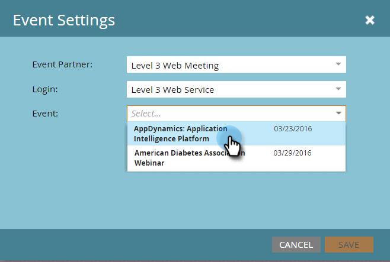

# Erstellen eines Ereignisses mit einer Web-Besprechung der Ebene 3 {#create-an-event-with-level-web-meeting}

>[!PREREQUISITES]
>
>* [Stufe 3-Webbesprechung als LaunchPoint-Service hinzufügen](/help/marketo/product-docs/administration/additional-integrations/add-level-3-web-meeting-as-a-launchpoint-service.md)
>* [Erstellen eines neuen Veranstaltungsprogramms](/help/marketo/product-docs/demand-generation/events/understanding-events/create-a-new-event-program.md)
>* Legen Sie die entsprechenden [Fluss-Aktionen](/help/marketo/product-docs/core-marketo-concepts/smart-campaigns/flow-actions/add-a-flow-step-to-a-smart-campaign.md) fest, um die Interaktion zu verfolgen

Erstellen Sie zunächst Ihr Webinar in Stufe 3. Wenn Sie Hilfe benötigen, besuchen Sie die [Level 3-Ressourcenbibliothek](https://www.level3.com/en/resource-library/). Sie werden feststellen, dass es BrightTalk sehr ähnlich ist.  Marketo verwendet eine kleine Teilmenge von Feldern der Ebene 3:

* **Name** - Der Name des Webcasts.
* **Startdatum** - Das Startdatum für den Webcast.
* **Enddatum** - Das Enddatum für den Webcast.
* **Zeitzone** - Die für den Webcast festgelegte Zeitzone.
* **Beschreibung** - Die Webcast-Beschreibung.

1. Wählen Sie Ihr neues Ereignis aus. Klicken Sie auf **Ereignisaktionen** und dann auf **Ereigniseinstellungen.**

   

1. Wählen Sie unter Veranstaltungspartner die Option **Level 3 Web Meeting** aus.

   

1. Wählen Sie unter „Anmelden“ Ihre Stufe 3-Anmeldung aus.

   

1. Wählen Sie unter Ereignis das Ereignis der Stufe 3 aus, das Sie verwenden möchten.

   

1. Klicken Sie auf **Speichern**.

   

   Sehr ausgezeichnet! Sie haben Ihre Veranstaltung mit Level 3 verbunden!

## Zeitplan anzeigen  {#viewing-the-schedule}

Klicken Sie in der Programmplanungsansicht auf den Kalendereintrag für Ihr Ereignis. Sie können den Zeitplan auf der rechten Seite des Bildschirms sehen!

