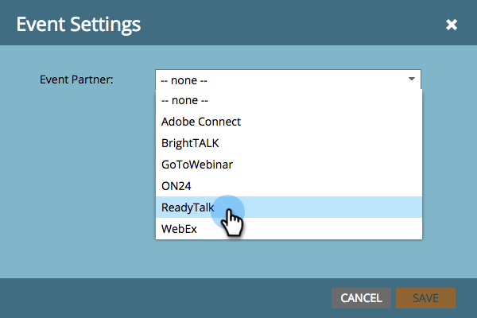
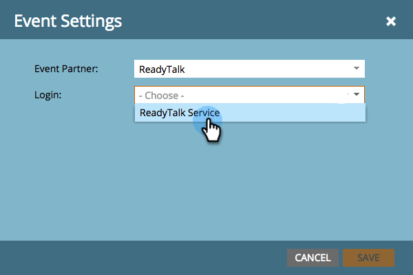

# Erstellen eines Ereignisses mit ReadyTalk {#create-an-event-with-readytalk}

>[!PREREQUISITES]
>
>* [hinzufügen ReadyTalk als LaunchPoint-Dienst](/help/marketo/product-docs/administration/additional-integrations/add-readytalk-as-a-launchpoint-service.md)
>* [Neues Ereignis-Programm erstellen](/help/marketo/product-docs/demand-generation/events/understanding-events/create-a-new-event-program.md)
>* Stellen Sie die entsprechenden [Flussaktionen](/help/marketo/product-docs/core-marketo-concepts/smart-campaigns/flow-actions/add-a-flow-step-to-a-smart-campaign.md)ein, um Interaktionen zu verfolgen.

Richten Sie zuerst Ihr Ereignis im ReadyTalk Konferenzzentrum ein. Wenn Sie Hilfe benötigen, sehen Sie sich das [ReadyTalk Resource Center](https://www.readytalk.com/resources/readytalk) an. Wählen Sie bei Auswahl des Registrierungstyps **Vor dem Meeting** die Option Vorregistrieren. Wenn Sie _Registrierung zum Zeitpunkt des Treffens_ auswählen, erfasst Marketo **nicht** einen registrierten Status für Ihre Personen und ruft nur den Personenstand von _nach_ Abschluss des Webinars ab.

Lassen Sie **mich über neue Registrierungen per E-Mail** unmarkiert.

Wenn Sie ReadyTalk zum Senden von Bestätigungs-E-Mails verwenden, müssen Sie auch eine Beschreibung hinzufügen. Speichern Sie Ihr Ereignis in ReadyTalk, wenn Sie fertig sind.

>[!NOTE]
>
>Um ein Ereignis mit Operatorunterstützung zu planen, klicken Sie auf den Link **Ereignis-Services anfordern** auf der linken Seite Ihres Home-Bildschirms im Conference Center, um ein Ereignis mit unserem Ereignisses-Team zu planen.

Jetzt können Sie Ihr Ereignis mit Marketo verknüpfen.

1. Wählen Sie Ihr Ereignis aus und klicken Sie dann auf **Ereignis Actions** und schließlich **Ereignis Settings.**

   

   >[!NOTE]
   >
   >Der Kanal des ausgewählten Ereignisses muss **Webinar sein.**

1. Wählen Sie unter **Ereignis-Partner** **ReadyTalk**.

   

1. Wählen Sie unter **Anmelden** Ihre ReadyTalk-Anmeldung aus.

   

1. Wählen Sie unter **Ereignis** das Ereignis, das Sie verknüpfen möchten, und klicken Sie dann auf **Speichern**.

   

   Schön! Ihr Ereignis wird jetzt synchronisiert.

   >[!NOTE]
   >
   >Die Felder, die von Marketo gesendet werden, sind: Vorname, Nachname, E-Mail-Adresse.

   >[!TIP]
   >
   >Um Ihre Bestätigungs-E-Mail mit dieser eindeutigen URL zu füllen, verwenden Sie das folgende Token in Ihrer E-Mail: `{{member.webinar url}}`. Wenn die Bestätigungs-URL gesendet wird, wird dieses Token automatisch zur eindeutigen Bestätigungs-URL der Person aufgelöst.
   >
   >Stellen Sie Ihre Bestätigungs-E-Mail auf Operational ein, um sicherzustellen, dass Personen, die sich registrieren und möglicherweise abgemeldet werden, ihre Bestätigungsinformationen erhalten.

   

   >[!CAUTION]
   >
   >Vermeiden Sie die Verwendung verschachtelter E-Mail-Programm zum Versenden Ihrer Bestätigungs-E-Mails. Verwenden Sie stattdessen die intelligente Kampagne des Ereignis Programms, wie oben gezeigt.

   >[!TIP]
   >
   >Es kann bis zu 48 Stunden dauern, bis die Daten in Marketo angezeigt werden. Wenn Sie nach dem Warten immer noch nichts sehen, wählen Sie **Von Webinar-Provider aktualisieren** im Menü &quot;Ereignis-Aktionen&quot;auf der Registerkarte **Zusammenfassung** aus.

## Ansicht des Zeitplans {#viewing-the-schedule}

Klicken Sie in der Ansicht Programmplanung auf den Kalendereintrag für Ihr Ereignis. Sie können den Zeitplan auf der rechten Seite des Bildschirms sehen!

Personen, die sich für Ihr Webinar anmelden, werden über den Schritt zum Ändern des Status des Programms an Ihren Webinaranbieter weitergeleitet, wenn der neue Status auf &quot;Registriert&quot;eingestellt ist. Kein anderer Status wird die Person übertreiben. Stellen Sie außerdem sicher, dass Sie den Schritt zum Ändern des Status des Programms 1 und zum Senden der E-Mail-Zustellung Schritt 2 durchführen.
