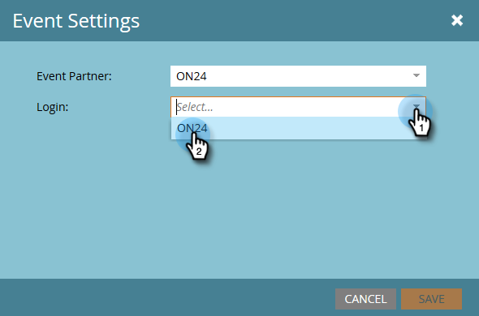

# Ereigniseinstellungen konfigurieren und Marketo mit Ihrem Webinar synchronisieren {#configure-event-settings-and-sync-marketo-with-your-webinar}

Führen Sie diese Schritte aus, um die Marketo-Ereigniseinstellungen zu konfigurieren und Marketo und ON24 zu verbinden.

## Festlegen des Ereignisses {#set-the-event}

1. Wählen Sie das Ereignis aus, das Sie mit einem ON24-Webinar verknüpfen möchten, klicken Sie dann auf **[!UICONTROL Ereignisaktionen]** Dropdown-Liste und wählen Sie **[!UICONTROL Ereigniseinstellungen]**.

   

1. Wählen Sie ON24 als [!UICONTROL Veranstaltungspartner].

   

1. Wählen Sie das [!UICONTROL Login]-Konto aus (z. B. den Anzeigenamen).

   

1. Geben Sie die [!UICONTROL Ereignis-ID] ein (rufen Sie diese von ON24 ab). Klicken Sie auf **[!UICONTROL Speichern]**.

   

   >[!NOTE]
   >
   >Während der Spitzenzeiten kann es 15 bis 20 Minuten dauern, bis ON24 die Ereignisinformationen für Marketo verfügbar macht. Wenn Sie die Nachricht „Ungültige Sitzungs-ID“ erhalten, versuchen Sie es etwas später erneut.

## Zeitplan festlegen {#set-the-schedule}

Wenn Sie ein Ereignis einrichten, das mit einem ON24-Webinar verknüpft ist, wird der Ereigniszeitplan mit Daten von ON24 gefüllt. Gehen Sie wie folgt vor, um auf [!UICONTROL  Dialogfeld ]Ereigniszeitplan“ zuzugreifen.

1. Wählen Sie das Ereignis aus. Klicken Sie auf **[!UICONTROL Dropdown-]** „Ereignisaktionen“ und wählen Sie **[!UICONTROL Zeitplan].**

   

1. Wählen Sie **[!UICONTROL Startdatum]**, **[!UICONTROL Enddatum]** und **[!UICONTROL Zeitzone]**. Klicken Sie auf **[!UICONTROL Speichern]**.

   

   >[!NOTE]
   >
   >Wenn Sie Ereignisinformationen in ON24 aktualisieren, müssen Sie auf **[!UICONTROL Vom Webinar-Anbieter aktualisieren]** im Menü [!UICONTROL Ereignisaktionen] klicken, um die neuen Daten anzuzeigen.

Jetzt können Sie mit dem nächsten Schritt fortfahren: [Erstellen von untergeordneten Kampagnen und lokalen Assets](/help/marketo/product-docs/demand-generation/events/create-an-event/create-an-event-with-the-marketo-on24-adapter/create-child-campaigns-and-local-assets.md){target="_blank"}.

>[!MORELIKETHIS]
>
>[Informationen zu Marketo On24-Adapterereignissen](/help/marketo/product-docs/demand-generation/events/create-an-event/create-an-event-with-the-marketo-on24-adapter/understanding-marketo-on24-adapter-events.md){target="_blank"}
