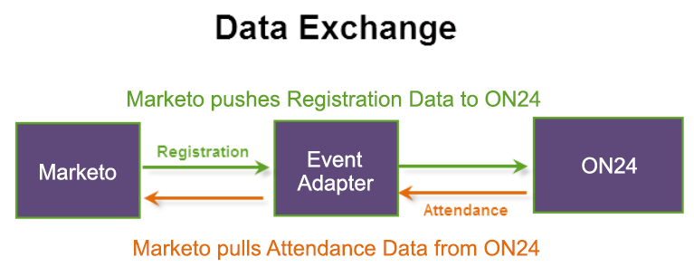

# Erstellen eines Ereignisses in Marketo {#create-an-event-in-marketo}

Ein Marketo-Event verfolgt den Fortschritt Ihrer Mitarbeiter in einem Programm. Es überträgt Registrierungsinformationen und ruft mithilfe des ON24-Adapters Anwesenheitsinformationen ab. Das Ereignis erfasst den Status Ihrer Personen, während sie es durchlaufen.

Im Folgenden wird gezeigt, wie die Daten ausgetauscht werden:

Wenn Sie das Marketo-Ereignis erstellen, wählen **als** „Webinar“ aus. Sie können diesen Kanal in Admin bearbeiten und einen neuen Kanal erstellen. Wenn Sie einen neuen Kanal erstellen, muss er vom Typ **Ereignis mit Webinar** sein, damit die Integration funktioniert. Weitere Informationen [&#x200B; Sie unter &#x200B;](/help/marketo/product-docs/administration/tags/create-a-program-channel.md){target="_blank"} eines Programmkanals .

Als Nächstes konfigurieren Sie [Ereigniseinstellungen konfigurieren und Marketo mit Ihrem Webinar synchronisieren](/help/marketo/product-docs/demand-generation/events/create-an-event/create-an-event-with-the-marketo-on24-adapter/configure-event-settings-and-sync-marketo-with-your-webinar.md){target="_blank"}.

>[!MORELIKETHIS]
>
>[Informationen zu Marketo ON24-Adapterereignissen](/help/marketo/product-docs/demand-generation/events/create-an-event/create-an-event-with-the-marketo-on24-adapter/understanding-marketo-on24-adapter-events.md){target="_blank"}
