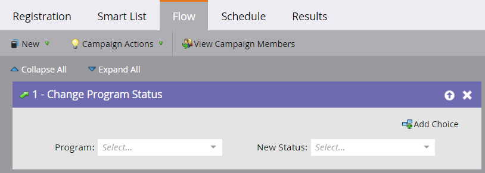

# Beispiel für die ON24-Ereignisintegration {#example-on-event-integration}

Hier ist ein Beispielereignis, einschließlich Kampagnen, für ein ON24-Webinar. Achten Sie beim Erstellen des Ereignisses darauf, Ihre Kampagnen zu testen, bevor Sie sie ausführen.

## Erstellen eines neuen Ereignisses in Marketing-Aktivitäten {#create-a-new-event-in-marketing-activities}

1. Wählen Sie **[!UICONTROL Neu]** > **[!UICONTROL Neues Programm]**.

   

1. Wählen Sie einen **[!UICONTROL Kampagnenordner]**, in dem das Ereignis live geschaltet werden soll.

   

1. Geben Sie einen **[!UICONTROL Namen]** für das Ereignis ein.

   

1. Wählen Sie **[!UICONTROL Ereignis]** als **[!UICONTROL Programmtyp]**.

   

1. Wählen Sie **[!UICONTROL Webinar]** als **[!UICONTROL Kanal]** für die Veranstaltung aus.

   

1. Klicken Sie auf **[!UICONTROL Erstellen]**.

   

## Einladen (Batch-Kampagne)  {#invite-batch-campaign}

* **Smart List** - Legen Sie fest, wen Sie zu dem Ereignis einladen.
* **Fluss**

   * E-Mail senden - Wenn es sich um eine lokale Asset-E-Mail handelt, gilt die folgende Namenskonvention: EventName.EmailName. Sie können auch globale E-Mails verwenden.
   * Status in Bearbeitung ändern - Auf Webinar > Eingeladen festlegen.

* **Zeitplan** - Legen Sie das Datum fest, an dem die Einladung gesendet werden soll.

## Anmeldung/Bestätigung (Trigger Campaign) {#registration-confirmation-trigger-campaign}

* **Smart-Liste**

   * Trigger der Kampagne basierend auf **[!UICONTROL Ausfülltes Formular]**. Denken Sie daran, die Landingpage, auf der sich das Formular befindet, mithilfe von **[!UICONTROL Einschränkung hinzufügen]** einzubeziehen, insbesondere wenn das Formular auf mehreren Landingpages verwendet wird.

>[!CAUTION]
>
>Sie müssen ein Marketo-Formular verwenden, um Personen für die Veranstaltung zu registrieren, oder ein Nicht-Marketo-Formular mit der richtigen API-Integration, um Registrierungsdaten an Marketo zu pushen. Dies ist entscheidend für den Erfolg Ihrer [!UICONTROL Event Partner]-Integration. **HINWEIS**: Wenn Sie ein Marketo-Formular auf einer nicht zu Marketo gehörenden Landingpage verwenden, lautet Ihr Trigger **[!UICONTROL Formular ausfüllen]** mit dem [!UICONTROL Formularnamen].

* **Fluss**

   * **Status in Bearbeitung ändern** - Auf Webinar setzen > Registriert. **ACHTUNG**: Dieser Flussschritt ist beim Einrichten der untergeordneten Kampagne erforderlich. Wenn sich der Fortschrittsstatus einer Person in &quot;**&quot; ändert** sendet Marketo die Registrierungsinformationen an ON24.

   * **E-Mail senden** - Bestätigungs-E-Mail (auf **Betriebsbereit** festgelegt, damit Abgemeldete, die sich registriert haben, weiterhin eine E-Mail erhalten).

**HINWEIS**: Wenn die Person mit einem Registrierungsfehler zurückgegeben wird, erhält sie die E-Mail-Bestätigung nicht.

## Erinnerung (Batch-Kampagne) {#reminder-batch-campaign}

* **Smart List** - Filtern Sie mithilfe von **Mitglied des Programms** und setzen Sie den Status auf **Registriert**.

* **Fluss** - E-Mail senden (Erinnerungs-E-Mail).

**HINWEIS**: Sie können eine ähnliche Kampagne verwenden, um eine *andere* Folgenachricht an Personen zu senden, die eingeladen wurden, sich aber noch nicht registriert haben.

## Folgekampagne (Batch- oder Trigger-Kampagne) {#follow-up-campaign-batch-or-trigger-campaign}

* **Smart List** - Trigger basierend auf Änderungen des Programmstatus.

* **Fluss** - E-Mail senden. Verwenden Sie Auswahlmöglichkeiten, um je nach Programmstatus unterschiedliche E-Mails zu senden.

>[!MORELIKETHIS]
>
>[Informationen zu Marketo ON24-Adapterereignissen](/help/marketo/product-docs/demand-generation/events/create-an-event/create-an-event-with-the-marketo-on24-adapter/understanding-marketo-on24-adapter-events.md){target="_blank"}
