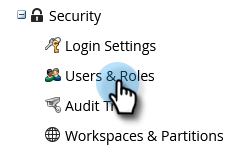
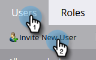
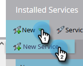

# Einrichten der ON24-Integration mit Marketo{#set-up-the-on24-integration-with-marketo}

So richten Sie Ihre ON24-Ereignisintegration ein.

## Nur API-Rolle erstellen {#create-an-api-only-role}

1. Klicken Sie in My Marketo auf **[!UICONTROL Admin]**.

   

1. Klicken [!UICONTROL  unter ] auf **[!UICONTROL Benutzer und Rollen]**.

   

1. Klicken Sie auf **[!UICONTROL Rollen]** und dann auf **[!UICONTROL Neue Rolle]**.

   

1. Geben Sie einen [!UICONTROL Rollennamen] ein. Öffnen Sie das Menü **[!UICONTROL Zugriff auf API]** und wählen Sie &quot;[!UICONTROL Benutzerdefiniertes Objekt mit Lese-/Schreibzugriff] und &quot;[!UICONTROL Person mit Lese-/Schreibzugriff]&quot; aus. Klicken Sie auf **[!UICONTROL Erstellen]**.

   

## Neuen Benutzer erstellen {#create-a-new-user}

1. Klicken Sie noch in [!UICONTROL Benutzer und Rollen] auf die Registerkarte **[!UICONTROL Benutzer]** und klicken Sie dann auf **[!UICONTROL Neuen Benutzer einladen]**.

   

1. Geben Sie die Informationen des neuen Benutzers ein und klicken Sie auf **[!UICONTROL Weiter]**.

   

1. Wählen Sie die Rolle [!UICONTROL Nur API24 (alle Arbeitsbereiche)] die Sie soeben erstellt haben. Aktivieren Sie das **[!UICONTROL Nur API]**-Kontrollkästchen. Klicken Sie auf **[!UICONTROL Weiter]**.

   

1. Klicken Sie auf **[!UICONTROL Senden]**.

   

>[!NOTE]
>
>Eine Einladung ist nicht erforderlich für Benutzende, die nur über eine API verfügen.

## Einrichten der ON24-Verbindung {#set-up-on24-connection}

1. Klicken Sie noch im [!UICONTROL Admin]-Abschnitt auf **[!UICONTROL LaunchPoint]**.

   

1. Klicken Sie **[!UICONTROL Neu]** und dann **[!UICONTROL Neuer Service]**.

   

1. Wählen Sie einen [!UICONTROL Anzeigenamen]. Klicken Sie auf die **[!UICONTROL Dienst]** und wählen Sie **[!UICONTROL Benutzerdefiniert]**. Geben Sie eine [!UICONTROL Beschreibung] ein. Klicken Sie auf [!UICONTROL  Dropdown-Liste Nur ]-Benutzer und wählen Sie den Benutzer aus[ den Sie in den obigen Schritten erstellt ](#create-a-new-user). Klicken Sie auf **[!UICONTROL Erstellen]**.

   

1. Suchen Sie den soeben erstellten benutzerdefinierten [!DNL LaunchPoint]-Service und klicken Sie auf [!UICONTROL Details anzeigen].

   

1. Markieren, klicken Sie mit der rechten Maustaste, kopieren Sie die [!UICONTROL Client-ID] und speichern Sie sie (Sie benötigen sie später). Wiederholen Sie dies für [!UICONTROL Client-Geheimnis].

   

1. Klicken Sie in der Baumstruktur links auf **[!UICONTROL Web-Services]**.

   

1. Markieren Sie unter &quot;[!UICONTROL REST API] den ersten Teil der [!UICONTROL  (bis zum „m“ in .com], klicken Sie mit der rechten Maustaste darauf, kopieren Sie ihn und speichern Sie ihn.

   

1. Navigieren Sie mit Ihrer gespeicherten Client-ID, Ihrem Client-Geheimnis und Ihrer Identität zu Ihrem ON24-Konto. Die restlichen Schritte werden dort ausgeführt und finden Sie in der [ON24-Dokumentation](https://support.on24.com/hc/en-us/articles/21420762650523-Data-Integration-Setup-Instructions-When-Using-Marketo-Registration-Option-1){target="_blank"}.
