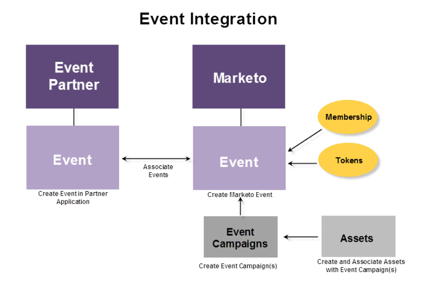

# Grundlegendes zu Marketo-ON24-Adapter-Ereignissen {#understanding-marketo-on-adapter-events}

Wenn Ihr ON24-Webinar nicht mit Marketo verbunden ist, müssen Sie die Teilnehmerinformationen, die sich bereits in Marketo befinden, in ON24 eingeben. Nach dem Webinar müssen Sie Informationen zur Teilnahme, die bereits auf ON24 verfügbar sind, wieder in Marketo eingeben.

Der ON24-Adapter übernimmt die gesamte Informationsübertragung für Sie. Die auf einer Marketo-Landingpage erfassten Registrierungsinformationen werden an ON24 gesendet und die Anwesenheitsdaten werden automatisch in eine Marketo-Veranstaltung übertragen.

Diese Artikel erläutern den Prozess der Erstellung eines Webinars in ON24, der Erstellung eines Ereignisses in Marketo und der Verknüpfung.

Die folgende Grafik zeigt den Integrationsprozess.

Bereit zu beginnen? Beginnen Sie mit [Ereignis mit dem ON24-Adapter erstellen](/help/marketo/product-docs/demand-generation/events/create-an-event/create-an-event-with-the-marketo-on24-adapter.md){target="_blank"}.
