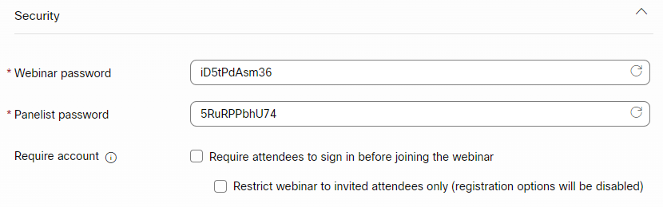
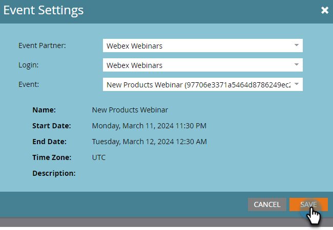

# Erstellen eines Ereignisses mit Webex {#create-an-event-with-webex}

Nachdem Sie ein Webinar in Webex erstellt haben, müssen Sie Ihr Ereignis mit Marketo Engage synchronisieren.

>[!PREREQUISITES]
>
>* [Webex als LaunchPoint-Dienst hinzufügen](/help/marketo/product-docs/administration/additional-integrations/add-webex-as-a-launchpoint-service.md)
>* [Neues Ereignisprogramm erstellen](/help/marketo/product-docs/demand-generation/events/understanding-events/create-a-new-event-program.md)
>* Legen Sie die entsprechende [Flussaktionen](/help/marketo/product-docs/core-marketo-concepts/smart-campaigns/flow-actions/add-a-flow-step-to-a-smart-campaign.md) Interaktion verfolgen

## Webinar planen {#schedule-your-webinar}

Sie planen Ihr Ereignis und wählen Ihre bevorzugten Einstellungen in [Webex](https://www.webex.com/){target="_blank"}. Only the following information is viewable in Marketo: webinar name, start/end date & time, time zone, and description. Additional information about Webex Webinars [can be found here](https://help.webex.com/en-us/landing/ld-7srxjs-WebexWebinars/Webex-Webinars){target="_blank"}.

### Grundlegende Informationen {#basic-information}

* **Thema**: Dies ist Ihr Ereignisname und kann in Marketo angezeigt werden.
* **Datum und Uhrzeit**: Start-/Enddatum, Start-/Endzeit, Dauer und Zeitzone sind alle in Marketo sichtbar.
* **Maximale Anzahl Teilnehmer**: Die maximale Teilnehmerzahl bestimmt, welche Webfunktionen unterstützt werden.
* **Webcast-Ansicht für Teilnehmer**: Aktivieren Sie diese Option, damit Ihr Webinar für alle Teilnehmer live gestreamt wird.
* **Bedienfelder**: Laden Sie bestimmte Personen zu Panelisten in Ihr Webinar ein.
* **Webinar-Agenda**: Füllen Sie dies aus, wenn Sie Kontext in der E-Mail-Einladung bereitstellen möchten, die an Panelisten gesendet wird.

### Sicherheit {#security}

* **Webinar-Kennwort**: (optional) Wenn Sie dieses Feld verwenden, stellen Sie sicher, dass Sie es in Ihre Bestätigungs-E-Mail aufnehmen.
* **Bedienfeldkennwort**: (optional) Wenn Sie dieses Feld verwenden, stellen Sie sicher, dass Sie es in Ihre Webinar-Agenda aufnehmen.
* **Konto anfordern**: Beschränkt die Teilnehmer auf diejenigen, die über Web-Konten verfügen.

### Optionen zur Audioverbindung {#audio-connection-options}

* **Audioverbindungstyp**: Wählen Sie aus, wie Webinarteilnehmer am Audio-Teil Ihres Webinars teilnehmen.
* **Einstiegs- und Ausstiegston**: Wählen Sie den Ton aus, den Sie für Benutzer verwenden möchten, wenn ein Benutzer das Webinar betritt oder verlässt (Telefonaudioverbindung erforderlich).
* **Stummschaltfläche**: Wählen Sie die gewünschten Einstellungen für die Stummschaltung der Bedienfeldliste aus.

### Erweiterte Optionen {#advanced-options}

* **Automatische Aufzeichnung**: Aktivieren Sie diese Option, damit Ihr Webinar automatisch aufgezeichnet wird.
* **Praktische Sitzung**: Aktivieren Sie diese Option, um eine praktische Sitzung zu starten, wenn das Webinar beginnt.
* **Aufschlüsselungssitzungen**: Mithilfe von Aufschlüsselungssitzungen können Sie Panelisten und Teilnehmer vor dem Beginn des Webinars vorab zuweisen oder ihnen die Teilnahme am Webinar ermöglichen.
* **Webinar-Reihe**: Durch Hinzufügen zu einer Webinarreihe können Benutzer sehen, ob Ihr Webinar öffentlich ist oder nicht.
* **Registrierung**: Erfordert, dass sich Teilnehmer registrieren und die Genehmigung des Gastgebers erhalten, bevor sie teilnehmen.
* **Email-Erinnerung**: Wählen Sie eine E-Mail-Erinnerung aus, die zwischen 15 Minuten dauert, bevor das Webinar beginnt, und zwei Tagen.
* **Webinar-Optionen**: Bestimmen Sie, welche Funktionen den Teilnehmern des Webinars zur Verfügung stehen.
* **Teilnehmerberechtigungen**: Die Teilnehmerberechtigungen bestimmen die Aktionen, die Webinarteilnehmern zur Verfügung stehen.

>[!NOTE]
>
>Die Marketo-Webbex-Integration kann das Senden von Bestätigungs-E-Mails von Webex nicht unterstützen. Die Bestätigung muss über Marketo erfolgen. Nachdem Sie das Ereignis geplant haben, kopieren Sie die Ereignisinformationen in die Marketo-Bestätigungs-E-Mail und stellen Sie die E-Mail auf _Betrieb_.

## Ereignis synchronisieren mit Marketo Engage {#sync-your-event-with-marketo-engage}

1. Suchen und wählen Sie in Marketo das gewünschte Veranstaltungsprogramm aus. Im **Ereignisaktionen** Dropdown-Liste auswählen **Ereigniseinstellungen**.

   

   >[!NOTE]
   >
   >Der Kanaltyp des ausgewählten Ereignisses muss **Webinar**.

1. Im **Veranstaltungspartner** Dropdown-Liste auswählen **Webex-Webinare**.

   

1. Im **Anmelden** wählen Sie Ihre Webex-Anmeldung.

   

1. Im **Ereignis** wählen Sie Ihr Webex-Ereignis aus.

   

1. Ihre Webinardetails werden ausgefüllt. Klicken Sie auf **Speichern**.

   

Ihr Webex-Ereignis wird jetzt mit Ihrem Marketo-Ereignisprogramm synchronisiert. Personen, die sich für Ihr Webinar anmelden, werden über die _Ändern des Programmstatus_ Flussschritt, wenn der neue Status auf &quot;Registered&quot;gesetzt ist. Kein anderer Status wird die Person überstürzen. Stellen Sie sicher, dass _Ändern des Programmstatus_ Flussschritt 1 und _E-Mail senden_ Flussschritt 2.

## Zu beachten {#things-to-note}

* Vermeiden Sie den Versand von Bestätigungs-E-Mails durch verschachtelte E-Mail-Programme. Verwenden Sie stattdessen die Smart-Kampagne Ihres Ereignisprogramms.

* Es kann bis zu 48 Stunden dauern, bis Daten in Marketo angezeigt werden. Wenn Sie nach so langer Wartezeit immer noch nichts sehen, klicken Sie auf **Von Webinar-Anbieter aktualisieren** im **Ereignisaktionen** in der **Zusammenfassung** Registerkarte Ihres Veranstaltungsprogramms angezeigt.
