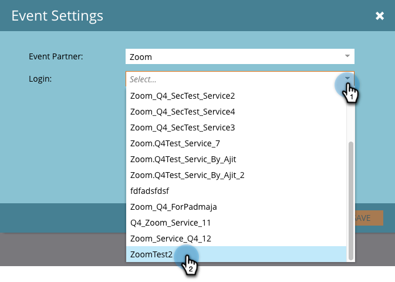

# Erstellen eines Ereignisses mit [!DNL Zoom] {#create-an-event-with-zoom}

>[!PREREQUISITES]
>
>* [Add [!DNL Zoom] as a [!DNL LaunchPoint] Service](/help/marketo/product-docs/administration/additional-integrations/add-zoom-as-a-launchpoint-service.md)
>* [Erstellen eines neuen Veranstaltungsprogramms](/help/marketo/product-docs/demand-generation/events/understanding-events/create-a-new-event-program.md)
>* Legen Sie die entsprechenden [Fluss-Aktionen](/help/marketo/product-docs/core-marketo-concepts/smart-campaigns/flow-actions/add-a-flow-step-to-a-smart-campaign.md) fest, um die Interaktion zu verfolgen

Erstellen Sie zunächst Ihr Webinar in [!DNL Zoom]. Bestimmte Einstellungen bei der Erstellung Ihrer [!DNL Zoom] werden von Marketo verwendet, andere nur von [!DNL Zoom].

Nachdem Sie eine Marketo-Veranstaltung erstellt und ein [!DNL Zoom] Webinar damit verknüpft haben, können die Systeme Informationen zur Registrierung und Teilnahme austauschen. Hilfe beim Erstellen eines Webinars finden Sie unter [Erste Schritte mit [!DNL Zoom] Webinaren](https://support.zoom.us/hc/en-us/articles/200917029-Getting-Started-With-Webinar).

Geben Sie die folgenden Informationen für Ihr Webinar ein. Dieses wird dann über den Adapter in Marketo übernommen. Wenn Sie Änderungen an diesen Informationen vornehmen möchten, müssen Sie auf den Link „Vom Webinar-Anbieter aktualisieren“ unter „Ereignisaktionen“ klicken, damit die Änderungen in Marketo angezeigt werden.

**Titel und Beschreibung**

* **Name des Webinars** - Geben Sie den Namen für das Webinar ein. Dieser Name wird in Marketo angezeigt.

* **Beschreibung** (optional) - Geben Sie eine Beschreibung für das Webinar ein. Die Beschreibung wird in Marketo angezeigt.

**Datum und Uhrzeit**

* **Startdatum** - Geben Sie Ihr Startdatum ein. Dieser wird in Marketo angezeigt.

* **Startzeit** - Geben Sie Ihre Startzeit ein. Dieser wird in Marketo angezeigt.

* **Dauer** - Geben Sie die Dauer ein. Die Start- und Endzeit werden in Marketo angezeigt.

* **Zeitzone** - Wählen Sie die entsprechende Zeitzone aus. Dieser wird in Marketo angezeigt.

* **Wiederkehrendes Webinar** - Deaktivieren Sie diese Option.

* **Registrierung** - Aktivieren Sie dieses Kontrollkästchen, um eine Registrierung erforderlich zu machen. Sie verwenden ein Marketo-Formular/eine Landingpage, um Registrierungsinformationen zu erfassen, die an [!DNL Zoom] gesendet werden.

>[!NOTE]
>
>Marketo unterstützt derzeit keine wiederkehrenden Webinare. Zwischen jedem Marketo-Event und [!DNL Zoom] Webinar muss eine Einzelsitzung eingerichtet werden.

>[!TIP]
>
>Es gibt zusätzliche Felder, die Sie in [!DNL Zoom] konfigurieren werden und die sich NICHT auf die Integration auswirken. Weitere Informationen zu diesen Feldern [[!DNL Zoom]  Sie im &#x200B;](https://support.zoom.us/hc/en-us/sections/200324965-Video-Webinar)Webinar-Hilfezentrum“.

Lassen Sie uns jetzt zu Marketo springen!

1. Ereignis auswählen. Klicken Sie auf **[!UICONTROL Ereignisaktionen]** und wählen Sie **[!UICONTROL Ereigniseinstellungen]**.

   

   >[!NOTE]
   >
   >Der Kanaltyp des ausgewählten Ereignisses muss „Webinar **sein**.

1. Wählen **[!UICONTROL Zoom]** aus der Liste **[!UICONTROL Veranstaltungspartner]** aus.

   

1. Wählen Sie das [!DNL Zoom] Konto aus, mit dem Sie Ihr Ereignis verknüpfen möchten.

   

1. Webinar auswählen.

   

1. Klicken Sie auf **[!UICONTROL Speichern]**.

   

   Ausgezeichnet! Jetzt wird das Ereignis synchronisiert und von [!DNL Zoom] geplant.

   >[!NOTE]
   >
   >Die von Marketo gesendeten Felder sind: Vorname, Nachname, E-Mail-Adresse.

   >[!TIP]
   >
   >Um Ihre Bestätigungs-E-Mail mit dieser eindeutigen URL zu füllen, verwenden Sie das folgende Token in Ihrer E-Mail: `{{member.webinar url}}`. Wenn die Bestätigungs-URL gesendet wird, wird dieses Token automatisch zur eindeutigen Bestätigungs-URL der Person aufgelöst.
   >
   >Legen Sie Ihre Bestätigungs-E **Mail auf** Betriebsbereit“ fest, um sicherzustellen, dass Personen, die sich registrieren und möglicherweise abgemeldet werden, weiterhin ihre Bestätigungsinformationen erhalten.

   Personen, die sich für Ihr Webinar anmelden, werden über den Flussschritt **[!UICONTROL Programmstatus ändern]** an Ihren Webinar-Anbieter weitergeleitet, wenn [!UICONTROL Neuer Status] auf „Registriert“ gesetzt ist. Kein anderer Status überträgt die Person. Stellen Sie außerdem sicher, dass **[!UICONTROL Programmstatus ändern]** Flussschritt #1 und **[!UICONTROL E-Mail senden]** Flussschritt #2.

   

   >[!CAUTION]
   >
   >Vermeiden Sie verschachtelte E-Mail-Programme, um Ihre Bestätigungs-E-Mails zu senden. Verwenden Sie stattdessen die intelligente Kampagne des Ereignisprogramms , wie oben gezeigt.

   >[!TIP]
   >
   >Es kann bis zu 48 Stunden dauern, bis die Daten in Marketo angezeigt werden. Wenn Sie nach so langer Wartezeit immer noch nichts sehen, wählen Sie **Vom Webinar-Anbieter aktualisieren** aus dem Menü Ereignisaktionen auf der Registerkarte **Zusammenfassung** Ihres Ereignisses aus und klicken Sie dann auf das Aktualisierungssymbol unten rechts im Bildschirm.
