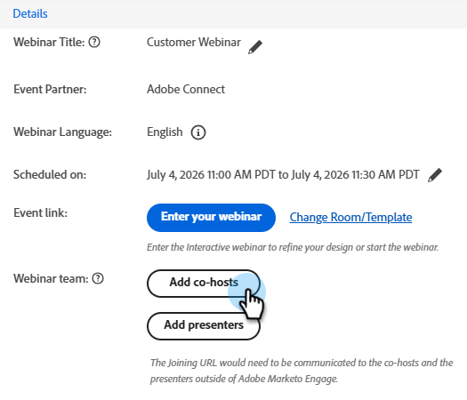

# Webinar-Team hinzufügen {#add-a-webinar-team}

Ein Webinar-Team in interaktiven Webinaren besteht aus allen Rollen, die zur erfolgreichen Bereitstellung des Webinars in Adobe Connect beitragen. Dies umfasst sowohl Moderatoren als auch Co-Hosts.

>[!NOTE]
>
>Moderatoren und Co-Hosts in Marketo entsprechen während der Bereitstellung des Webinars in Adobe Connect exakt den Rollen von Moderatoren und Mitveranstaltern.

Der Moderator ist eine externe Rolle, die an der Bereitstellung des Webinar-Erlebnisses beteiligt ist, während Ko-Hosts als Moderator fungieren und administrative Aspekte des Webinar-Versands handhaben können. Co-Hosts können sowohl intern als auch extern sein. Externe Hosts haben keinen Zugriff auf die interaktiven Webinar-Ereignisprogramme in Marketo, haben aber Co-Hosting-Berechtigungen während der Bereitstellung in Adobe Connect. Interne Hosts haben während der Bereitstellung Zugriff auf das Programm für interaktive Webinar-Ereignisse in Marketo sowie auf Co-Hosting-Berechtigungen. Dadurch wird sichergestellt, dass die internen Hosts die Züge des Interaktiven Webinar-Veranstaltungsprogramms übernehmen können, wenn der ursprüngliche Ersteller des interaktiven Webinar-Programms entweder nicht mehr Teil des Benutzersets der interaktiven Webinare ist oder nicht einmal ein Marketo-Benutzer.

>[!PREREQUISITES]
>
>[Erstellen eines interaktiven Webinars](/help/marketo/product-docs/demand-generation/events/interactive-webinars/create-an-interactive-webinar.md)

## Hinzufügen eines Co-Hosts {#add-a-co-host}

1. Klicken Sie auf der Übersichtsseite des interaktiven Webinars auf **Hinzufügen von Hosts**.

   

1. Sie können interne oder externe Benutzer hinzufügen. In diesem Beispiel wählen wir &quot;extern&quot;.

   

   >[!NOTE]
   >
   >Wenn Sie **Interner interaktiver Webinar-Benutzer**, müssen Sie einfach auf die **Verfügbare Hosts** und wählen Sie aus der Liste der Personen aus, die als Benutzer von interaktiven Webinaren im Marketo Engage hinzugefügt wurden.

1. Geben Sie den Vornamen, Nachnamen und die E-Mail-Adresse des gewünschten Co-Hosts ein. Klicks **Hinzufügen**.

   

1. Ihr neuer Co-Host wird im Abschnitt Webinar-Team angezeigt.

   

## Hinzufügen eines Moderators {#add-a-presenter}

1. Klicken Sie auf der Übersichtsseite des interaktiven Webinars auf **Hinzufügen von Moderatoren**.

   

1. Geben Sie den Vornamen, Nachnamen und die E-Mail-Adresse des gewünschten Moderators ein. Klicks **Hinzufügen**.

   

   >[!NOTE]
   >
   >Die Informationen des Moderators werden Adobe Connect während des Webinar-Versands zur Verfügung gestellt, sodass die entsprechenden Details automatisch ausgefüllt werden können, ohne dass der Benutzer sie während des Webinar-Versands eingeben muss.

1. Ihr neuer Moderator wird im Bereich Webinar-Team angezeigt.

   

>[!TIP]
>
>Nachdem Sie ein Webinar-Team hinzugefügt haben, können Sie auf das Kopiersymbol neben jedem Benutzer klicken, um dessen Join-URLs zu kopieren (und dann freizugeben).

>[!MORELIKETHIS]
>
>[Erstellen eines interaktiven Webinars](/help/marketo/product-docs/demand-generation/events/interactive-webinars/create-an-interactive-webinar.md)
