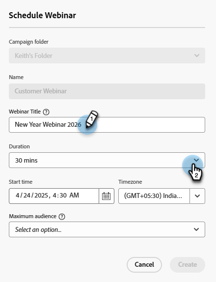

# Erstellen eines interaktiven Webinars {#create-an-interactive-webinar}

Erstellen Sie ein interaktives Webinar in wenigen einfachen Schritten.

1. Navigieren Sie zu **Marketingaktivitäten**.

   

1. Klicken Sie mit der rechten Maustaste auf den gewünschten Ordner und wählen Sie **Neues Programm**.

   

1. Nennen Sie das Programm. Wählen Sie unter &quot;Programmtyp&quot;die Option **Ereignis**.

   

1. Klicken Sie auf die Dropdown-Liste Kanal und wählen Sie einen beliebigen Kanal aus, der _Veranstaltung mit Webinar_ in der Spalte &quot;Gilt für&quot;. In diesem Beispiel wählen wir **Webinar**.

   

   >[!NOTE]
   >
   >So sehen Sie, auf welche Kanäle zutrifft _Veranstaltung mit Webinar_, gehen Sie zu **Admin** > **Tags**. &quot;Wendet auf&quot;sollte die mittlere Spalte sein. Weitere Informationen zu &quot;Gilt für&quot;finden Sie in Schritt 5 von [diesem Artikel](/help/marketo/product-docs/administration/tags/create-a-program-channel.md){target="_blank"}.

1. Auswählen **Interaktive Webinare** und klicken **Nächste**.

   

   >[!NOTE]
   >
   >Informationen zu Partner-Webinaren finden Sie hier.

1. Legen Sie die maximale Zielgruppengröße für Ihr Webinar fest und wie lange es dauern wird.

   

1. Planen Sie Datum/Uhrzeit Ihres Webinars und klicken Sie auf **Erstellen**.

   

Ihr interaktives Webinar wird erstellt. Jetzt haben Sie die Möglichkeit, ein Webinar-Team hinzuzufügen.

## Webinar-Team {#webinar-team}

Ein Webinar-Team in interaktiven Webinaren besteht aus allen Rollen, die zur erfolgreichen Bereitstellung des Webinars in Adobe Connect beitragen. Dies umfasst sowohl Moderatoren als auch Co-Hosts.

>[!NOTE]
>
>Moderatoren und Co-Hosts in Marketo entsprechen während der Bereitstellung des Webinars in Adobe Connect exakt den Rollen von Moderatoren und Mitveranstaltern.

Der Moderator ist eine externe Rolle, die an der Bereitstellung des Webinar-Erlebnisses beteiligt ist, während Ko-Hosts als Moderator fungieren und administrative Aspekte des Webinar-Versands handhaben können. Co-Hosts können sowohl intern als auch extern sein. Externe Hosts haben keinen Zugriff auf die interaktiven Webinar-Ereignisprogramme in Marketo, haben aber Co-Hosting-Berechtigungen während der Bereitstellung in Adobe Connect. Interne Hosts haben während der Bereitstellung Zugriff auf das Programm für interaktive Webinar-Ereignisse in Marketo sowie auf Co-Hosting-Berechtigungen. Dadurch wird sichergestellt, dass die internen Hosts die Züge des Interaktiven Webinar-Veranstaltungsprogramms übernehmen können, wenn der ursprüngliche Ersteller des interaktiven Webinar-Programms entweder nicht mehr Teil des Benutzersets der interaktiven Webinare ist oder nicht einmal ein Marketo-Benutzer.

### Webinar-Team hinzufügen {#adding-a-webinar-team}

Um einen Mitwirt oder Moderator hinzuzufügen, klicken Sie auf **Hinzufügen von Hosts** oder **Hinzufügen von Moderatoren** auf dem Bildschirm Übersicht angezeigt.

Beim Klicken **Hinzufügen von Moderatoren** eingeben, werden Sie aufgefordert, ihren Vornamen, Nachnamen und ihre E-Mail-Adresse einzugeben. Diese Informationen werden Adobe Connect während des Webinar-Versands zur Verfügung gestellt, sodass die entsprechenden Details automatisch ausgefüllt werden können, ohne dass der Benutzer sie während des Webinar-Versands eingeben muss. Eine Join-URL wird für alle Moderatoren ausgefüllt und kann vom Ersteller freigegeben werden.

Beim Klicken **Hinzufügen von Hosts**, werden Sie aufgefordert, einen internen oder externen Benutzer hinzuzufügen. Wenn Sie &quot;Intern&quot;auswählen, können Sie den gewünschten Benutzer aus der Liste aller Benutzer auswählen, die als Benutzer mit interaktiven Webinaren in Marketo Engage hinzugefügt wurden. Wenn Sie &quot;extern&quot;auswählen, werden Sie aufgefordert, ihren Vornamen, Nachnamen und ihre E-Mail-ID hinzuzufügen (ähnlich wie beim Hinzufügen eines Moderators). Sie können auch die Join-URLs für interne und externe Benutzer abrufen, die für sie freigegeben werden sollen.

Nachdem Sie ein Webinar-Team hinzugefügt haben, können Sie auf das Kopiersymbol neben jedem Benutzer klicken, um dessen Join-URLs zu kopieren (und dann freizugeben).

 

Jetzt ist es an der Zeit [Webinar erstellen](/help/marketo/product-docs/demand-generation/events/interactive-webinars/designing-interactive-webinars.md){target="_blank"}.
