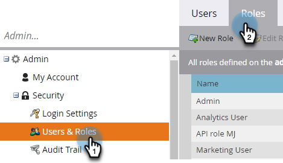
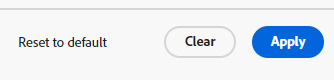

# Anpassung interaktiver Webinare {#interactive-webinars-customization}

Sie müssen Ihre Webinare anpassen, um den Teilnehmern ein ansprechenderes und effektiveres Erlebnis zu bieten.

Interaktive Webinare bieten verschiedene Anpassungsoptionen, um die Webinar-Umgebung an Ihre Bedürfnisse anzupassen. Passen Sie das Erscheinungsbild verschiedener Bildschirme an, um das Branding Ihres Unternehmens widerzuspiegeln.

Sie können die folgenden Optionen anpassen:

* Markenfarben für das Zimmer
* Benutzerdefinierter Hintergrund zur Darstellung Ihrer Organisation auf den Einstiegs-, Ausstiegs- und Wartebildschirmen
* Logo
* Virtuelle Videohintergründe

## Berechtigungen erteilen {#grant-permissions}

Bevor Benutzerinnen und Benutzer in Ihrem Unternehmen Ihre interaktiven Webinare anpassen können, muss ein Marketo Engage-Administrator zunächst Zugriff auf die gewünschten Rollen hinzufügen.

1. Klicken Sie in Marketo Engage auf **[!UICONTROL Admin]**.

   

1. Klicken Sie auf **[!UICONTROL Benutzer und Rollen]** und dann auf die Registerkarte **[!UICONTROL Rollen]**.

   

1. Doppelklicken Sie auf die Rolle, der Sie die Berechtigungen hinzufügen möchten.

   

1. Klicken Sie, um **[!UICONTROL Access Design Studio]** zu öffnen.

   

1. Aktivieren Sie das **[!UICONTROL Anpassen von interaktiven Webinaren]**.

   

## Anpassen der Bildschirme für interaktive Webinare {#customize-interactive-webinar-screens}

1. Gehen Sie zum **Design Studio**.

   

1. Klicken Sie auf **Interaktive Webinare** und wählen Sie **Webinare anpassen** aus.

   

1. Sie können die Raumschnittstelle, die Sofortbilder oder die virtuellen Videohintergründe anpassen.

   

### Raumschnittstelle anpassen {#customize-the-room-interface}

Sie können das Erscheinungsbild des Sitzungsraums anpassen, indem Sie das Logo, den anklickbaren Weiterleitungs-Link und die Farben ändern. Ihre Änderungen werden in allen Veranstaltungen und Räumen in Ihrer Organisation widergespiegelt.

Um das Erscheinungsbild eines Raums anzupassen, wählen Sie in der Menüleiste die Registerkarte Raumoberfläche aus.

1. Passen Sie im rechten Bedienfeld die folgenden Voreinstellungen an:

   

   **Benutzerdefiniertes Logo**: Wählen Sie Logo hochladen aus und durchsuchen Sie das Bild auf Ihrem Gerät. Die Bildgröße darf 50 x 31 Pixel nicht überschreiten und kann verschiedene Dateiformate aufweisen: .svg, .gif, .jpg und .png. Sie können Ihr Logo ändern oder löschen.

   **Umleitungs-Link**: Fügen Sie eine URL hinzu, um Ihre Teilnehmer umzuleiten, nachdem sie auf das Logo geklickt haben.

   **Alternativtext**: Fügen Sie mithilfe von Barrierefreiheitsfunktionen einen alternativen Text für die Teilnehmer hinzu.

   **Farben**: Wählen Sie Farben für Raumleiste, Raumsymbole, Raumhintergrund, Pod-Leiste und Pod-Kacheln/-Symbole aus, um die Farbe verschiedener Abschnitte zu ändern.

   Sie können den HEX-Farbcode auch mit der Option HEX eingeben.

   Wählen Sie **[!UICONTROL Vorlagen anzeigen]**, um das Design des Raums zu ändern.

   Nachdem Sie die Änderungen vorgenommen haben, können Sie das Logo und die Farben in der Vorschau überprüfen.

1. Klicken Sie **[!UICONTROL Übernehmen]**, um die Änderungen zu speichern. Um die Standardeinstellungen wiederherzustellen, klicken Sie auf **[!UICONTROL Auf Standard zurücksetzen]**.

   

### Anpassen von Zwischenbildschirmen {#customize-intermediate-screens}

Ändern Sie das Hintergrundbild, um das Erscheinungsbild der Einstiegs-, Ausstiegs- und Wartebildschirme zu ändern. Die Änderungen spiegeln sich in allen Veranstaltungen und Räumen in Ihrer Organisation wider.

Um das Erscheinungsbild eines Raums anzupassen, wählen Sie in der Menüleiste die Registerkarte Zwischenbildschirme aus.

1. Passen Sie im rechten Bedienfeld das Hintergrundbild an, indem Sie **Bild hochladen** auswählen und nach einem Logo suchen. Die Bildgröße darf 1920 x 1080 Pixel nicht überschreiten und kann verschiedene Dateiformate aufweisen: .svg, .gif, .jpg und .png. Sie können das Logo bei Bedarf ändern oder löschen.

   

   >[!NOTE]
   >
   >Das hochgeladene Bild wird auf die Bildschirme „Einstieg“, „Ausstieg“ und „Warten“ angewendet.

1. Klicken Sie **[!UICONTROL Übernehmen]**, um die Änderungen zu speichern. Um die Standardeinstellungen wiederherzustellen, klicken Sie auf **[!UICONTROL Auf Standard zurücksetzen]**.

### Anpassen von virtuellen Videohintergründen {#Customize-virtual-video-backgrounds}

Verwenden Sie bei Ihren Veranstaltungen vom Unternehmen definierte Hintergründe, um das Logo oder Markenbild Ihres Unternehmens im Hintergrund Ihres Kamera-Video-Feeds anzuzeigen. Um die virtuellen Hintergründe Ihres Unternehmens hinzuzufügen, wählen Sie in der Menüleiste die Registerkarte Virtuelle Videohintergründe aus. Sie können festlegen, dass nur benutzerdefinierte Hintergründe, Adobe Connect-Hintergründe oder beides angezeigt werden sollen.

**Benutzerdefinierte Hintergründe**

1. Klicken Sie auf den Umschalter, um benutzerdefinierte Hintergründe in Ihren Ereignissen und Räumen zuzulassen.

   

1. Wählen Sie **Hintergrund hochladen**, um einen benutzerdefinierten Hintergrund hochzuladen. Die Bildgröße darf 1920 x 1080 Pixel nicht überschreiten und kann verschiedene Dateiformate aufweisen: .svg, .gif, .jpg und .png.

Bewegen Sie den Mauszeiger über das benutzerdefinierte Hintergrundbild, um es aus Videohintergründen zu löschen.

Nachdem Sie die Änderungen vorgenommen haben, zeigen Sie den Hintergrund in der Vorschau an.

Sie können den Schieberegler im Bildschirm Vorschau verwenden, um ein- oder auszuzoomen und zu testen, wie der virtuelle Hintergrund aussehen würde, wenn der Benutzer nahe oder weit von der Kamera entfernt wäre. Wenn Text im Hintergrund vorhanden ist, ist dies hilfreich, um sicherzustellen, dass er sichtbar bleibt.

1. Klicken Sie **[!UICONTROL Übernehmen]**, um die Änderungen zu speichern. Um die Standardeinstellungen wiederherzustellen, klicken Sie auf **[!UICONTROL Auf Standard zurücksetzen]**.

**Adobe Connect-Hintergründe**

Adobe Connect bietet neun Standardhintergründe, die einsatzbereit sind. Sie können ihr Erscheinungsbild in der Vorschau sehen.

Verwenden Sie den Umschalter, um die Verfügbarkeit dieser Standardhintergründe in Ihren Ereignissen und Räumen zu steuern.

Wählen Sie **Übernehmen**, um die Änderungen zu speichern, oder **Auf Standard zurücksetzen**, um die Standardeinstellungen wiederherzustellen.
