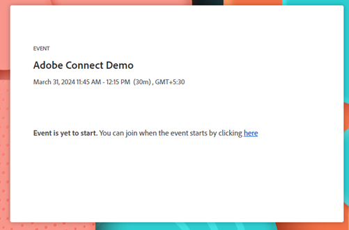
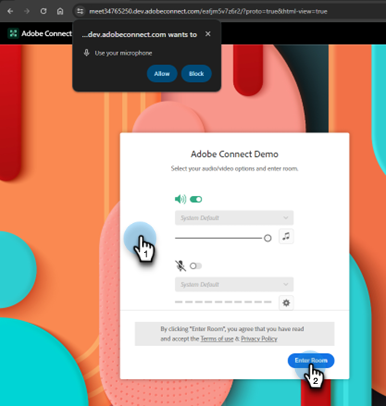

# Durchführen eines interaktiven Webinars {#deliver-an-interactive-webinar}

Ihr interaktives Webinar ist startbereit. Erfahren Sie alles, was Sie über die Präsentation wissen müssen.

1. Wählen Sie Ihre Veranstaltung aus und klicken Sie **Webinar eingeben**.

   

   >[!NOTE]
   >
   >Es wird empfohlen, dies mindestens 15 Minuten vor der geplanten Startzeit zu tun.

1. Wenn Sie Co-Moderator oder Moderator sind, klicken Sie auf den personalisierten Link in der E-Mail, die Sie für das Webinar erhalten haben.

1. Wählen Sie Ihre Audio-/Videoeinstellungen aus und klicken Sie auf **Raum eingeben**.

   

1. Wählen Sie das Layout aus, das den frühen Joinern angezeigt werden soll.

   

   >[!NOTE]
   >
   >Die Teilnehmer können den Raum bis zu 15 Minuten vor dem geplanten Start betreten und sehen das aktive Layout. Wir empfehlen, für sie ein „Lobby“-Layout zu entwerfen.

   >[!TIP]
   >
   >Broadcast-Steuerung aktivieren, um einen virtuellen grünen Raum zu betreten. Auf diese Weise können Gastgeber und Moderatoren privat sprechen und einander sehen, ohne dass Audio und Video an die Teilnehmer im Raum übertragen werden. Ideal vor und nach der Sitzung, um Audio und Video zu testen oder nach dem Webinar eine Nachbesprechung durchzuführen.

1. Sie können die Sitzung bei Bedarf aufzeichnen. Wählen **Sitzung aufzeichnen** aus dem Zimmermenü aus. Die Aufzeichnung kann im selben Menü zu einem späteren Zeitpunkt gestoppt werden.

   

1. Ihre Sitzung beginnt zum festgelegten Zeitpunkt.

1. Klicken Sie auf den Raumnamen. Wählen Sie in der Dropdown-Liste den Bereich **Host und Moderator** aus, um mit dem Präsentationsteam backstage zu chatten oder Notizen zu teilen. Der Bereich „Host und Präsentator“ wird auf der rechten Bildschirmseite geöffnet. Nur Hosts/Co-Hosts und Moderatoren können diesen Teil des Bildschirms sehen.

   

1. Wenn die Sitzung abgeschlossen ist, klicken Sie auf den roten Pfeil und wählen Sie **Sitzung für alle beenden**.

   

   >[!CAUTION]
   >
   >Durch Klicken auf „Raum verlassen“ verlassen Sie den Raum nur. Das Webinar **damit** beendet.

   >[!TIP]
   >
   >Weitere Informationen zu [Ereignisleistung und Aufzeichnungen](/help/marketo/product-docs/demand-generation/events/interactive-webinars/event-workflows.md){target="_blank"}.

## Teilnehmererlebnis {#participant-experience}

Die Teilnehmer können an dem Webinar teilnehmen, indem sie auf den personalisierten Link klicken, der nach der Registrierung für die Veranstaltung erhalten wurde.

1. Teilnehmer, die den Ereignis-Link mehr als 15 Minuten vor dem geplanten Start starten, sehen eine Landingpage, auf der sie aufgefordert werden, auf den Start des Ereignisses zu warten.

   

1. Teilnehmer müssen ihre Audioeinstellungen auswählen und dann auf „Raum eingeben“ klicken. Teilnehmer, die zum ersten Mal an einem Adobe Connect-Raum teilnehmen, sehen auch ein Browser-Popup für die Mikrofonberechtigung. Adobe Connect benötigt diesen Zugang, damit die Teilnehmer ihr Mikrofon später im Raum benutzen können.

   

   >[!NOTE]
   >
   >Das Berechtigungs-Popup kann geschlossen werden, ohne den Zugriff bereitzustellen. Die Teilnehmer müssen im Raum Zugang gewähren, wenn sie versuchen, ihr Mikrofon zu aktivieren.

## Einstellungen und Bereiche {#settings-and-areas}

### Bereich für Host und Moderator {#host-and-presenter-area}

Der „Host- und Präsentationsbereich“ (auch als „Backstage“ bezeichnet) ist ein privater Bereich auf der rechten Seite eines Meetingraums, den nur Moderatoren und Moderatoren sehen können. Sie kann zur Zusammenarbeit vor, während und nach einem Ereignis verwendet werden. Verwenden Sie Chat, Notizen und andere Pods als Rückkanäle im Bereich „Host &amp; Presenter“.

Um darauf zuzugreifen, wählen Sie **Bereich „Host und Moderator** aus dem Dropdown-Menü Raum aus. Weitere Informationen zu diesem Bereich finden Sie im [ Video](https://www.youtube.com/watch?v=11GkcvIUttY){target="_blank"}.

### Broadcast-Steuerung {#broadcast-controls}

Die Broadcast-Steuerung fügt Ihrer interaktiven Webinar-Sitzung einen virtuellen grünen Raum hinzu. Es ermöglicht Gastgebern und Moderatoren, privat zu sprechen und einander zu sehen, ohne an die Teilnehmer im Raum zu senden. Es ist eine großartige Möglichkeit, Ihr Mikrofon und Ihre Webcam vor einer Sitzung zu testen. Die Präsentatoren können auch im Bereich „Host und Präsentator“ zusammenarbeiten, bis sie bereit sind, live zu gehen. Es bietet dem Sprecher und den Produzenten die Möglichkeit, sich nach einer Sitzung privat zu informieren, falls ein Teilnehmer vergisst, das Webinar zu verlassen.

Die Broadcast-Steuerung kann so eingestellt werden, dass die Aufnahme automatisch gestartet wird, nachdem der grüne Raum verlassen wurde. Dadurch wird sichergestellt, dass Hosts nicht daran denken müssen, die Aufzeichnung manuell zu starten und zu beenden. Durch das Anhalten oder Stoppen der Übertragung wird auch die Aufzeichnung angehalten oder gestoppt. Alles ist automatisch.

Weitere Informationen zu Broadcast-Steuerelementen finden [ in diesem Video](https://www.youtube.com/watch?v=TcoCeEJoyjg){target="_blank"}.

### Chats in Aufzeichnungen {#chats-in-recordings}

Je nach Anwendungsfall kann es eine gute Idee sein, den In-Room-Chat in den Ereignisaufzeichnungen entweder einzubeziehen oder auszuschließen.

Diskussionen innerhalb der Chat-Pods werden immer aufgezeichnet. Wenn also die Chatdiskussionen einen Mehrwert für die Aufzeichnung von Viewern (Teilnehmer und On-Demand-Viewer, die das Live-Ereignis posten) bieten, verwenden Sie die Chat-Pods beim Entwerfen des Raums.

Diskussionen innerhalb des Chat-Panels werden nicht aufgezeichnet. Das Chat-Panel gibt auch die Grundstücke frei, die vom Chat-Pod innerhalb des Layouts belegt worden wären. Wenn also die Chatdiskussionen keinen Mehrwert für die Aufnahme von Viewern bieten, verwenden Sie beim Entwerfen des Raums das Chat-Panel anstelle von Chat-Pods.

Erfahren Sie mehr über [das Chat-Bedienfeld](https://helpx.adobe.com/adobe-connect/using/notes-chat-q-a-polls.html#chat_panel){target="_blank"}.

### Vorbereitungsmodus {#prepare-mode}

Im Vorbereitungsmodus können Moderatoren und Moderatoren ein Besprechungsraum-Layout hinter den Kulissen erstellen oder ändern, während eine Sitzung stattfindet, ohne dass die Teilnehmer die Änderungen sehen, bis der Moderator sie sichtbar macht. Die Funktion Vorbereiten des Modus markiert die Live-Pods in blau und Nicht-Live-Pods in weiß.

So verwenden Sie den Vorbereitungsmodus:

1. Klicken Sie auf das Schraubenschlüsselsymbol unten im Bedienfeld „Layouts“.

   

1. Wählen Sie im Bedienfeld Layouts das Layout aus, das Sie anpassen möchten. Verschieben, Ausblenden oder Anzeigen von Pods nach Bedarf. Sie können auch den Inhalt in Pods aktualisieren, z. B. eine neue Version der Präsentation in einen freigegebenen Pod hochladen.

1. Wenn die Änderungen abgeschlossen sind, wählen Sie **Vorbereitungsmodus beenden** aus dem Dropdown-Menü aus oder klicken Sie ein zweites Mal auf das Schraubenschlüsselsymbol.

Dadurch wird der Vorbereitungsmodus deaktiviert und Sie kehren zum aktiven Layout zurück.

Weitere Informationen zum Vorbereitungsmodus [in diesem Video](https://www.youtube.com/watch?v=kUya84sx-E4){target="_blank"}.

>[!NOTE]
>
>* Alle Änderungen an den Live-Pods werden sofort den Teilnehmern angezeigt.
>* [Chat-Bedienfeld](https://helpx.adobe.com/adobe-connect/using/notes-chat-q-a-polls.html#chat_panel){target="_blank"} ist nicht Teil des Vorbereitungsmodus und alle Änderungen daran werden sofort den Teilnehmern angezeigt.

### Barrierefreiheit {#accessibility}

Adobe ist bestrebt, Moderatoren und Teilnehmer mit Behinderungen einzubeziehen, indem die Barrierefreiheit von interaktiven Webinaren verbessert wird. Die Software wird kontinuierlich verbessert, um die Bedürfnisse aller Arten von Benutzern zu erfüllen und die weltweiten Standards einzuhalten, die Personen mit visuellen, auditiven, Mobilitäts- oder anderen Beeinträchtigungen einschließen.

Erfahren Sie, wie Adobe Connect Unterstützung für [visuelle, auditive und Mobilitätsanforderungen](https://helpx.adobe.com/adobe-connect/using/accessibility-features.html){target="_blank"} bietet.

### Untertitel {#closed-captions}

Untertitel sind eine textliche Darstellung des Audioinhalts in einem Adobe Connect-Raum und helfen Teilnehmern, die taub oder schwerhörig sind, an Veranstaltungen teilzunehmen. Sie können die Echtzeit-Untertitelung von Audioinhalten in Ereignisse integrieren und diese Untertitel in der Anzeige für Untertitel präsentieren.

Erfahren Sie, wie Sie [Untertitel aktivieren](https://helpx.adobe.com/adobe-connect/using/closed-captioning-html-client.html){target="_blank"}.
