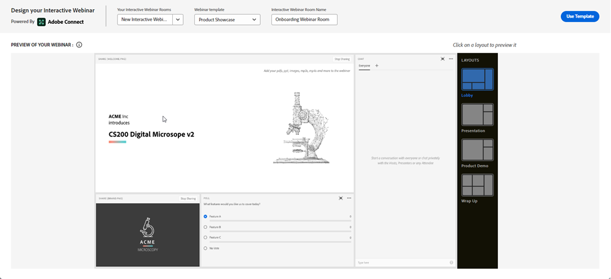

# Interaktive Webinare erstellen {#designing-interactive-webinars}

Erfahren Sie, wie Sie Ihr Webinar entsprechend Ihren Anforderungen entwerfen.

1. Wählen Sie das Ereignis aus und klicken Sie auf **Webinar erstellen**.

   

1. Sie können einen vorhandenen Webinar-Raum auswählen oder einen neuen erstellen. In diesem Beispiel erstellen wir ein neues, klicken Sie also auf das **Select Room** und wählen Sie **Neuer interaktiver Webinar-Raum**.

   

   >[!NOTE]
   >
   >Ein Raum ist ein Online-Raum, der für Meetings genutzt wird.

1. Wählen Sie eine Vorlage aus.

   

1. Ihre Webinar-Vorschau wird angezeigt.

   

   >[!TIP]
   >
   >Ihr Webinar wird in Ihrer Marketo Engage-Instanz auf die Standardsprache eingestellt, Sie können jedoch die Sprachen für jedes Webinar ändern, indem Sie die Dropdown-Liste oberhalb der Vorschau verwenden.

1. Sie können verschiedene Layouts zur Vorschau auswählen. Klicken Sie auf **Vorlage verwenden**.

   

1. Sie können Ihr Webinar sofort oder später verfeinern. Machen wir es jetzt! Klicks **Webinar jetzt verfeinern**.

   

1. Wählen Sie Ihre Audio-/Videoeinstellungen aus und klicken Sie auf **Eingabefeld**.

   

1. Die ausgewählte Vorlage kann jetzt bearbeitet werden.

   

1. Ausführliche Informationen zu Zimmern und Vorlagen finden Sie im Abschnitt &quot;Vorlagen und Layouts von Meetingräumen&quot; unter [dieser Adobe-Hilfeartikel](https://helpx.adobe.com/in/adobe-connect/using/creating-arranging-meetings.html#creating_and_arranging_meetings){target="_blank"}.

1. Wenn Sie mit der Erstellung Ihres Webinars fertig sind, klicken Sie auf **Ausstiegsraum**.

   

## Design-Elemente {#design-elements}

**Vorlage**: Struktur eines Raums basierend auf dem Ziel des Webinars, das bereitgestellt wird. Wenn Sie beispielsweise ein Webinar für Produktpräsentationen planen möchten, ist die Bildschirmfreigabe eine wichtige Komponente für die Präsentation der Demo. Die Vorlage stellt sicher, dass die für eine effektive Bereitstellung eines bestimmten Webinars erforderlichen wesentlichen Komponenten während der Konfiguration des Webinarraums vorhanden sind.

**Layout**: Verschiedene Möglichkeiten, wie die verschiedenen Komponenten, die zum erfolgreichen Abschluss des Webinars erforderlich sind, in einer bestimmten Vorlage angeordnet werden. Eine einzelne Vorlage kann mehrere Layouts enthalten, aus denen Sie wählen können. Die wesentlichen Komponenten des Webinars bleiben in allen Vorlagen gleich. Die von Ihnen ausgewählte Vereinbarung ist am besten auf den Stil/die Bedürfnisse Ihrer Person oder des Moderators abgestimmt, der das Webinar versendet.

**Pod**: Eine Komponente in einer Vorlage, die eine bestimmte Aktivität während des Webinars ausführt. So können Sie beispielsweise eine Umfrage einrichten und durchführen, um die Antworten der Teilnehmer in einer Aktivität zu erfassen, die durch einen Umfrage-Pod erfüllt werden kann. Ebenso kann es sich bei dem Chat mit den Teilnehmern um eine Nachricht handeln oder mit ihnen gelegentlich interagieren, um eine Aktivität handeln, die über den Chat-Pod bereitgestellt wird. Es stehen mehrere weitere Pods zur Verfügung, z. B. Freigabe, Hinweise, Video, Chat, Teilnehmerliste, Dateien, Web-Links, Umfragen und Fragen und Antworten.
