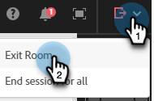

# Entwerfen interaktiver Webinare {#designing-interactive-webinars}

Erfahren Sie, wie Sie Ihr Webinar an Ihre Anforderungen anpassen.

1. Wählen Sie Ihre Veranstaltung aus und klicken Sie auf **Webinar entwerfen**.

   

1. Sie können einen vorhandenen Webinar-Raum auswählen oder einen neuen erstellen. In diesem Beispiel wird ein neues erstellt. Klicken Sie also auf die **Select Room** Dropdown-Liste und wählen Sie **New Interactive Webinar Room**.

   

   >[!NOTE]
   >
   >* Ein Raum ist ein Online-Raum, in dem Meetings durchgeführt werden.
   >
   >* Wenn Sie einen vorhandenen Webinar-Raum auswählen und ihn umbenennen möchten, klicken Sie einfach auf die Schaltfläche **Webinar-Raum umbenennen** rechts.
   >
   >* Die Dropdown-Liste zeigt nur die vorhandenen Räume an, die Sie zuvor erstellt haben, nicht die der anderen Hosts.

1. Wählen Sie eine Vorlage.

   

1. Ihre Webinar-Vorschau wird angezeigt.

   

   >[!NOTE]
   >
   >Standardmäßig ist der Name des Raums, der im Feld „Name des interaktiven Webinar-Raums“ angegeben ist, derselbe Name wie der Name Ihres Veranstaltungsprogramms für das interaktive Webinar. Sie haben die Möglichkeit, ihn zu ändern, um den Titel des Webinars selbst widerzuspiegeln, da dieser Name für Ihre Zielgruppe sichtbar ist.

   >[!TIP]
   >
   >Für Ihr Webinar wird die Standardsprache in Ihrer Marketo Engage-Instanz festgelegt, Sie haben jedoch die Möglichkeit, die Sprache pro Webinar zu ändern, indem Sie die Dropdown-Liste über der Vorschau verwenden.

1. Sie können verschiedene Layouts für die Vorschau auswählen. Klicken Sie auf „Vorlage **&quot;, um**.

   

1. Sie können Ihr Webinar sofort oder später verfeinern. Lass es uns jetzt tun. Klicken Sie **Webinar jetzt verfeinern**.

   

1. Wählen Sie Ihre Audio-/Videoeinstellungen aus und klicken Sie auf **Raum eingeben**.

   

1. Die ausgewählte Vorlage kann jetzt bearbeitet werden.

   

1. Detaillierte Informationen zu Räumen und Vorlagen finden Sie im Abschnitt „Vorlagen und Layouts für Besprechungsräume“ in [Adobe-Hilfeartikel](https://helpx.adobe.com/in/adobe-connect/using/creating-arranging-meetings.html#creating_and_arranging_meetings){target="_blank"}.

1. Wenn Sie mit der Gestaltung Ihres Webinars fertig sind, klicken Sie auf **Raum verlassen**.

   

## Design-Elemente {#design-elements}

**Vorlage**: Struktur eines Raums basierend auf dem Ziel des durchgeführten Webinars. Wenn Sie beispielsweise ein Produkt-Showcase-Webinar planen möchten, ist die Freigabe des Bildschirms eine wesentliche Komponente, um die Demo zu präsentieren. Die Vorlage stellt sicher, dass die wesentlichen Komponenten für einen effektiven Versand eines bestimmten Webinar-Typs bei der Konfiguration des Webinar-Raums vorhanden sind.

**Layout**: Bezieht sich auf verschiedene Arten, wie die verschiedenen Komponenten, die für den Erfolg des Webinars erforderlich sind, in einer bestimmten Vorlage angeordnet sind. Eine Vorlage kann mehrere Layouts zur Auswahl haben. Die wesentlichen Komponenten des Webinars bleiben in allen Vorlagen gleich. Das von Ihnen ausgewählte Arrangement ist am besten auf Ihren Stil/Ihre Bedürfnisse oder die des Referenten, der das Webinar hält, abgestimmt.

**Pod**: Eine Komponente in einer Vorlage, die während des Webinars eine bestimmte Aktivität ausführt. Sie können beispielsweise eine Umfrage einrichten und durchführen, um die Antworten der Teilnehmer in einer Aktivität zu erfassen, die von einem Umfrage-Pod ausgeführt werden kann. Ebenso kann es sich bei dem Chat mit den Teilnehmern zur Vermittlung einer Nachricht oder bei der beiläufigen Interaktion mit ihnen um eine Aktivität handeln, die über den Chat-Pod bereitgestellt wird. Es stehen mehrere weitere Pods zur Verfügung, z. B. Freigabe, Notizen, Video, Chat, Teilnehmerliste, Dateien, Weblinks, Umfragen und Fragen und Antworten.

      **Survey Pod**: Ermöglicht Hosts, strukturierte Feedback-Formulare direkt innerhalb einer Live-Sitzung zu entwerfen und bereitzustellen. Der Umfrage-Pod erweitert die vorhandenen Umfrage-Pod-Funktionen, indem er die Möglichkeit bietet, mehrere Fragen zusammen zu stellen, und so eine optimierte und kohärentere Möglichkeit bietet, Einblicke zu sammeln. [Weitere Informationen](https://helpx.adobe.com/adobe-connect/using/survey-pod.html){target="_blank"}

      **Ressourcen-Pod**: Ersetzt die vorherigen Dateien und Weblinks-Pods und bietet eine einzige, einheitliche Möglichkeit, Ressourcen während Live-Sitzungen freizugeben. [Weitere Informationen](https://helpx.adobe.com/adobe-connect/using/resources-pod.html){target="_blank"}

>[!MORELIKETHIS]
>
>[Erfahren Sie, wie Sie Moderatoren und/oder Co-Hosts hinzufügen](/help/marketo/product-docs/demand-generation/events/interactive-webinars/add-a-webinar-team.md){target="_blank"}
