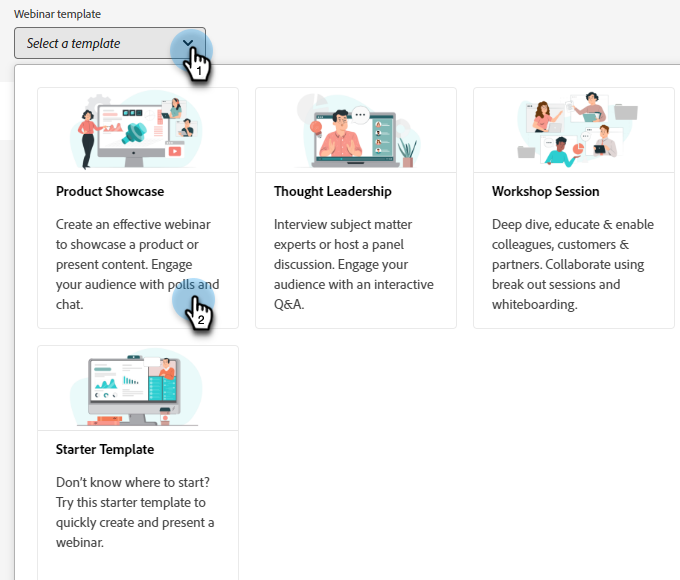

# Interaktive Webinare erstellen {#designing-interactive-webinars}

Einführung.

1. Wählen Sie das Ereignis aus und klicken Sie auf **Design-Webinar**.

   

1. Sie können einen vorhandenen Webinar-Raum auswählen oder einen neuen erstellen. In diesem Beispiel erstellen wir ein neues, klicken Sie also auf das **Select Room** und wählen Sie **Neuer interaktiver Webinar-Raum**.

   

   >[!NOTE]
   >
   >Ein Raum ist ein Online-Raum, den Sie für Meetings nutzen werden.

1. Wählen Sie eine Vorlage aus.

   

1. Ihre Webinar-Vorschau wird angezeigt.

   

1. Sie können verschiedene Layouts zur Vorschau auswählen. Um fortzufahren, klicken Sie auf **Vorlage verwenden**.

   

1. Sie können Ihr Webinar sofort oder später verfeinern. Machen wir es jetzt! Klicken **Webinar jetzt verfeinern**.

   

1. Wählen Sie Ihre Audio-/Videoeinstellungen aus und klicken Sie auf **Eingabefeld**.

   

1. Die ausgewählte Vorlage kann jetzt bearbeitet werden.

   

1. Text

https://helpx.adobe.com/in/adobe-connect/using/creating-arranging-meetings.html#creating_and_arranging_meetings??????

Saal: (Sie haben dies aus der Dokumentation zum Verbinden zur genauen genommen) Quelle: https://helpx.adobe.com/in/adobe-connect/using/meeting-basics.html

Ein Adobe Connect-Webinar ist eine interaktive Live-Online-Konferenz für mehrere Benutzer. Der Raum ist ein persistenter virtueller Online-Raum, den Sie für die Durchführung von Webinaren verwenden. Es umfasst verschiedene Anzeigebereiche (Pods) und Layouts. Es gibt mehrere vorgefertigte Sitzungsraum-Layouts, oder Sie können zusätzliche benutzerdefinierte Layouts erstellen und verwenden, um Ihre Anforderungen zu erfüllen. Der Raum ermöglicht es den Teilnehmern, Computerbildschirme oder Dateien gemeinsam zu nutzen, zu chatten, Audio und Video zu übertragen und an interaktiven Online-Aktivitäten teilzunehmen.

Vorlage:

Template ist eine Struktur, die einem Raum zur Verfügung gestellt wird, basierend auf dem Ziel, dass das Webinar im Raum geliefert wird. Wenn ein Marketing-Experte beispielsweise ein Webinar für Produktpräsentationen planen möchte, wäre die Bildschirmfreigabe eine wichtige Komponente, um die Demo in Groß- und Kleinschreibung zu zeigen. Die Vorlage stellt sicher, dass die für eine effektive Bereitstellung eines bestimmten Webinars erforderlichen wesentlichen Komponenten während der Konfiguration des Webinarraums vorhanden sind.

Layout:

Layout bezeichnet verschiedene Methoden, mit denen mehrere Komponenten, die für den Erfolg eines Webinars erforderlich sind, in einer bestimmten Vorlage angeordnet werden. Eine einzelne Vorlage kann mehrere Layouts aufweisen, aus denen der Marketing-Experte wählen kann. Die wesentlichen Komponenten des Webinars bleiben in allen Vorlagen gleich. Die vom Marketingexperten ausgewählte Vereinbarung ist am besten auf die Bedürfnisse und den Stil des Marketingexperten oder des Moderators abgestimmt, der das Webinar bereitstellt.

Pod:

Werbeunterbrechung bezieht sich auf eine Komponente innerhalb einer Vorlage, die beim Ausführen einer bestimmten Aktivität während des Webinars hilft. So können Sie z. B. eine Umfrage einrichten und durchführen, um Teilnehmer-Antworten in einer Aktivität zu erfassen, die durch einen Umfrage-Pod erfüllt werden können. Auf ähnliche Weise kann es sich bei dem Chat mit den Teilnehmern um eine Nachricht handeln oder gelegentlich mit ihnen interagieren, um eine Aktivität handeln, die über den Chat-Pod bereitgestellt wird. In Connect sind mehrere weitere Pods verfügbar, z. B. Freigabe, Hinweise, Video, Chat, Teilnehmerliste, Dateien, Web-Links, Umfragen und Fragen und Antworten.