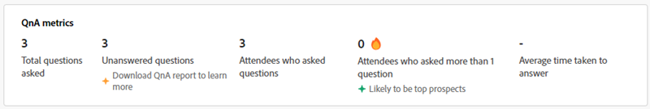
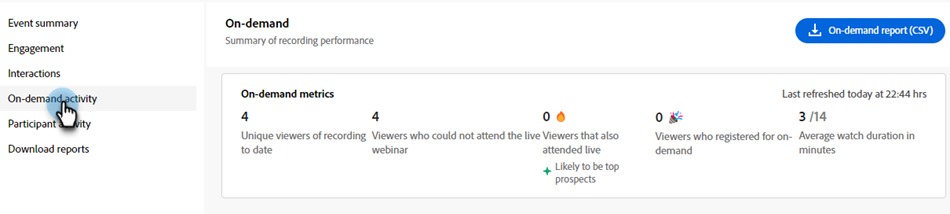

# Interaktions-Dashboard {#engagement-dashboard}

Interaktive Webinare mit Adobe Connect verwenden verschiedene Pods, um Teilnehmer an Chat, Fragen und Antworten, Quizes und Umfragen zu beteiligen. Im Interaktions-Dashboard können Sie wichtige Metriken und Datenvisualisierungen verfolgen.

Sehen Sie sich eine konsolidierte Ansicht der Teilnehmeraktivitäten, Interaktionen und Interaktionen während eines Ereignisses an. Als Host können Sie die Leistung von Live- und On-Demand-Ereignissen anzeigen und verschiedene Berichte nach der Sitzung herunterladen. Zusätzlich werden über das Dashboard erstellte Berichte nach dem Webinar verwendet, um die Effektivität der Sitzung zu bewerten, zukünftige Inhalte zu informieren und die allgemeine Webinar-Strategie zu verbessern.

Das Dashboard verfolgt verschiedene Metriken, einschließlich Umfrageantworten, Chat-Aktivitäten und Videointeraktionen, und bietet wertvolle Einblicke in die Voreinstellungen und Verhaltensweisen der Teilnehmer. Es bietet einen umfassenden Überblick über die Aktivitäten und Interaktionsstufen der Teilnehmer, sodass Hosts die Echtzeit-Besuchszeit, -Teilnahme und -Interaktionen überwachen können.

Zeigen Sie die Interaktion für die folgenden Sitzungstypen in einem interaktiven Webinar an.

* **Live-Sitzung**: Eine Echtzeit-Online-Sitzung, bei der Teilnehmer aktiv miteinander interagieren können.
* **On-Demand-Sitzung**: Die Aufzeichnung des Live-Ereignisses wird als eigenständiges Ereignis bereitgestellt. Neue Einladende können sich registrieren und die Aufzeichnung ansehen. Nach der Registrierung erhalten sie einen Ereignisverbindungs-Link, über den sie zur Aufzeichnung des Ereignisses gelangen, nachdem es beendet wurde. Teilnehmer, die für das Live-Ereignis registriert sind, können die Aufzeichnung auch über denselben Join-Link anzeigen.

## Dashboard anzeigen {#view-the-dashboard}

1. Wechseln Sie zu **[!UICONTROL Marketingaktivitäten]**.

   

1. Wählen Sie das gewünschte abgeschlossene Ereignis aus.

   

1. Klicken Sie in der Übersicht auf **[!UICONTROL Interaktions-Dashboard anzeigen]**.

   

   >[!NOTE]
   >
   >Auf das Interaktions-Dashboard kann 45 bis 120 Minuten nach dem Ende des geplanten Ereignisses zugegriffen werden.

## Dashboard-Details {#dashboard-details}

Sie können die folgenden Details im Interaktions-Dashboard anzeigen.

<table><tbody>
  <tr>
    <td><b>Ereigniszusammenfassung</td>
    <td>Bietet einen konsolidierten Überblick über die Leistung von Live- und On-Demand-Sitzungen.</td>
  </tr>
  <tr>
    <td><b>Interaktion</td>
    <td>Bietet einen Überblick über die Leistung von Live-Sitzungen.</td>
  </tr>
  <tr>
    <td><b>Interaktionen</td>
    <td>Bietet einen detaillierten Überblick über die Beteiligung der Teilnehmer an Pods.</td>
  </tr>
  <tr>
    <td><b>Aktivität "On-Demand"</td>
    <td>Bietet eine Zusammenfassung der Aufzeichnungsleistung.</td>
  </tr>
  <tr>
    <td><b>Teilnehmer-Aktivität</td>
    <td>Bietet eine konsolidierte Ansicht der Interaktion.</td>
  </tr>
  <tr>
    <td><b>Berichte herunterladen</td>
    <td>Laden Sie Berichte zur Interaktion in verschiedenen Pods herunter.</td>
  </tr>
</tbody>
</table>

### Ereigniszusammenfassung {#event-summary}

Diese Oberfläche bietet einen konsolidierten Überblick über die Leistung des Ereignisses bei Live- und On-Demand-Sitzungen. Wählen Sie im linken Bereich die Option Ereigniszusammenfassung aus, um die Gesamtmetriken anzuzeigen.

<table><tbody>
  <tr>
    <td><b>Registrierungen insgesamt</td>
    <td>Zeigt die Anzahl der Teilnehmer an, die sich für die Veranstaltung registriert haben.</td>
  </tr>
  <tr>
    <td><b>Gesamtzahl der Teilnehmer</td>
    <td>Zeigt die Anzahl der Teilnehmer an der Veranstaltung an.</td>
  </tr>
  <tr>
    <td><b>Anmeldung zur Teilnehmer-Konversionsrate</td>
    <td>Zeigt den Prozentsatz der Teilnehmer an, die sich registriert und an der Veranstaltung teilgenommen haben.</td>
  </tr>
  <tr>
    <td><b>Anwesende Besucher sowohl live als auch On-Demand</td>
    <td>Dies zeigt die Anzahl der Teilnehmer, die an Live- und On-Demand-Veranstaltungen teilgenommen haben.</td>
  </tr>
</tbody>
</table>

### Interaktion {#engagement}

Bietet einen Überblick über die Leistung einer Live-Sitzung bei einem Ereignis. Die Übersicht enthält wichtige Metriken, Interaktionen im Zeitverlauf und Teilnehmerinteraktionen. Es hilft Organisatoren, den Erfolg des Ereignisses zu bewerten und Bereiche für Verbesserungen zu identifizieren.

Wählen Sie im linken Bereich **[!UICONTROL Interaktion]** aus, um die Leistung der Live-Sitzung anzuzeigen. **[!UICONTROL Klicken Sie auf Interaktionszusammenfassung (PDF)]** , um die Leistungszusammenfassung der Live-Sitzung herunterzuladen. Die Übersicht enthält Daten in verschiedenen Abschnitten.

**Schlüsselmetriken**

Anzeigen der Anzahl der Registrierungen, Teilnehmer und Interaktionen in der Live-Sitzung

<table><tbody>
  <tr>
    <td><b>Registrierungen</td>
    <td>Anzeigen der Anzahl der Registrierungen für die Live-Sitzung</td>
  </tr>
  <tr>
    <td><b>Anziehungskraft</td>
    <td>Anzeigen der Anzahl der Teilnehmer, die an der Live-Sitzung teilnehmen</td>
  </tr>
  <tr>
    <td><b>Dringend engagiert</td>
    <td>Sehen Sie sich die Anzahl der Teilnehmer an, die während der Live-Sitzung stark involviert waren und wahrscheinlich Top-Perspektiven bieten.</td>
  </tr>
  <tr>
    <td><b>Moderat engagiert</td>
    <td>Anzeigen der Anzahl der mäßig engagierten Teilnehmer während der Live-Sitzung
     <b>Hinweis</b>: Diese Zahlen werden basierend auf Interaktionen und Interaktionen während der Sitzung berechnet.</td>
  </tr>
  <tr>
    <td><b>Durchschnittliche Dauer der Uhr in Minuten</td>
    <td>Zeigt die durchschnittliche Überwachungsdauer in Minuten der Live-Sitzung an.</td>
  </tr>
</tbody>
</table>

**Interaktion im Zeitverlauf**

In den Interaktionsdiagrammen erfahren Sie über die durchschnittliche Interaktion im Zeitverlauf während der Live-Sitzung. Hosts können überwachen, wie Interaktionsstufen schwanken, und ihnen so die Möglichkeit geben, kritische Momente hoher oder geringer Interaktion zu identifizieren. Erfahren Sie, wie viel des durchschnittlichen Interaktionswerts von den beteiligten Teilnehmern in verschiedenen Layouts erzielt wurde.

Zeigen Sie die folgenden Informationen an, indem Sie den Mauszeiger über das Diagramm bewegen:

* Der Zeitpunkt, zu dem die Interaktionsstufe überwacht wird.
* Durchschnittliche Interaktionsbewertung zu diesem Zeitpunkt.
* Anzahl der Teilnehmer, die zu diesem Zeitpunkt eingestellt wurden.
* Layout der Interaktion zu diesem Zeitpunkt.
* Wählen Sie **[!UICONTROL Instant in Recording anzeigen]** aus, um den Zeitpunkt in der Aufzeichnung anzuzeigen, an dem die Interaktion hoch oder niedrig war.
* Durchschnittliche Interaktionsbewertung (%) im Zeitverlauf der Sitzung
* Teilnahme im Zeitverlauf
* Die Interaktion in verschiedenen Webinar-Layouts wird angezeigt, wenn während der Veranstaltung verschiedene Layouts im Raum verwendet wurden. Dies hilft, den Anstieg und Rückgang von Interaktionen in verschiedenen Layouts zu korrelieren.

**An Interaktionen teilnehmen**

Sie können die Interaktionen der Teilnehmer von verschiedenen Pods aus anzeigen. Es enthält Informationen wie Antworten auf Fragen, Fragen, Interagieren mit Chat, Klicks auf mindestens einen Link und Heruntergeladen mindestens eine Datei.

Wählen Sie **[!UICONTROL Gehe zu Interaktionen]** aus, um Antworten aus Umfragen, Metriken zur Servicequalität und die Reaktionen der Teilnehmer während der Sitzung anzuzeigen. Sehen Sie sich an, wie Teilnehmer über Pods aus Interaktionen interagieren, und laden Sie Interaktionsberichte aus dem folgenden Abschnitt herunter.

### Interaktionen {#interactions}

Interaktion und Teilnahme der Teilnehmer an der Sitzung über Interaktionen anzeigen. Verfolgen Sie Antworten auf Umfragen, QnA-Metriken, Reaktionen von Teilnehmern sowie Links und Dateien aus den entsprechenden Pods. Hosts können für eine bessere Analyse auch Interaktionsberichte dieser Pods herunterladen. Durch Analyse dieser Interaktionen können Sie Trends identifizieren und ihre Strategien anpassen, um eine interaktivere und ansprechendere Umgebung zu fördern.

Wählen Sie im linken Bereich **[!UICONTROL Interaktionen]** aus, um zu sehen, wie Teilnehmer über Pods hinweg interagieren.

Wählen Sie in der Menüleiste die Registerkarte **[!UICONTROL Umfragen]** aus, um Fragen und Antworten anzuzeigen, die zur Umfrage hinzugefügt wurden. Dieser Tab enthält die folgenden Informationen:

* Wählen Sie **[!UICONTROL Umfragebericht (CSV)]** aus, um den Bericht für Interaktionen im Umfrage-Pod herunterzuladen.
* Frage und Art der Umfrage.
* Anzahl der Antworten und Zeitraum, in dem der Umfrage-Pod geöffnet und aktiviert wurde.
* Wählen Sie &quot;**Alle `<number>` Antworten anzeigen**&quot;, um sie in einem Dialogfeld anzuzeigen.

Wählen Sie in der Menüleiste die Registerkarte **[!UICONTROL Sonstige Interaktionen]** aus, um die Interaktion mit anderen Pods anzuzeigen und die zugehörigen Berichte herunterzuladen.

Wählen Sie **[!UICONTROL Interaktionsberichte herunterladen]** aus der Dropdown-Liste aus, um Berichte mit verschiedenen Pods herunterzuladen. Laden Sie hier den Bericht zu Fragen und Antworten, den Bericht zu Links und Dateien sowie den Bericht Reaktionen herunter, um eine bessere Verfolgung zu erzielen.

Die Interaktionsinformationen über Pods hinweg sind in verschiedenen Abschnitten verfügbar.

**QnA-Metriken**

Zeigen Sie die folgenden Attribute des Fragen- und Antworten-Pods an.

* Gesamtzahl der gestellten Fragen.
* Anzahl der unbeantworteten Fragen.
* Anzahl der Teilnehmer, die Fragen gestellt haben
* Anzahl der Teilnehmer, die mehr als eine Frage gestellt haben und die wahrscheinlich die besten Aussichten haben.
* Durchschnittliche Dauer für die Beantwortung einer Frage.

**Reaktionen**

Sehen Sie sich die Reaktionen der Teilnehmer von hier aus an, z. B. Einverständnis, Ablehnung, Beifall und Lachen während der Sitzung.

Sehen Sie sich im Reaktionsdiagramm die folgenden Details an:

* Gesamte Reaktionen
* Anzahl der Teilnehmer, die mindestens einmal reagiert haben
* Klicks insgesamt
* Einzelbesucher
* Trend der Klicks auf Reaktionen basierend auf der Gesamtzahl der Klicks für Unique Opens.

**weblinks pod**

Links anzeigen, die während der Sitzung zum Weblinks-Pod hinzugefügt wurden, sowie die Anzahl der Klicks auf den freigegebenen Link. Mit dem Weblink-Pod können Sie Links aus Quellen außerhalb des Webinars hinzufügen, um eine Interaktion zu generieren.

Zeigen Sie im Diagramm die folgenden Details an:

* Links, die zum Weblinks-Pod hinzugefügt werden.
* Anzahl der Teilnehmer, die mindestens auf einen Link geklickt haben.
* Anzahl der vom Host gestarteten Links.
* Trend der eindeutigen Klicks auf jeden Link, der zum Weblinks-Pod hinzugefügt wird.

**Dateien pod**

Zeigen Sie die Dateien an, die während der Sitzung zum Dateipod hinzugefügt wurden, sowie die Anzahl der eindeutigen Downloads. Mit dem Datei-Pod können Sie Dateien hinzufügen und Ressourcen bereitstellen, um Interaktionen zu generieren.

Zeigen Sie im Diagramm die folgenden Details an:

* Name der Dateien, die zum Datei-Pod hinzugefügt werden.
* Anzahl der Teilnehmer, die mindestens eine Datei heruntergeladen haben.
* Trend der eindeutigen Downloads für jede Datei, die zum Weblinks-Pod hinzugefügt wird.

### Aktivität &quot;On-Demand&quot; {#on-demand-activity}

Wählen Sie im linken Bereich die Option **[!UICONTROL On-Demand-Aktivität]** aus, um die Zusammenfassung der Aufzeichnungen anzuzeigen. Sie können auch einen Bericht für On-Demand-Aktivitäten herunterladen.

Zeigen Sie in der On-Demand-Aktivität die folgenden Metriken an:

* Klicken Sie auf **[!UICONTROL On-Demand-Bericht (CSV)]** , um die On-Demand-Metriken herunterzuladen.
* Anzahl der eindeutigen Viewer, bis das Dashboard zuletzt aktualisiert wurde.
* Anzahl der Zuschauer, die die Aufzeichnung angesehen, aber nicht am Webinar teilnehmen konnten.
* Anzahl der Zuschauer, die das Webinar besucht und die Aufzeichnung angesehen haben. Sie werden wahrscheinlich die besten Aussichten haben.
* Anzahl der Viewer, die sich für die On-Demand-Sitzung registriert haben.
* Durchschnittliche Überwachungsdauer der Aufzeichnung in Minuten.

### Teilnehmer-Aktivität {#participant-activity}

Wählen Sie im linken Bereich **[!UICONTROL Teilnehmer-Aktivität]** aus, um konsolidierte Informationen über die Interaktionsstufe jedes Teilnehmers anzuzeigen. Sehen Sie sich an, wie diese Interaktion in Stufen von der Interaktionsstufe Teilnehmer klassifiziert wird. Klicken Sie auf **[!UICONTROL Benutzeraktivitätsbericht (CSV)]** , um den Bericht zur besseren Verfolgung herunterzuladen.

Zeigen Sie die folgenden Details aus der Tabelle an:

* Interaktionsstufe jedes Teilnehmers. Sie können sie auch von oben nach unten sortieren oder umgekehrt.
* Dauer der Sitzung, an der der Teilnehmer teilnahm.
* Antworten vom Teilnehmer.
* Dateien, die vom Teilnehmer aus dem Datei-Pod heruntergeladen wurden.
* Vom Teilnehmer im Weblink-Pod angeklickte Links.
* Fragen, die vom Teilnehmer vom QnA-Pod gestellt werden.

### Berichte herunterladen {#download-reports}

Laden Sie Berichte für verschiedene Aktivitäten und Pods von einem zentralisierten Hub als Host herunter.

1. Wählen Sie im linken Bereich **[!UICONTROL Berichte herunterladen]** aus.

1. Wählen Sie **[!UICONTROL Alle herunterladen (.zip)]** aus, um Berichte für alle Aktivitäten und Pods gleichzeitig herunterzuladen.

   

>[!NOTE]
>
>Klicken Sie auf das Download-Symbol neben jedem Bericht, um ihn einzeln herunterzuladen.

## Interaktionsstufe des Teilnehmers {#participant-engagement-level}

Unternehmen verwenden Adobe Connect, um hochgradig personalisierte, markenspezifische und interaktionsgeführte Webinare bereitzustellen. Interaktive Tools wie Umfragen, Chat, Fragen und Antworten helfen den Teilnehmern, sich zu engagieren und mehr zu sammeln als nur Registrierungs- und Anwesenheitsdaten. Nachdem die Teilnehmer mit diesen interaktiven Funktionen interagiert haben, werden die Interaktionsdaten verwendet, um die Teilnehmer in drei Interaktionsstufen zu klassifizieren: hoch, mittel und niedrig. Sie können die Interaktionsstufe verwenden, um Zielgruppensegmente zu aktualisieren, Personenergebnisse zu aktualisieren und Verkäufe zu warnen.

Machen Sie sich mit den Kriterien für die Klassifizierung des Interaktionsniveaus für jeden Teilnehmer vertraut:

<table><thead>
  <tr>
    <th>Interaktionsstufe</th>
    <th>Klassifizierungskriterien</th>
  </tr></thead>
<tbody>
  <tr>
    <td>Hoch</td>
    <td>Teilnehmer, die alle folgenden Kriterien erfüllen:
    <li>Die Dauer der Teilnahme beträgt mindestens 80 % der gesamten Ereigniszeit.</li>
    <li>Alle Multiple-Choice-Fragen (MCQs) und Multiple-Response-Umfragen (MA) werden beantwortet, mindestens eine Datei wird heruntergeladen oder die Anzahl der geposteten Chats beträgt fünf oder mehr.</li>
    <li>Der Teilnehmer hat mindestens eine Frage in der Frage und Antwort-Pod gestellt.</li></td>
  </tr>
  <tr>
    <td>Medium</td>
    <td>Teilnehmer, die alle folgenden Kriterien erfüllen:
    <li>Die Interaktionsstufe des Teilnehmers ist nicht als hoch festgelegt.</li>
    <li>Die Dauer der Teilnahme beträgt mindestens 60 % der gesamten Ereigniszeit.</li>
    <li>Der Teilnehmer hat mindestens eine der folgenden Aktionen ausgeführt:
    <ul>
    <li>Antworten Sie mindestens auf eine Umfrage.
    <li>Mindestens eine Frage in der Frage-und-Antwort-Pod.<li>Mindestens eine Datei heruntergeladen wurde.
    <li>auf mindestens einen Weblink geklickt (aber nicht gestartet) haben.<li>Drei oder mehr Chats gepostet.</ul></li>
    </td>
  </tr>
  <tr>
    <td>Niedrig</td>
    <td>Alle Teilnehmer, die nicht als hoch oder mittelgroß eingestuft wurden.</td>
  </tr>
</tbody></table>
