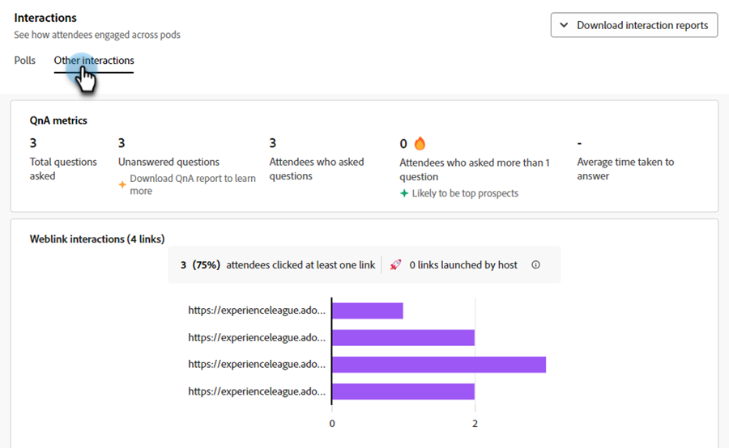

# Interaktions-Dashboard {#engagement-dashboard}

Interaktive Webinare auf Basis von Adobe Connect verwenden verschiedene Pods, um Teilnehmer an Chats, Fragen und Antworten, Tests und Umfragen zu beteiligen. Mit dem Interaktions-Dashboard können Sie Schlüsselmetriken und Datenvisualisierungen verfolgen.

Zeigen Sie eine konsolidierte Ansicht der Teilnehmeraktivitäten, Interaktionen und Interaktionen während eines Ereignisses an. Als Host können Sie die Leistung von Live- und On-Demand-Ereignissen anzeigen und nach der Sitzung verschiedene Berichte herunterladen. Darüber hinaus werden aus dem Dashboard generierte Berichte nach dem Webinar verwendet, um die Effektivität der Sitzung zu bewerten, zukünftige Inhalte zu informieren und die allgemeine Webinar-Strategie zu verbessern.

Das Dashboard verfolgt verschiedene Metriken, einschließlich Umfrageantworten, Chat-Aktivitäten und Videointeraktionen, und bietet wertvolle Einblicke in die Vorlieben und Verhaltensweisen der Teilnehmer. Es bietet einen umfassenden Überblick über die Aktivitäten und Interaktionsstufen der Teilnehmer, sodass Hosts die Anwesenheit, Teilnahme und Interaktionen in Echtzeit überwachen können.

Zeigen Sie Interaktionen für die folgenden Sitzungstypen in einem interaktiven Webinar an.

* **Live-Sitzung**: Eine Online-Sitzung in Echtzeit, in der sich Teilnehmer aktiv miteinander austauschen können.
* **On-Demand-**: Die Aufzeichnung des Live-Ereignisses wird als eigenes Ereignis zur Verfügung gestellt. Neue Einladende können sich registrieren und die Aufnahme ansehen. Nach der Registrierung erhalten sie einen Link zur Teilnahme an der Veranstaltung, über den sie nach Ablauf zur Aufzeichnung der Veranstaltung weitergeleitet werden. Teilnehmer, die sich für die Live-Veranstaltung registriert haben, können die Aufzeichnung auch über denselben Link zur Teilnahme einsehen.

## Dashboard anzeigen {#view-the-dashboard}

1. Navigieren Sie **[!UICONTROL Marketing-Aktivitäten]**.

   

1. Das gewünschte abgeschlossene Ereignis auswählen.

   

1. Klicken Sie in der Übersicht auf **[!UICONTROL Interaktions-Dashboard anzeigen]**.

   

   >[!NOTE]
   >
   >Das Interaktions-Dashboard ist 45 bis 120 Minuten nach Ablauf des geplanten Ereignisses verfügbar.

## Dashboard-Details {#dashboard-details}

Im Interaktions-Dashboard können Sie die folgenden Details anzeigen.

<table><tbody>
  <tr>
    <td><b>Ereigniszusammenfassung</td>
    <td>Bietet einen Überblick über die Leistung von Live- und On-Demand-Sitzungen.</td>
  </tr>
  <tr>
    <td><b>Interaktion</td>
    <td>Bietet einen Überblick über die Leistung von Live-Sitzungen.</td>
  </tr>
  <tr>
    <td><b>Interaktionen</td>
    <td>Bietet eine detaillierte Ansicht der Interaktion der Teilnehmer über alle Pods hinweg.</td>
  </tr>
  <tr>
    <td><b>On-Demand-Aktivität</td>
    <td>Bietet eine Zusammenfassung der Aufzeichnungsleistung.</td>
  </tr>
  <tr>
    <td><b>Teilnehmeraktivität</td>
    <td>Bietet eine konsolidierte Ansicht der Interaktion.</td>
  </tr>
  <tr>
    <td><b>Herunterladen von Berichten</td>
    <td>Laden Sie Berichte zur Interaktion in verschiedenen Pods herunter.</td>
  </tr>
</tbody>
</table>

### Ereigniszusammenfassung {#event-summary}

Diese Benutzeroberfläche bietet einen konsolidierten Überblick über die Leistung des Ereignisses bei Live- und On-Demand-Sitzungen. Wählen Sie aus dem linken Bereich die Option Ereigniszusammenfassung , um die Gesamtmetriken anzuzeigen.

<table><tbody>
  <tr>
    <td><b>Registrierungen insgesamt</td>
    <td>Hier wird die Anzahl der Teilnehmer angezeigt, die sich für die Veranstaltung registriert haben.</td>
  </tr>
  <tr>
    <td><b>Teilnehmer insgesamt</td>
    <td>Zeigt die Anzahl der Teilnehmer, die an der Veranstaltung teilgenommen haben.</td>
  </tr>
  <tr>
    <td><b>Konversionsrate der Registrierung für die Teilnahme</td>
    <td>Hier wird der Prozentsatz der Teilnehmer angezeigt, die sich angemeldet und an der Veranstaltung teilgenommen haben.</td>
  </tr>
  <tr>
    <td><b>Zuschauer haben sowohl live als auch On-Demand teilgenommen</td>
    <td>Hier wird die Anzahl der Teilnehmer angezeigt, die sowohl an Live- als auch an On-Demand-Events teilgenommen haben.</td>
  </tr>
</tbody>
</table>

### Interaktion {#engagement}

Bietet einen Überblick über die Leistung der Live-Sitzung bei einem Ereignis. Die Übersicht enthält Schlüsselmetriken, Interaktionen im Zeitverlauf und Interaktionen mit Teilnehmern. Es hilft Organisatoren, den Erfolg der Veranstaltung zu bewerten und Bereiche zu identifizieren, in denen Verbesserungen möglich sind.

Wählen Sie im linken Bedienfeld **[!UICONTROL Interaktion]** aus, um die Leistung der Live-Sitzung anzuzeigen. **[!UICONTROL Klicken Sie auf Interaktionszusammenfassung (PDF]**, um die Leistungszusammenfassung der Live-Sitzung herunterzuladen. Die Übersicht enthält Daten in verschiedenen Abschnitten.

**Schlüsselmetriken**

Zeigen Sie die Anzahl der Registrierungen, Teilnehmer und die Interaktion mit der Live-Sitzung an.

<table><tbody>
  <tr>
    <td><b>Registrierungen</td>
    <td>Anzahl der Registrierungen für die Live-Sitzung anzeigen.</td>
  </tr>
  <tr>
    <td><b>Beiwohnende</td>
    <td>Die Anzahl der in der Live-Sitzung anwesenden Teilnehmer anzeigen.</td>
  </tr>
  <tr>
    <td><b>Hochgradig engagiert</td>
    <td>Zeigen Sie die Anzahl der Teilnehmer an, die während der Live-Sitzung stark engagiert waren und wahrscheinlich die besten potenziellen Kunden sind.</td>
  </tr>
  <tr>
    <td><b>Mäßig eingestellt</td>
    <td>Zeigen Sie die Anzahl der mäßig interaktiven Teilnehmer während der Live-Sitzung an.
     <b>Hinweis</b>: Diese Zahlen werden basierend auf Interaktion und Interaktion während der Sitzung berechnet.</td>
  </tr>
  <tr>
    <td><b>Durchschnittliche Dauer der Armbanduhr in Minuten</td>
    <td>Zeigt die durchschnittliche Dauer der Beobachtung in Minuten der Live-Sitzung an.</td>
  </tr>
</tbody>
</table>

**Interaktion im Zeitverlauf**

In den Interaktionsdiagrammen erfahren Sie mehr über die durchschnittliche Interaktion während der Live-Sitzung. Hosts können überwachen, wie die Interaktionsstufen schwanken, sodass sie kritische Momente hoher oder niedriger Interaktion identifizieren können. Ermitteln Sie, wie viel vom durchschnittlichen Interaktionswert von den engagierten Teilnehmern in verschiedenen Layouts gewonnen wurde.

Zeigen Sie mit dem Mauszeiger über das Diagramm auf die folgenden Informationen:

* Der Zeitpunkt, zu dem die Interaktionsstufe überwacht wird.
* Durchschnittliche Interaktionsbewertung zu diesem Zeitpunkt.
* Anzahl der zu diesem Zeitpunkt interagierenden Teilnehmer.
* Layout des Projekts zu diesem Zeitpunkt.
* Wählen Sie **[!UICONTROL Sofort bei Aufzeichnung anzeigen]**, um den Zeitpunkt in der Aufzeichnung anzuzeigen, zu dem die Interaktion hoch oder niedrig war.
* Durchschnittlicher Interaktionswert (%) im Zeitverlauf in der Sitzung
* Anwesenheit im Zeitverlauf während der Sitzung
* Die Interaktion mit verschiedenen Webinar-Layouts wird angezeigt, wenn während der Veranstaltung verschiedene Layouts im Raum verwendet wurden. Es hilft, den Aufstieg und Fall der Interaktion in verschiedenen Layouts zu korrelieren.

**Interaktionen mit Teilnehmern**

Sie können die Interaktionen der Teilnehmer aus verschiedenen Pods anzeigen. Es enthält Informationen wie beantwortete Umfragen, gestellte Fragen, Interaktion mit Chat, Klicks auf mindestens einen Link und Herunterladen von mindestens einer Datei.

Wählen Sie **[!UICONTROL Wechseln zu Interaktionen]** aus, um Antworten aus Umfragen, Metriken der QnA und die Reaktionen der Teilnehmer während der Sitzung anzuzeigen. Im folgenden Abschnitt erfahren Sie, wie Teilnehmer über Pods aus Interaktionen hinweg interagieren und Interaktionsberichte herunterladen.

### Interaktionen {#interactions}

Interaktionen anzeigen, wie Teilnehmer interagieren und an der Sitzung teilnehmen. Verfolgen Sie Antworten auf Umfragen, QNa-Metriken, Reaktionen von Teilnehmern und gelöschte Links und Dateien aus den entsprechenden Pods. Hosts können auch Interaktionsberichte dieser Pods herunterladen, um eine bessere Analyse zu ermöglichen. Durch die Analyse dieser Interaktionen können Sie Trends identifizieren und ihre Strategien anpassen, um eine interaktivere und ansprechendere Umgebung zu fördern.

Wählen Sie im linken Bedienfeld die Option **[!UICONTROL Interaktionen]**, um anzuzeigen, wie die Teilnehmer über Pods hinweg interagieren.

Wählen Sie in der ]**die Registerkarte**[!UICONTROL  Umfragen“ aus, um Fragen und Antworten anzuzeigen, die zur Umfrage hinzugefügt wurden. Auf dieser Registerkarte werden die folgenden Informationen angezeigt:

* Wählen Sie **[!UICONTROL Bericht abfragen (CSV)]**, um den Bericht für Interaktionen im Abrufbereich herunterzuladen.
* Frage und Typ der Abfrage.
* Anzahl der Antworten und der Zeitraum, in dem der Pod offen und aktiv war.
* Wählen **Alle `<number>` Antworten anzeigen**, um sie in einem Dialogfenster anzuzeigen.

Wählen Sie in der ]**die Registerkarte**[!UICONTROL  Sonstige Interaktionen“ aus, um Interaktionen in anderen Pods anzuzeigen und deren Berichte herunterzuladen.

Wählen Sie **[!UICONTROL Interaktionsberichte herunterladen]** aus der Dropdown-Liste aus, um Berichte von verschiedenen Pods herunterzuladen. Laden Sie den QnA-Bericht, den Link- und Dateibericht und den Reaktionsbericht von hier herunter, um das Tracking zu verbessern.

Die Interaktionsinformationen zu den einzelnen Pods sind in verschiedenen Abschnitten verfügbar.

**QnA-**

Zeigen Sie die folgenden Attribute des Fragen- und Antwort-Pods an.

* Insgesamt gestellte Fragen.
* Anzahl der unbeantworteten Fragen.
* Die Anzahl der Teilnehmer, die Fragen gestellt haben.
* Anzahl der Teilnehmer, die mehr als eine Frage gestellt haben und wahrscheinlich als potenzielle Kunden gelten.
* Durchschnittliche Zeit für die Beantwortung einer Frage.

**Reaktionen**

Sehen Sie sich die Reaktionen der Teilnehmer von hier an an, z. B. Zustimmen, widersprechen, applaudieren und lachen während der Sitzung.

Zeigen Sie im Diagramm Reaktionen die folgenden Details an:

* Reaktionen insgesamt
* Anzahl der Teilnehmer, die mindestens einmal reagiert haben
* Klicks insgesamt
* Eindeutige Teilnehmer
* Trend der Klicks auf Reaktionen, basierend auf der Gesamtzahl der Klicks bei einzelnen Teilnehmern.

**Weblinks-Pod**

Links anzeigen, die während der Sitzung zum Pod „Weblinks“ hinzugefügt wurden, und die Anzahl der Klicks auf den freigegebenen Link. Mit dem Weblinks-Pod können Sie Links aus Quellen außerhalb des Webinars hinzufügen, um Interaktionen zu generieren.

Zeigen Sie im Diagramm die folgenden Details an:

* Links, die zum Weblinks-Pod hinzugefügt werden.
* Anzahl der Teilnehmer, die auf mindestens einen Link geklickt haben
* Anzahl der vom Host ausgeführten Links.
* Trend der Einzelklicks auf jeden Link, der zum Pod „weblinks“ hinzugefügt wurde.

**Dateien-Pod**

Zeigen Sie die Dateien an, die während der Sitzung zum Datei-Pod hinzugefügt wurden, und die Anzahl der eindeutigen Downloads. Mit dem File Pod können Sie Dateien hinzufügen und Ressourcen bereitstellen, um Interaktionen zu generieren.

Zeigen Sie im Diagramm die folgenden Details an:

* Name der Dateien, die dem Datei-Pod hinzugefügt werden.
* Anzahl der Teilnehmer, die mindestens eine Datei heruntergeladen haben
* Trend der eindeutigen Downloads für jede Datei, die zum Weblinks-Pod hinzugefügt wird.

### On-Demand-Aktivität {#on-demand-activity}

Wählen Sie im linken Bereich die Option **[!UICONTROL On-Demand-Aktivität]**, um die Zusammenfassung der Aufzeichnungen anzuzeigen. Sie können auch einen Bericht für On-Demand-Aktivitäten herunterladen.

Zeigen Sie in der On-Demand-Aktivität die folgenden Metriken an:

* Klicken Sie **[!UICONTROL On-Demand-Bericht (CSV]**, um die On-Demand-Metriken herunterzuladen.
* Anzahl der eindeutigen Viewer, bis das Dashboard zuletzt aktualisiert wurde.
* Anzahl der Betrachterinnen und Betrachter, die sich die Aufzeichnung angesehen, aber nicht am Webinar teilnehmen konnten.
* Anzahl der Betrachterinnen und Betrachter, die am Webinar teilgenommen und die Aufzeichnung angesehen haben. Sie sind wahrscheinlich die besten Aussichten.
* Anzahl der Viewer, die sich für die On-Demand-Sitzung registriert haben.
* Durchschnittliche Dauer der Aufzeichnung in Minuten.

### Teilnehmeraktivität {#participant-activity}

Wählen Sie im linken Bedienfeld **[!UICONTROL Teilnehmeraktivität]** aus, um konsolidierte Informationen über die Interaktionsstufe jedes Teilnehmers anzuzeigen. Sehen Sie sich an, wie diese Interaktion in Ebenen der Interaktionsstufe „Teilnehmer“ klassifiziert wird. Klicken Sie auf **[!UICONTROL User Activity Report (CSV)]**, um den Bericht zur besseren Nachverfolgung herunterzuladen.

Zeigen Sie die folgenden Details aus der Tabelle an:

* Interaktionsstufe jedes Teilnehmers. Sie können sie auch von hoch nach niedrig oder umgekehrt sortieren.
* Dauer der vom Teilnehmer besuchten Sitzung.
* Vom Teilnehmer beantwortete Umfragen.
* Dateien, die der Teilnehmer aus dem Dateien-Pod heruntergeladen hat
* Vom Teilnehmer im Weblinks-Pod angeklickte Links
* Fragen, die der Teilnehmer vom QnA-Pod stellt.

### Herunterladen von Berichten {#download-reports}

Laden Sie Berichte für verschiedene Aktivitäten und Pods von einem zentralen Hub als Host herunter.

1. Wählen Sie im linken Bedienfeld die Option **[!UICONTROL Berichte herunterladen]**.

1. Wählen Sie **[!UICONTROL Alle herunterladen (.zip)]** aus, um Berichte für alle Aktivitäten und Pods gleichzeitig herunterzuladen.

   

>[!NOTE]
>
>Klicken Sie neben jedem Bericht auf das Download-Symbol, um ihn einzeln herunterzuladen.

## Interaktionsstufe des Teilnehmers {#participant-engagement-level}

Unternehmen verwenden Adobe Connect, um hochgradig angepasste, markenspezifische und interaktionsorientierte Webinare bereitzustellen. Interaktive Tools wie Umfragen, Chat, Fragen und Antworten helfen, die Teilnehmer einzubinden und mehr als nur Registrierungs- und Anwesenheitsdaten zu erfassen. Nachdem die Teilnehmer mit diesen interaktiven Funktionen interagiert haben, werden die Interaktionsdaten verwendet, um Teilnehmer in drei Interaktionsstufen zu klassifizieren: hoch, mittel und niedrig. Sie können die Interaktionsstufe verwenden, um Zielgruppensegmente, Personenbewertungen und Warnhinweise für Verkäufe zu aktualisieren.

Verstehen Sie die Kriterien zur Klassifizierung des Interaktionsniveaus für jeden Teilnehmer:

<table><thead>
  <tr>
    <th>Interaktionsstufe</th>
    <th>Klassifizierungskriterien</th>
  </tr></thead>
<tbody>
  <tr>
    <td>Hoch</td>
    <td>Teilnehmer, die alle folgenden Kriterien erfüllen:
    <li>Die Anwesenheitsdauer beträgt mindestens 80 % der gesamten Veranstaltungszeit.</li>
    <li>Alle Multiple-Choice-Fragen (MCQs) und Multiple-Answer-Fragen (MA) werden beantwortet, mindestens eine Datei wird heruntergeladen oder die Anzahl der geposteten Chats beträgt fünf oder mehr.</li>
    <li>Der Teilnehmer hat mindestens eine Frage im Fragenkatalog gestellt.</li></td>
  </tr>
  <tr>
    <td>Medium</td>
    <td>Teilnehmer, die alle folgenden Kriterien erfüllen:
    <li>Das Interaktionsniveau des Teilnehmers wurde nicht als hoch eingestuft.</li>
    <li>Die Anwesenheitsdauer beträgt mindestens 60 % der gesamten Veranstaltungszeit.</li>
    <li>Mindestens eine der folgenden Aktionen wurde vom Teilnehmer ausgeführt:
    <ul>
    <li>Hat mindestens eine Umfrage beantwortet.
    <li>Hat mindestens eine Frage im Fragenbereich gestellt.<li>Mindestens eine Datei heruntergeladen.
    <li>Auf mindestens einen Weblink geklickt (aber nicht gestartet).<li>Veröffentlicht drei oder mehr Chats.</ul></li>
    </td>
  </tr>
  <tr>
    <td>Niedrig</td>
    <td>Alle Teilnehmer werden weder als hoch noch als mittel eingestuft.</td>
  </tr>
</tbody></table>
