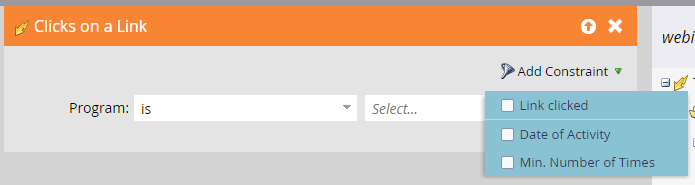

# Ereignis-Workflows {#event-workflows}

Gehen Sie nach Abschluss Ihres Webinars zum Tab Dashboard , um die aggregierte Leistung anzuzeigen.

>[!NOTE]
>
>Wenn das Webinar noch nicht abgeschlossen ist oder die Daten aus irgendeinem Grund nicht empfangen wurden, ist der Tab Dashboard noch nicht verfügbar.

## Dashboard-Widgets {#dashboard-widgets}

Das Dashboard besteht aus vier Widgets.

**Status des Ereignisprogramms**: Zeigt die verschiedenen Programmstatus für dieses Ereignis und die Anzahl der Programmmitglieder an, die derzeit diesen Programmstatus aufweisen.

**Teilnahme**: Zeigt die Dauer der Teilnahme verschiedener Mitglieder des Webinars im Vergleich zur Gesamtdauer des Webinars in Prozent an.

**Umfrageleistung**: Zeigt die verschiedenen Umfragen an, die im Rahmen des von Adobe Connect unterstützten Webinars durchgeführt wurden, sowie die Verteilung der Teilnehmer, die an der Umfrage teilgenommen haben und auf die einzelnen Antworten reagiert haben.

**Klick- und Dateidownload-Aktivität**: Stellt die Download-Anzahl der Dateien und Weblinks bereit, die im Webinar mit Adobe Connect von verschiedenen Mitgliedern angeklickt wurden, die am Webinar teilgenommen haben und diese Aktion ausgeführt haben.

## Webinar-Aufzeichnung {#webinar-recording}

Gehen Sie zur Registerkarte Übersicht , um das aufgezeichnete Webinar anzuzeigen, den Link zum Freigeben zu erhalten und sogar eine Kopie herunterzuladen.

>[!NOTE]
>
>* Interaktive Webinare werden nicht automatisch aufgezeichnet. Klicken Sie nach Beginn Ihres Webinars auf das Dropdown-Menü neben dem Namen des Webinars und wählen Sie **Sitzung aufzeichnen**.
>* Die Aufzeichnung wird im MP4-Format heruntergeladen.
>* Wenn Sie die Aufzeichnung freigeben, kann sie von jedem Benutzer mit dem Link angezeigt werden. Stellen Sie daher sicher, dass sie für die gewünschte Zielgruppe freigegeben ist.

## Trigger und Filter {#triggers-and-filters}

Verwenden Sie interaktive Webinar-bezogene Trigger und Filter, um bestimmte Personengruppen innerhalb Ihres Veranstaltungsprogramms zu finden.

Jeder Trigger/Filter enthält zusätzliche Einschränkungen, mit denen Sie eine fokussierte Untergruppe dieser Gruppe erfassen können.

**Fragen während des Ereignisses stellen** (Filterversion: Hat während des Ereignisses Fragen gestellt)

**Attends-Ereignis** (Filterversion: Ereignis wurde hinzugefügt)

**Klicks auf einen Link** (Filterversion: Auf einen Link geklickt)

**Herunterladen eines Assets** (Filterversion: Asset heruntergeladen)

**Antworten auf eine Umfrage** (Filterversion: Antwort auf eine Umfrage)

