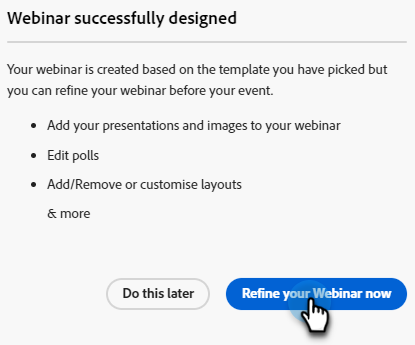
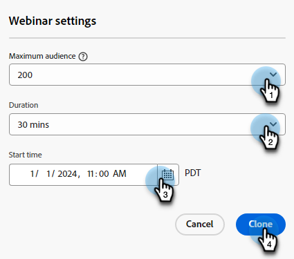
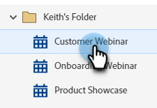

# Ändern oder Löschen eines interaktiven Webinars {#modify-or-delete-an-interactive-webinar}

Erfahren Sie, wie Sie Änderungen an Ihrem interaktiven Webinar vornehmen können.

## Ändern eines interaktiven Webinars {#modify-an-interactive-webinar}

1. Wählen Sie das gewünschte Ereignisprogramm aus und klicken Sie auf **Raum/Vorlage ändern**.

   

1. Das Zimmer wird sich laden. Wenn Sie das Zimmer wechseln möchten, wählen Sie eines aus der Dropdown-Liste Zimmer aus. Um Ihre Vorlage einfach zu aktualisieren, klicken Sie auf **Use Room**.

   

>[!NOTE]
>
>Eine Zimmeränderung ist optional und nicht erforderlich, um Ihre Vorlage zu aktualisieren.

1. Klicken Sie auf **Ihr Webinar jetzt verfeinern**.

   

1. Wählen Sie Ihre Audio-/Videovoreinstellungen aus und klicken Sie auf **Raum betreten**.

   

1. Wenn Sie Ihre Änderungen vorgenommen haben, klicken Sie auf **Ausstiegsraum**.

   

## Ein interaktives Webinar neu planen {#reschedule-an-interactive-webinar}

1. Wählen Sie das gewünschte Ereignisprogramm aus und klicken Sie auf das Stiftsymbol neben dem aktuell geplanten Datum/der Uhrzeit.

   

1. Klicken Sie auf das Kalendersymbol, wählen Sie das neue Datum/die neue Uhrzeit und klicken Sie auf **Speichern**.

   

## Ein interaktives Webinar klonen {#clone-an-interactive-webinar}

1. Wählen Sie das gewünschte Veranstaltungsprogramm aus.

   

1. Klicken Sie auf das Dropdown-Menü Programmaktionen und wählen Sie **Klonen** aus.

   

   >[!TIP]
   >
   >Sie können auch mit der rechten Maustaste auf das Ereignisprogramm im Baum klicken und dort **Klonen** auswählen.

1. Geben Sie dem geklonten Programm einen Namen, legen Sie die Workspace und das Ziel fest (wenn das Programm an einer anderen Stelle live sein soll) und klicken Sie auf **Speichern**.

   

1. Klicken Sie auf **Weiter**.

   

   >[!NOTE]
   >
   >Sie können ein geklontes interaktives Webinar derzeit nur als interaktives Webinar speichern. Speichern eines geklonten Webinars als Partner-Webinar (z. B. Zoom, ON24 usw.) wird in Kürze verfügbar sein.

1. Wählen Sie die Einstellungen für Ihr geklontes Webinar aus und klicken Sie auf **Klonen**.

   

## Löschen eines interaktiven Webinars {#delete-an-interactive-webinar}

>[!NOTE]
>
>Wenn Sie ein Test-Webinar erstellen, muss es vor seiner Startzeit gelöscht werden, um sicherzustellen, dass die Lizenz für dieses Webinar nicht genutzt wird.

1. Wählen Sie das gewünschte Veranstaltungsprogramm aus.

   

1. Klicken Sie auf das Dropdown-Menü Programmaktionen und wählen Sie **Löschen** aus.

   

   >[!TIP]
   >
   >Sie können auch mit der rechten Maustaste auf das Ereignisprogramm im Baum klicken und dort **Löschen** auswählen.

1. Klicken Sie auf **Löschen**.

   

   >[!IMPORTANT]
   >
   >Wenn das Programm lokale Assets enthält, werden diese ebenfalls gelöscht.
