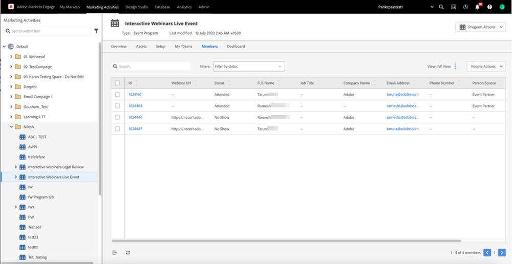

# Bewerben eines interaktiven Webinars {#promoting-an-interactive-webinar}

Die Förderung eines interaktiven Webinars ähnelt der Förderung eines Partner-Webinars über Launchpoint. Beim Erstellen eines Veranstaltungsprogramms für ein interaktives Webinar können Sie Mitglieder hinzufügen, indem Sie entweder eine Kampagne ausführen oder Mitglieder in das Programm importieren. Um die Mitglieder zu überprüfen, die zum Veranstaltungsprogramm der interaktiven Webinare hinzugefügt wurden, klicken Sie auf die Registerkarte **[!UICONTROL Mitglieder]**.

## Überblick {#overview}

Nachdem die Mitglieder hinzugefügt oder importiert wurden, können Sie im Veranstaltungsprogramm Interaktives Webinar eine E-Mail-Kampagne erstellen, um eine Einladung an alle Programmmitglieder zu senden, und ihren Status in „Eingeladen“ ändern, sobald die E-Mail zugestellt wurde.

>[!NOTE]
>
>Wenn Sie einen Co-Moderator oder Moderator als Zielgruppenmitglied zum Veranstaltungsprogramm des interaktiven Webinars hinzufügen möchten, müssen Sie eine andere E-Mail-ID für ihn verwenden, da er sonst den Fehler „Diese E-Mail ist bereits registriert“ erhält.

Die E-Mail kann bestimmte Details des Programms sowie eine Landingpage-URL enthalten, die den Empfänger zu einer bestimmten Seite weiterleitet, auf der weitere Informationen zum Webinar (z. B. Inhalt, Präsentationsinformationen usw.) hinzugefügt werden können. Diese Landingpage kann im Veranstaltungsprogramm Interaktive Webinare als lokales Asset erstellt werden.

Sie können sich für dieses Webinar registrieren, indem Sie ein Formular auf der Landingpage aktivieren und das Formular mit Klicks verknüpfen, um die Registrierung im Veranstaltungsprogramm für das interaktive Webinar zu aktivieren. Anschließend kann eine Kampagne erstellt werden, die Formularübermittlungen als Trigger verwendet und den Programmstatus von „Eingeladen“ in „Registriert“ ändert.

>[!NOTE]
>
>Der Wechsel von „eingeladen“ zu „registriert“ erfolgt in interaktiven Webinaren nicht automatisch, da mehrere Trigger den Übergang erstellen können.

Sobald ein Mitglied den Programmstatus „registriert“ in einem Veranstaltungsprogramm eines interaktiven Webinars erreicht hat, wird automatisch eine Registrierung für das in Adobe Connect erstellte Webinar durchgeführt. Registrierungsdaten wie Vorname, Nachname und E-Mail-ID werden dann an Adobe Connect übertragen. Das bedeutet, dass die Informationen dem Referenten oder Moderator während des Webinars zur Verfügung stehen, sobald der Benutzer als Teilnehmer am Webinar teilnimmt.

Innerhalb weniger Minuten nach der Registrierung wird die Webinar-URL für das Mitglied auf der Registerkarte Mitglieder angezeigt. Wenn Sie die Spalte für die Webinar-URL nicht finden können, stellen Sie sicher, dass diese Spalte zu Ihrer Ansicht hinzugefügt wurde. Dies ist eine personalisierte URL für jedes registrierte Mitglied, um zum geplanten Zeitpunkt am Webinar teilnehmen zu können, ohne dass eine Authentifizierung erforderlich ist. Intern ausgetauschte Token übernehmen die Authentifizierung für die Mitglieder.

Sie können das `{{member.webinar url}}`[ Token](/help/marketo/product-docs/demand-generation/landing-pages/personalizing-landing-pages/tokens-overview.md){target="_blank"} verwenden, um die Webinar-URL einzelnen Mitgliedern in eine E-Mail-Kampagne einzuschließen, um mitzuteilen, dass sie für die Veranstaltung registriert wurden, und um die URL der Teilnahme zu verwenden, um zum geplanten Zeitpunkt in das Webinar einzutreten. Kalender-Token können in derselben E-Mail-Kampagne verwendet werden, um sicherzustellen, dass der Webinar-Zeitplan zum Kalender der Mitglieder hinzugefügt werden kann.

Links sind auf der rechten Seite der Registerkarte Übersicht in Ihrem Veranstaltungsprogramm verfügbar, um eine Landingpage sowie eine E-Mail-Kampagne zu erstellen. Der Rest der Promotions im Zusammenhang mit einer Veranstaltung bleibt gleich wie Partner-Webinare unter Verwendung der Launchpoint-Integration.

Mit interaktiven Webinaren können Sie sich vor, während oder nach einem Webinar registrieren lassen. In jedem Fall müssten Sie einfach die Webinar-URL für den Lead freigeben. Wenn Sie auf den Link klicken, bevor das Webinar beginnt, werden sie zu einer Landingpage vor dem Webinar weitergeleitet. Wenn Sie während des Webinars darauf klicken, gelangen Sie zum laufenden Webinar. Wenn Sie nach dem Webinar darauf klicken, gelangen Sie zu einer Aufzeichnung des Webinars.

## Token für interaktive Webinare {#interactive-webinars-tokens}

Verwenden Sie Token, um interaktive Webinare in E-Mails und Landingpages zu bewerben, ohne Webinar-Details manuell hinzufügen zu müssen. Dies verbessert die Gesamteffizienz, da alle Änderungen an den Webinar-Metadaten (wie Webinar-Titel, Startdatum usw.) automatisch in Ihren Assets widergespiegelt werden.

**Liste der Token**

<table><thead>
  <tr>
    <th>Token</th>
    <th>Definition</th>
  </tr></thead>
<tbody>
  <tr>
    <td>program.webinarCapacity</td>
    <td>Die maximale Anzahl von Teilnehmern, die am interaktiven Webinar teilnehmen können.</td>
  </tr>
  <tr>
    <td>program.webinarDuration</td>
    <td>Die Dauer, für die das interaktive Webinar geplant ist.</td>
  </tr>
  <tr>
    <td>program.webinarEndDate</td>
    <td>Das Enddatum für das geplante interaktive Webinar.</td>
  </tr>
  <tr>
    <td>program.webinarEndTime</td>
    <td>Die geplante Endzeit des interaktiven Webinars.</td>
  </tr>
  <tr>
    <td>program.webinarGenericURL</td>
    <td>Die allgemeine Aufzeichnungs-URL, die nach dem Webinar für die Zielgruppe freigegeben werden kann. Diese URL ist nicht für die Live-Teilnahme am Webinar vorgesehen und verfolgt nicht die Aktivität der Zielgruppe.</td>
  </tr>
  <tr>
    <td>program.webinarLanguage</td>
    <td>Die Sprache, in der das Webinar durchgeführt werden soll.</td>
  </tr>
  <tr>
    <td>program.webinarStartDate</td>
    <td>Das Startdatum des geplanten interaktiven Webinars.</td>
  </tr>
  <tr>
    <td>program.webinarStartTime</td>
    <td>Die geplante Startzeit des interaktiven Webinars.</td>
  </tr>
  <tr>
    <td>program.webinarTimezone</td>
    <td>Die Zeitzone, in der das interaktive Webinar geplant ist.</td>
  </tr>
  <tr>
    <td>program.webinarTitle</td>
    <td>Der Titel des interaktiven Webinars, das für die Zielgruppe auf dem Webinar-Eintrag Screens sichtbar ist.</td>
  </tr>
</tbody></table>
