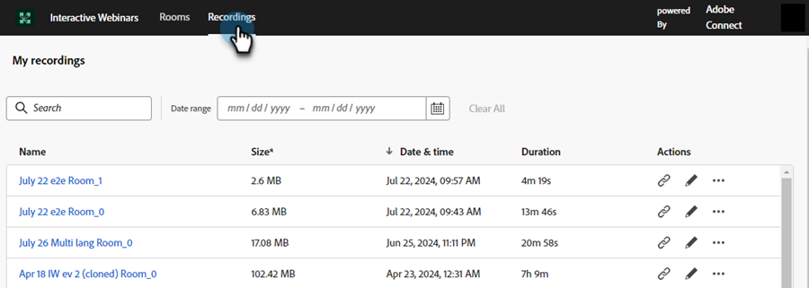

# Raumverwaltung {#room-management}

Interaktive Webinar-Räume auf Basis von Adobe Connect ermöglichen ansprechende und kooperative Online-Events. In diesen Webinaren werden Inhalte und Aufzeichnungen gespeichert, die während des Webinars erstellt und verwendet wurden. Als Mitglied mit dem Recht, einen Raum zu erstellen, können Sie von einem zentralen Ort aus darauf zugreifen und sie verwalten.

>[!NOTE]
>
>Sie können nur auf die Räume zugreifen, die Sie für ein Webinar erstellt haben, nicht auf die Räume anderer Mitglieder in Ihrem Unternehmen.

## Verwalten und Zugreifen auf Räume und Aufzeichnungen {#manage-and-access-rooms-and-recordings}

1. Gehen Sie zum **[!UICONTROL Design Studio]**.

   

1. Wählen Sie **[!UICONTROL Interaktive Webinare]** und dann **[!UICONTROL Räume verwalten]** aus.

   

### Zimmer {#rooms}

Ein interaktiver Webinar-Raum ist ein virtueller Raum, in dem Live- und interessante Online-Veranstaltungen stattfinden, bei denen die Teilnehmer mit dem Moderator und anderen Teilnehmern interagieren können. In diesen Räumen finden Sie die hochgeladenen Inhalte und Aufzeichnungen von Webinaren.

Um die Liste aller Zimmer anzuzeigen, wählen Sie **[!UICONTROL Zimmer]** aus der oberen Menüleiste aus. In diesen Räumen finden Sie alle von Ihnen erstellten Räume sowie hochgeladene Inhalte und Aufzeichnungen. Sie können auch die Anzahl der Aufzeichnungen, die Größe der Dateien im Raum und das Datum des letzten Zugriffs für die jeweiligen Räume anzeigen.

<table><tbody>
  <tr>
    <td><b>Aufnahmen</td>
    <td>Anzahl der verfügbaren Aufzeichnungen in einem Raum anzeigen.</td>
  </tr>
  <tr>
    <td><b>Größe der Datei im Zimmer</td>
    <td>Anzeigen der kombinierten Dateigröße der in einem Raum verfügbaren Inhalte und Aufzeichnungen.</td>
  </tr>
  <tr>
    <td><b>Zuletzt aufgerufen am</td>
    <td>Zeigt das Datum, an dem der Raum zuletzt aufgerufen wurde. Sie können die Informationen anhand der Zeitleiste sortieren.</td>
  </tr>
</tbody>
</table>

Von dieser zentralen Benutzeroberfläche aus können Sie die folgenden Aktionen ausführen:

* Klicken Sie auf das Symbol Launch-Raum , um zu starten und den Raum zu betreten.
* Verwenden Sie die Suchleiste, um das gewünschte Zimmer zu finden (durchsucht nur die von Ihnen erstellten Zimmer).
* Klicken Sie auf das Symbol Raum löschen , um den Raum zu entfernen. Dadurch werden alle Aufzeichnungen und Dateien im Zusammenhang mit dem Raum gelöscht.

Wenn Sie einen Raum auswählen, können Sie den Inhalt oder die Aufzeichnungen anzeigen, die in diesem Raum verfügbar sind. Auf diesem Bildschirm sind die Informationen auf zwei Registerkarten verfügbar: der Registerkarte **Inhalt** und der Registerkarte **Aufnahmen**.

**Registerkarte „Inhalt**

Auf der Registerkarte Inhalt können Sie die hochgeladenen Dateien, ihren Typ, ihre Größe, das Datum des letzten Zugriffs und das Datum des Uploads anzeigen.

<table><tbody>
  <tr>
    <td><b>Typ</td>
    <td>Zeigt den Dateityp wie PDF, JPG, PNG usw.</td>
  </tr>
  <tr>
    <td><b>Größe</td>
    <td>Zeigt die Größe der verfügbaren Datei an.</td>
  </tr>
  <tr>
    <td><b>Zuletzt aufgerufen am</td>
    <td>Zeigt das Datum, an dem der Raum zuletzt aufgerufen wurde. Sie können die Informationen anhand der Zeitleiste sortieren.</td>
  </tr>
  <tr>
    <td><b>Hochgeladen</td>
    <td>Zeigt an, wann die Datei hochgeladen wurde.</td>
  </tr>
</tbody>
</table>

Sie können die folgenden Aktionen auf der Registerkarte Inhalt ausführen:

* Klicken Sie auf **[!UICONTROL Launch-Raum]**, um zu starten und den Raum zu betreten.
* Verwenden Sie die Suchleiste, um die gesuchte Datei zu finden.
* Klicken Sie auf das Symbol Datei herunterladen , um eine Datei auf Ihr Gerät herunterzuladen. Wählen Sie zwei oder mehr Dateien aus, die stapelweise heruntergeladen werden sollen.
* Klicken Sie auf das Symbol Raum löschen , um den Raum zu entfernen. Wenn eine Datei gelöscht wird, kann sie nicht abgerufen werden.
* Wählen Sie eine Datei aus den aufgelisteten Inhalten aus, um sie auf dem Gerät anzuzeigen.

**Registerkarte „Aufnahmen“**

Auf der Registerkarte Aufnahmen können Sie alle in diesem Raum verfügbaren Aufnahmen anzeigen. Jede Aufzeichnung wird mit Details wie Größe, Datum und Uhrzeit der Aufzeichnung und Dauer angezeigt.

Von diesem zentralen Hub aus können Sie die folgenden Aktionen durchführen:

* Klicken Sie auf **[!UICONTROL Launch-Raum]**, um zu starten und den Raum zu betreten.
* Verwenden Sie die Suchleiste, um die gesuchte Aufnahme zu finden.
* Klicken Sie auf das Symbol Datei herunterladen , um eine Datei auf Ihr Gerät herunterzuladen. Wählen Sie zwei oder mehr Dateien aus, die stapelweise heruntergeladen werden sollen.
* Klicken Sie auf das Symbol Aufnahme-Link kopieren , um die Aufnahme-URL zu kopieren.
* Klicken Sie auf das Symbol Aufzeichnung bearbeiten , um Änderungen an der Aufzeichnung vorzunehmen.
* Klicken Sie auf das Symbol Löschen , um die Aufzeichnung zu entfernen. Wenn eine Aufzeichnung gelöscht wird, kann sie nicht abgerufen werden.
* Wählen Sie eine Aufzeichnung aus, um sie auf dem Gerät abzuspielen.

## Verwalten und Zugreifen auf Aufzeichnungen {#manage-and-access-recordings}

Aufzeichnungen sind wertvolle Ressourcen, die die Essenz von Live-Diskussionen, Präsentationen und Fragen und Antworten widerspiegeln. Sie ermöglichen es den Teilnehmern, wichtige Einblicke, verpasste Details oder komplexe Konzepte in ihrem eigenen Tempo zu überprüfen.

Klicken Sie auf **[!UICONTROL Registerkarte]** Aufzeichnungen“, um eine Liste aller hochgeladenen Aufzeichnungen anzuzeigen.

Unter **[!UICONTROL Meine Aufnahmen]** finden Sie alle Aufnahmen, die in dem von Ihnen erstellten Raum verfügbar sind. Sie können auch die jeweilige Größe, Datum und Uhrzeit sowie die Dauer der Aufzeichnungen anzeigen.

Von diesem zentralen Hub aus können Sie die folgenden Aktionen durchführen:

* Verwenden Sie die Suchleiste, um die gesuchte Aufnahme zu finden. Sie können auch innerhalb einer Zeitleiste suchen, indem Sie einen Datumsbereich auswählen.
* Klicken Sie auf das Symbol Aufnahme-Link kopieren , um die Aufnahme-URL zu kopieren.
* Klicken Sie auf das Symbol Aufzeichnung bearbeiten , um Änderungen an der Aufzeichnung vorzunehmen.
* Klicken Sie auf das Symbol Verknüpfte Seite anzeigen , um Informationen über den Raum anzuzeigen, in dem die ausgewählte Aufzeichnung verfügbar ist.
* Klicken Sie auf das Symbol Löschen , um die Aufzeichnung zu entfernen. Wenn eine Aufzeichnung gelöscht wird, kann sie nicht abgerufen werden.
* Wählen Sie eine Aufzeichnung aus, um sie auf dem Gerät abzuspielen.
