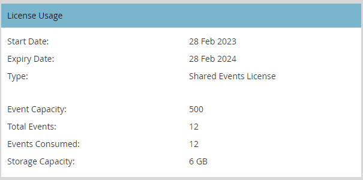

# Benutzer- und Lizenzverwaltung {#user-and-license-management}

Erfahren Sie, wie Sie Benutzer hinzufügen und entfernen sowie Ihre aktuellen Lizenzen anzeigen können.

## Hinzufügen von Benutzern {#add-a-user}

1. Navigieren Sie zum **Admin**-Bereich.

   

1. Klicks **Interaktive Webinare**.

   

1. Klicks **Benutzer hinzufügen/entfernen**.

   

1. Klicken Sie auf das Dropdown-Menü Verfügbare Benutzer , wählen Sie die Benutzer aus, die Sie hinzufügen möchten, und klicken Sie auf **OK**.

   

## Entfernen von Benutzern {#remove-a-user}

1. Navigieren Sie zum **Admin**-Bereich.

   

1. Klicks **Interaktive Webinare**.

   

1. Klicks **Benutzer hinzufügen/entfernen**.

   

1. Markieren Sie die Benutzer, die Sie entfernen möchten, und drücken Sie die Entf-Taste auf Ihrer Tastatur. Klicks **OK** wann geschehen.

   

## Lizenzverwendung {#license-usage}

Interaktive Webinare bieten spezifische Lizenzen für die Erstellung von Veranstaltungen auf Basis von Adobe Connect. Jedes Mal, wenn eine Lizenz hinzugefügt wird, wird ein neues Feld zur Lizenzverwendung angezeigt. Marketo-Administratoren können die Lizenzen anzeigen (nicht bearbeiten), indem sie die folgenden Schritte ausführen. Wenden Sie sich an das Adobe Account Team (Ihren Kundenbetreuer), um zusätzliche Lizenzen zu erhalten.

1. Navigieren Sie zum **Admin**-Bereich.

   

1. Klicks **Interaktive Webinare**.

   

1. Scrollen Sie nach unten zu den Karten für die Lizenznutzung .

   

<table> 
  <tr> 
   <td><b>Startdatum</b></td>
   <td>Datum, an dem die Lizenz beginnt</td>
  </tr>
  <tr> 
   <td><b>Ablaufdatum</b></td>
   <td>Datum, an dem die Lizenz abläuft.</td>
  </tr>
  <tr> 
   <td><b>Typ</b></td>
   <td>Die Art der erworbenen Lizenz. Es stehen drei Typen zur Verfügung: Shared Events License, Shared Rooms License, Additional Storage License.</td>
  </tr>
  <tr> 
   <td><b>Ereigniskapazität</b></td>
   <td>Die maximale Anzahl der Teilnehmer, die für eine Veranstaltung geeignet sind.</td>
  </tr>
  <tr> 
   <td><b>Gesamtereignisse</b></td>
   <td>Die Gesamtzahl der Ereignisse, die mit dieser Lizenz bereitgestellt wurden.</td>
  </tr>
  <tr> 
   <td><b>Konsumierte Ereignisse</b></td>
   <td>Die Gesamtzahl der abgeschlossenen Ereignisse.</td>
  </tr>
  <tr> 
   <td><b>Speicherkapazität</b></td>
   <td>Speichermenge, die zum Speichern von Aufzeichnungen, Collaterals, hero images, Dokumentationen und anderen Assets verfügbar ist.</td>
  </tr>
  </tbody>
</table>

**Zu beachten**

* Der Typ &quot;Zusätzliche Speicherlizenz&quot;liefert nur Speicher, daher der Wert in jedem Feld _beats_ Die Speicherkapazität wird einfach als &quot;-&quot;aufgeführt.

* Der Typ &quot;Shared Room License&quot; hat unbegrenzte Ereignisse und &quot;Additional Storage License&quot; stellt nur Speicher bereit, daher wird das Feld Total Events für diese Lizenzen einfach als &quot;-&quot;aufgeführt.

* Jedes Mal, wenn ein Ereignis erstellt wird, zählt es von seiner jeweiligen Lizenz aus als &quot;konsumiert&quot;(es sei denn, es handelt sich um eine Shared Room-Lizenz). Die &quot;Lizenz für freigegebene Ereignisse&quot;erhält Vorrang, wenn sowohl &quot;Lizenz für freigegebene Ereignisse&quot;als auch &quot;Lizenz für freigegebene Ereignisse&quot;mit derselben Kapazität vorhanden sind. Wenn das Ereignis nicht bereitgestellt wurde und das Ereignisprogramm vor der geplanten Zeit gelöscht wird, wird die Ereignisanzahl erneut aufgefüllt, indem ein Ereignis von &quot;Entnommen&quot;abgezogen wird.

* Sobald eine Lizenz erschöpft ist, bleibt ihre Kachel auf dem Bildschirm der interaktiven Webinare im Admin-Bereich mit dem Wert &quot;Gesamtereignisse&quot;und &quot;Entsuchte Ereignisse&quot;erhalten. Erst wenn die Lizenz abläuft, wird sie vom Bildschirm entfernt.
