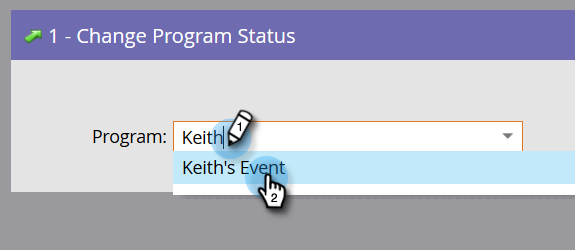

# Hinzufügen von Mitgliedern zu einem Veranstaltungsprogramm {#adding-members-to-an-event-program}

Dieser Artikel gilt nur für Benutzer, die Event Cap oder Event Goals verwenden.

>[!CAUTION]
>
>Durch den Import einer Personenliste direkt in ein Ereignisprogramm wird verhindert, dass diese Datensätze in den eigentlichen Registrierungen im Zielverfolgungsbericht und im Bericht zur Event Cap-Progression gezählt werden. Befolgen Sie die nachstehenden Anweisungen, um sicherzustellen, dass Ihre Datensätze gezählt werden.

1. Erstellen und [Personen zu einer statischen Liste hinzufügen](/help/marketo/product-docs/core-marketo-concepts/smart-lists-and-static-lists/static-lists/create-a-static-list.md).

1. [Erstellen einer Smart-Kampagne](/help/marketo/product-docs/core-marketo-concepts/smart-campaigns/creating-a-smart-campaign/create-a-new-smart-campaign.md).

1. Suchen und fügen Sie in der Smart-Liste der Smart-Kampagne, die Sie in Schritt 2 erstellt haben, die **Mitglied der Liste** Filter.

   

1. Suchen und wählen Sie die Liste aus, die Sie in Schritt 1 erstellt haben.

   

1. Suchen Sie im Fluss nach und fügen Sie die **Ändern des Programmstatus** Flussschritt.

   

1. Suchen und wählen Sie Ihr Veranstaltungsprogramm aus.

   

1. Wählen Sie den gewünschten Status aus.

   

1. Klicken Sie im Tab Planung auf **Einmal ausführen**.

   

1. Auswählen **Jetzt ausführen** und klicken **Ausführen**.

   

1. Nachdem die intelligente Kampagne ausgeführt wurde, werden die Mitglieder zum Programm hinzugefügt und in den Berechnungen Zielverfolgung und Ereignis-Begrenzung berücksichtigt.
