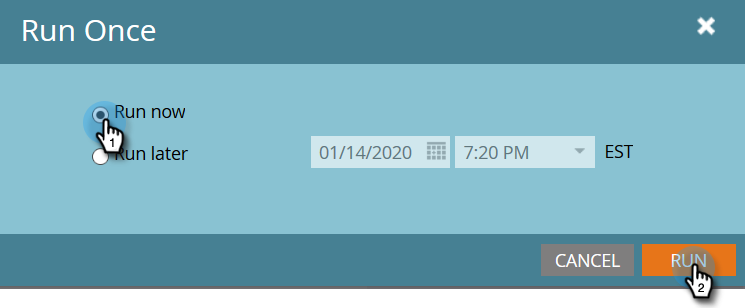

# Hinzufügen von Mitgliedern zu einem Ereignis-Programm {#adding-members-to-an-event-program}

Dieser Artikel gilt nur für Benutzer, die Ereignis Cap oder Ereignis Goals verwenden.

>[!CAUTION]
>
>Wenn Sie eine Liste von Personen direkt in ein Ereignis-Programm importieren, wird verhindert, dass diese Datensätze in den eigentlichen Registrierungen im Bericht &quot;Zielverfolgung&quot;und im Bericht &quot;Fortschrittlichkeit bei Ereignissen&quot;gezählt werden. Befolgen Sie die unten stehenden Anweisungen, um sicherzustellen, dass Ihre Datensätze gezählt werden.

1. Erstellen Sie Personen und [fügen Sie sie einer statischen Liste](http://docs.marketo.com/x/ecKt)hinzu.
1. [Erstellen Sie eine intelligente Kampagne](http://docs.marketo.com/x/M4AR).
1. Suchen Sie in der Smart-Liste der Smart-Kampagne, die Sie in Schritt 2 erstellt haben, den Filter **Member of Liste** und fügen Sie ihn hinzu.

   

1. Suchen Sie die Liste, die Sie in Schritt 1 erstellt haben, und wählen Sie sie aus.
1. 

1. Suchen und fügen Sie im Fluss den Textfluss **Change Programm Status** hinzu.
1. 

1. Suchen und wählen Sie Ihr Ereignis-Programm aus.

   

1. Wählen Sie den gewünschten Status aus.

   

1. Klicken Sie auf der Registerkarte Plan auf Einmal **ausführen**.
1. 

1. Wählen Sie **Jetzt** ausführen und klicken Sie auf **Ausführen**.
1. 

1. Nachdem die intelligente Kampagne ausgeführt wurde, werden die Mitglieder dem Programm hinzugefügt und zählen in den Berechnungen für die Zielverfolgung und die Ereignis-Cap-Progression.

