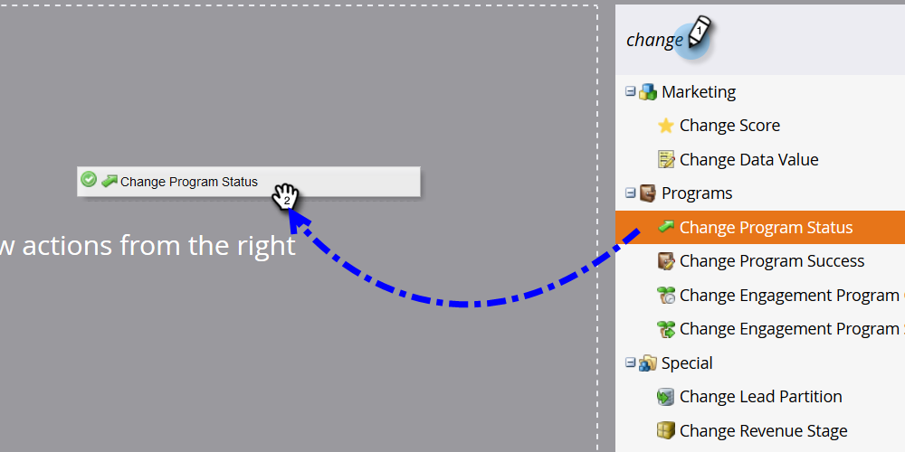

# Hinzufügen von Mitgliedern zu einem Ereignisprogramm {#adding-members-to-an-event-program}

Dieser Artikel gilt nur für Benutzer, die Event-Begrenzungs- oder Event-Ziele verwenden.

>[!CAUTION]
>
>Wenn Sie eine Liste von Personen direkt in ein Veranstaltungsprogramm importieren, werden diese Datensätze bei den tatsächlichen Registrierungen im Zielverfolgungsbericht und im Ereignisbegrenzungs-Fortschrittsbericht nicht gezählt. Folgen Sie den unten stehenden Anweisungen, um sicherzustellen, dass Ihre Datensätze gezählt werden.

1. Erstellen und [Hinzufügen von Personen zu einer statischen Liste](/help/marketo/product-docs/core-marketo-concepts/smart-lists-and-static-lists/static-lists/create-a-static-list.md).

1. [Erstellen Sie eine intelligente Kampagne](/help/marketo/product-docs/core-marketo-concepts/smart-campaigns/creating-a-smart-campaign/create-a-new-smart-campaign.md).

1. Suchen Sie in der Smart List der Smart Campaign, die Sie in Schritt 2 erstellt haben, den Filter **[!UICONTROL Member of List]** und fügen Sie ihn hinzu.

   

1. Suchen Sie die in Schritt 1 erstellte Liste und wählen Sie sie aus.

   

1. Suchen Sie im Fluss den Flussschritt **[!UICONTROL Programmstatus ändern]** und fügen Sie ihn hinzu.

   

1. Suchen und wählen Sie Ihr Veranstaltungsprogramm.

   

1. Wählen Sie den gewünschten Status aus.

   

1. Klicken Sie auf [!UICONTROL  Registerkarte ]Zeitplan **[!UICONTROL auf Einmal ausführen]**.

   

1. Wählen Sie **[!UICONTROL Jetzt ausführen]** und klicken Sie auf **[!UICONTROL Ausführen]**.

   

1. Nach der Ausführung der intelligenten Kampagne werden die Mitglieder zum Programm hinzugefügt und in den Berechnungen für die Zielverfolgung und die Ereignisbegrenzungsprogression gezählt.
