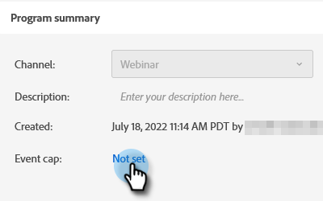
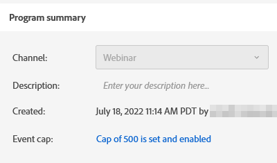

# Festlegen einer Ereignisbegrenzung {#setting-an-event-cap}

Begrenzen Sie die Anzahl der Personen, die sich mit einer Event-Obergrenze für Ihre Veranstaltung registrieren können.

>[!NOTE]
>
>Nicht jeder hat diese Funktion erworben. Weitere Informationen erhalten Sie beim Adobe Account Team (Ihrem Account Manager).

>[!IMPORTANT]
>Sie müssen mindestens zwei genehmigte Landingpages (eine Registrierungsseite und eine vollständige Registrierungsseite) im Programm haben, bevor Sie eine Begrenzung für ein Ereignis festlegen können.

>[!NOTE]
>
>Um in einem Ereignis Speicherplatz freizugeben, muss das Programmmitglied entfernt werden (Sie können dies tun, indem Sie seinen Status auf „Nicht im Programm“ aktualisieren).

1. Wählen Sie Ihr Veranstaltungsprogramm aus.

   

1. Suchen Sie in der Übersicht nach [!UICONTROL Ereignisbegrenzung] und klicken Sie auf **[!UICONTROL Nicht festgelegt]**.

   

1. Geben Sie die maximale Anzahl an Personen ein, die Sie für Ihre Veranstaltung registrieren möchten, und klicken Sie auf **[!UICONTROL Weiter]**.

   

1. Klicken Sie auf [!UICONTROL  Dropdown-Liste ]Registrierungsseite(n)“ und wählen Sie die Landingpage aus, die als Registrierungsseite dienen soll.

   

1. Klicken Sie auf **[!UICONTROL Dropdown-Liste]** Registrierung voll) und wählen Sie die Landingpage aus, die als vollständige Registrierungsseite fungieren soll. Klicken Sie abschließend **[!UICONTROL Festlegen und]** Aktivieren“.

   

   Sie sind bereit. Wenn Sie die Details der Ereignisbegrenzung bearbeiten möchten, klicken Sie auf den blauen Text neben &quot;[!UICONTROL &quot;].

   
