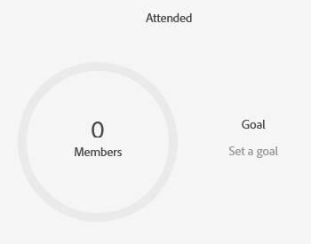

# Festlegen von Ereigniszielen {#setting-event-goals}

Geben Sie Ihren Ereignissen spezifische Ziele und sehen Sie, wie sie funktionieren.

>[!IMPORTANT]
>
>Nicht jeder hat diese Funktion erworben. Weitere Informationen erhalten Sie vom Adobe Account Team (Ihrem Kundenbetreuer).

1. Erstellen Sie ein Veranstaltungsprogramm.

   

1. Wählen Sie den Ordner [!UICONTROL Kampagne] aus, geben Sie Ihrem Ereignis den Namen [!UICONTROL 3}, wählen Sie den [!UICONTROL Programmtyp] und den Kanal [!UICONTROL  aus. ]] Klicken Sie abschließend auf **[!UICONTROL Erstellen]** .

   

1. Klicken Sie in Ihrem Ereignis auf die Registerkarte **[!UICONTROL Berichte]** .

   

1. Geben Sie das Ziel für [!UICONTROL Registriert] ein, indem Sie auf **[!UICONTROL Ziel festlegen]** klicken. Geben Sie die Zahl in ein und drücken Sie die Eingabetaste.

   

   

1. Wiederholen Sie die gleichen Schritte für [!UICONTROL Geteilt].

   

>[!NOTE]
>
>Sie können für ein Ereignis nach dem Start keine Ziele festlegen.

Und das ist es! Überprüfen Sie den Status Ihres Ereignisziels durch Klicken auf die Registerkarte [!UICONTROL Berichte] .
