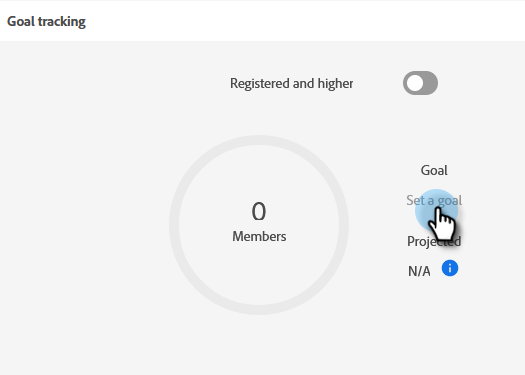
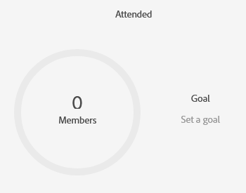

# Festlegen von Ereigniszielen {#setting-event-goals}

Geben Sie Ihren Ereignissen spezifische Ziele und sehen Sie, wie sie funktionieren.

>[!IMPORTANT]
>
>Nicht jeder hat diese Funktion erworben. Weitere Informationen erhalten Sie beim Adobe Account Team (Ihrem Account Manager).

1. Erstellen Sie ein Veranstaltungsprogramm.

   

1. Wählen Sie den [!UICONTROL Kampagnenordner], geben Sie Ihrem Ereignis einen [!UICONTROL Namen], wählen Sie den [!UICONTROL Programmtyp] und [!UICONTROL Kanal]. Klicken Sie **[!UICONTROL Erstellen]** wenn Sie fertig sind.

   

1. Klicken Sie in Ihrem Ereignis auf die Registerkarte **[!UICONTROL Berichte]**.

   

1. Geben Sie das Ziel für [!UICONTROL Registriert] ein, indem **[!UICONTROL Ziel festlegen]** klicken. Geben Sie die Zahl in ein und drücken Sie die Eingabetaste.

   

   

1. Wiederholen Sie die gleichen Schritte für [!UICONTROL Teilgenommen].

   

>[!NOTE]
>
>Sie können keine Ziele für ein Ereignis festlegen, nachdem es gestartet wurde.

Überprüfen Sie den Status Ihres Ereignisziels, indem Sie auf die Registerkarte [!UICONTROL Berichte] klicken.
