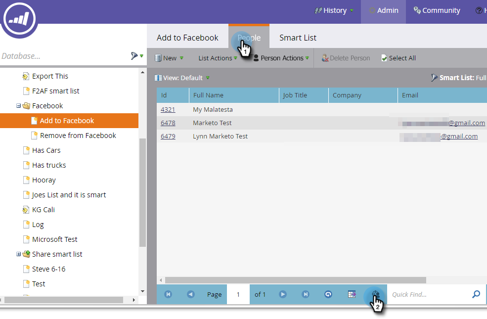
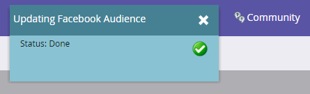

# Erstellen einer benutzerdefinierten Zielgruppe in [!DNL Facebook] {#create-a-custom-audience-in-facebook}

>[!PREREQUISITES]
>
>* [Hinzufügen [!DNL Facebook] Benutzerdefinierte Zielgruppen als LaunchPoint-](/help/marketo/product-docs/demand-generation/ad-network-integrations/add-facebook-custom-audiences-as-a-launchpoint-service.md){target="_blank"} im Administratorbereich.
>* [Akzeptieren [!DNL Facebook] der benutzerdefinierten Zielgruppenbedingungen von ](https://www.facebook.com/ads/manage/customaudiences/tos.php){target="_blank"} in Ihrem [!DNL Facebook].

>[!TIP]
>
>Weitere Informationen zu [benutzerdefinierten Zielgruppen in [!DNL Facebook]](https://www.facebook.com/help/341425252616329){target="_blank"}.

1. Suchen Sie die Smart- oder statische Liste, die die Leads enthält, aus denen Sie die Zielgruppe erstellen möchten, und wählen Sie sie aus.

   

1. Wählen Sie die **[!UICONTROL Leads]** aus und klicken Sie dann unten auf **Symbol Über Ad Bridge senden** .

   

1. Wählen Sie **[!UICONTROL Facebook]** aus und klicken Sie auf **[!UICONTROL Weiter]**.

   

1. Klicken Sie auf **[!UICONTROL Zielgruppe]** und wählen Sie **[!UICONTROL + Neue Zielgruppe]**.

   

   >[!IMPORTANT]
   >
   >Die Facebook-API ermöglicht bis zu 500 benutzerdefinierte Zielgruppen pro Facebook-Werbekonto.

1. Geben Sie einen **[!UICONTROL Zielgruppennamen]** ein. Klicken Sie auf **[!UICONTROL Aktualisieren]**.

   

   >[!NOTE]
   >
   >Wenn Sie mehrere [!DNL Facebook]-Werbekonten haben, wird eine zusätzliche Dropdown-Liste angezeigt, in der Sie auswählen können, in welchem Werbekonto diese Zielgruppe erstellt wird.

   >[!TIP]
   >
   >Möchten Sie eine neue Zielgruppe durch eine vorhandene austauschen, die derzeit mit einem Anzeigensatz oder einer Gruppe verknüpft ist? Aktivieren Sie **[!UICONTROL Kontrollkästchen]** Vorhandene Zielgruppe ersetzen). Dadurch wird **ersetzte Zielgruppe** gelöscht.

1. Danach wird das Statusdialogfeld aktualisiert.

   

   Und das war&#39;s! In Facebook sehen Sie die neue Audience unter **Ads Manager** > **Audiences**.

   

   >[!NOTE]
   >
   >Alle Listen, die Sie per Push übertragen, werden [!DNL Facebook] statisch. Smart-Listen in Marketo aktualisieren die Audience-Liste nicht automatisch, [!DNL Facebook] nach der Übertragung vorgenommene Änderungen widerzuspiegeln.

   >[!MORELIKETHIS]
   >
   >[Hinzufügen von Leads zu einer benutzerdefinierten Zielgruppe in [!DNL Facebook]](/help/marketo/product-docs/demand-generation/facebook/add-leads-to-a-custom-audience-in-facebook.md)
