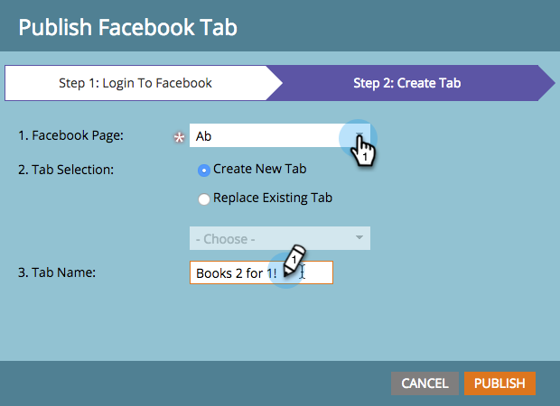
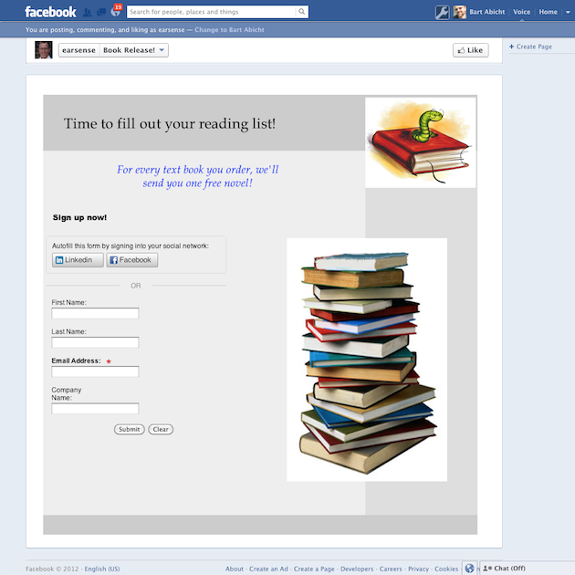

# Veröffentlichen von Landingpages in [!DNL Facebook] {#publish-landing-pages-to-facebook}

Sie können Ihre Landingpages in [!DNL Facebook] veröffentlichen, um Ihre Zielgruppe dort zu treffen, wo sie bereits hängen, und um mehr Traffic zu Ihren Programmen zu generieren.

>[!AVAILABILITY]
>
>SMB Spark, Standard &amp; Select. Unternehmen mit separat lizenzierter Funktion.

>[!PREREQUISITES]
>
>Bevor Sie eine Seite in [!DNL Facebook] veröffentlichen können, muss sie mindestens 2.000 „Gefällt mir“ aufweisen.

Angenommen, Sie starten ein neues Buch, Sie könnten einige Ihrer Zielgruppen per E-Mail und Website erreichen. Das Veröffentlichen einer Marketo-Landingpage zusätzlich zu Ihrer [!DNL Facebook] Brand Page erreicht eine größere Zielgruppe und fördert die Freigabe Ihres Angebots.

1. Eine genehmigte Landingpage auswählen.

   

1. Wählen **[!UICONTROL In Facebook veröffentlichen]** unter Landingpage-Aktionen aus.

   

   >[!NOTE]
   >
   >Mit dieser Methode wird Ihre Landingpage in einer [!DNL Facebook] App veröffentlicht (ehemals [!DNL Facebook]-Registerkarte). Da [!DNL Facebook]-Apps auf Mobilgeräten nicht verfügbar sind, funktioniert diese Technik nicht, wenn der Besucher versucht, auf eine Landingpage zuzugreifen, die in einer [!DNL Facebook] App auf einem Mobilgerät veröffentlicht wurde.

1. Marketo zur Veröffentlichung auf der [!DNL Facebook] autorisieren.

   

1. Geben Sie Ihre [!DNL Facebook] ein.

   

   >[!NOTE]
   >
   >Sie müssen ein Konto mit Administratorrechten für die [!DNL Facebook] verwenden, auf der Sie Ihre Marketo-Landingpage veröffentlichen möchten.

1. Wählen Sie die **[!UICONTROL Facebook-Seite]** auf der Sie die Landingpage veröffentlichen möchten, und geben Sie den Namen ein, mit dem Ihre Marketo-Landingpage dort angezeigt werden soll.

   

   >[!NOTE]
   >
   >Um Marketo-Landingpages zu ersetzen, die Sie zuvor in [!DNL Facebook] veröffentlicht haben, wählen Sie **[!UICONTROL Vorhandene Registerkarte]** und wählen Sie die zu ersetzende Registerkarte aus der Dropdown-Liste aus. Beachten Sie, dass dies nicht an die Stelle von Nicht-Marketo-Registerkarten tritt.

1. Leads können Ihre Landingpage jetzt direkt auf Ihrer [!DNL Facebook] besuchen. Klicken Sie einfach auf den Namen der Registerkarte unter Ihrem Titelbild.

   

   >[!NOTE]
   >
   >Um die Landingpage aus [!DNL Facebook] zu entfernen, heben Sie die Genehmigung in Marketo auf und wählen Sie nach Aufforderung die Option zum Entfernen der Registerkarte [!DNL Facebook] aus.
