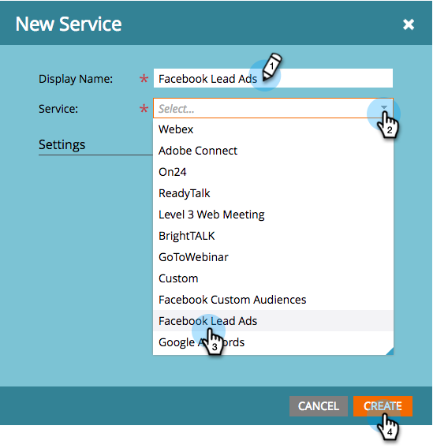

# Einrichten von Lead-Anzeigen in Facebook {#set-up-facebook-lead-ads}

Verwenden Sie [Facebook-Lead](https://www.facebook.com/business/ads/ad-objectives/lead-generation){target="_blank"}, um Anzeigenkampagnen in Facebook durchzuführen und Leads für Marketo zu generieren.

>[!NOTE]
>
>**Administratorberechtigungen erforderlich**

>[!AVAILABILITY]
>
>Um Facebook-Lead-Anzeigen zu Ihrer Instanz hinzufügen zu lassen, wenden Sie sich bitte an das Adobe Account Team (Ihren Account Manager).

1. Navigieren Sie in Marketo Engage zum Bereich **Admin** .

   

1. Wechseln Sie zu **LaunchPoint**, klicken Sie auf die **Neu** und wählen Sie **Neuer Service** aus.

   

1. Geben Sie einen **[!UICONTROL Anzeigenamen]** für Ihren Dienst ein, wählen Sie den **[!UICONTROL Facebook-Lead-Anzeigen]**-Dienst aus der Dropdown-Liste aus und klicken Sie auf **[!UICONTROL Erstellen]**.

   

1. Öffnen Sie eine neue Registerkarte im selben Browser und gehen Sie zu [facebook.com](https://www.facebook.com){target="_blank"}. Melden Sie sich bei Facebook mit dem Konto an, das Sie für die Integration verwenden möchten.

   >[!NOTE]
   >
   >Das [!DNL Facebook]-Konto benötigt Zugriff auf alle [!DNL Facebook] Geschäftsseiten, von denen Sie Lead-Anzeigen abrufen möchten.

   

1. Kehren Sie nach der Anmeldung bei [!DNL Facebook] zu Marketo zurück und klicken Sie auf **[!UICONTROL Autorisieren]**.

   

1. Klicken Sie auf **[!UICONTROL OK]**, um die Installation der Marketo-App in [!DNL Facebook] zu akzeptieren.

   

1. Sie werden feststellen, dass Sie jetzt autorisiert sind. Klicken Sie auf **[!UICONTROL Weiter]**.

   

1. Wählen Sie die Seite(n) aus, von der/denen Marketo (Facebook[!UICONTROL Lead-Anzeigen] abrufen soll, und klicken Sie auf **[!UICONTROL Weiter]**.

   >[!TIP]
   >
   >Wenn eine erwartete Seite nicht angezeigt wird, stellen Sie sicher, dass das für die Authentifizierung verwendete [!DNL Facebook]-Konto der Seite auf der [!DNL Facebook] hinzugefügt wird, und versuchen Sie es erneut.

   

1. Um standardmäßige [!DNL Facebook] zu Marketo-Feldzuordnungen zu akzeptieren, klicken Sie einfach auf **[!UICONTROL Erstellen]**.

   >[!TIP]
   >
   >Durch Ändern der Zuordnungen können Sie anpassen, wo die Lead-Anzeigen-Daten in Marketo gespeichert werden. Sie können auch [Daten aus benutzerdefinierten Fragen zu Lead-Anzeigen abrufen](/help/marketo/product-docs/demand-generation/facebook/set-up-facebook-lead-ads/map-custom-fields-to-marketo.md){target="_blank"}.

   >[!CAUTION]
   >
   >Marketo unterstützt nicht die Zuordnung von zwei [!DNL Facebook] zu einem einzigen Marketo-Feld, nur 1 zu 1. Wenn Sie 2 zu 1 zuordnen, gelangen Leads möglicherweise nicht in das Marketo-System.

   

   Gut gemacht! Leads fließen in Marketo ein, wenn Sie [!DNL Facebook] Lead-Anzeigenkampagnen erfolgreich ausgeführt werden.

   

>[!MORELIKETHIS]
>
>* [Berechtigungen in Lead-Zugriffs-Manager (Facebook) zuweisen/entfernen](https://www.facebook.com/business/help/540596413257598?id=735435806665862){target="_blank"}
>* [Verwenden von Lead-Anzeigen-Filtern und -Triggern in einer Smart-Kampagne](/help/marketo/product-docs/demand-generation/facebook/use-lead-ads-filters-and-triggers-in-a-smart-campaign.md){target="_blank"}
>* [Zuordnen benutzerdefinierter Felder zu Marketo](/help/marketo/product-docs/demand-generation/facebook/set-up-facebook-lead-ads/map-custom-fields-to-marketo.md){target="_blank"}
