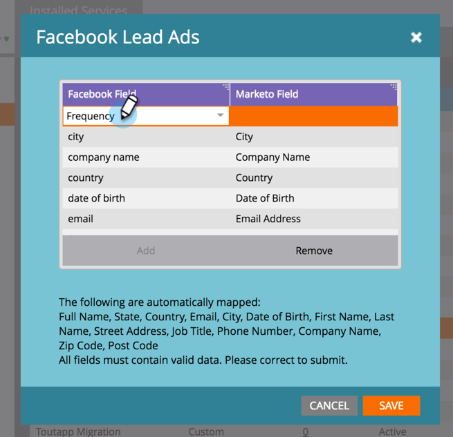

# Zuordnen benutzerdefinierter Felder zu Marketo {#map-custom-fields-to-marketo}

Sie möchten möglicherweise mehr als die standardmäßigen Informationen erfassen, die standardmäßig gespeichert [!DNL Facebook], z. B. wie oft jemand Ihren Online-Versanddienst verwendet. Sie können dies erreichen, indem [benutzerdefinierte Fragen erstellen](https://www.facebook.com/business/help/774623835981457?helpref=uf_permalink) in Ihren [!DNL Facebook]-Lead-Anzeigen verwenden.

**Marketo beginnt jedoch nicht automatisch mit der Erfassung dieser Daten**. Damit Marketo mit der Erfassung benutzerdefinierter Feldwerte beginnen kann, **müssen** diese benutzerdefinierten Felder einem Feld in Marketo zugeordnet werden.

Gehen Sie wie folgt vor, um dies im LaunchPoint-Bereich von Admin einzurichten.

>[!NOTE]
>
>**Administratorberechtigungen erforderlich**

1. Wechseln Sie zum Bereich Admin und klicken Sie auf **[!UICONTROL LaunchPoint]**. Suchen und bearbeiten Sie unter Installierte Dienste **[!UICONTROL Facebook-Lead-Anzeigen]**.

   

1. Klicken Sie auf **[!UICONTROL Weiter]**.

   

1. Lassen Sie das autorisierte Konto unverändert - nehmen Sie **Änderungen** vor. Klicken Sie auf **[!UICONTROL Weiter]**.

   

1. Belassen Sie die ausgewählten Seiten unverändert und nehmen Sie **Änderungen**. Klicken Sie auf **[!UICONTROL Weiter]**.

   

1. Hier ordnen Sie das benutzerdefinierte [!DNL Facebook] Ihrem Marketo-Feld zu. Klicken Sie auf **[!UICONTROL Hinzufügen].**

   

1. Geben Sie in der neuen Zeile den Namen Ihres [!DNL Facebook] benutzerdefinierten Felds ein.

   

   >[!NOTE]
   >
   >Nur Felder, die in [!DNL Facebook] Formularvorlagen gespeichert wurden, werden hier als Optionen angezeigt.

1. Klicken Sie in die Spalte **[!UICONTROL Marketo]**. Tippen Sie, um nach dem Feld zu suchen, dem Sie zuordnen möchten. Klicken Sie nach Auswahl eines Felds auf **[!UICONTROL Speichern]**.

   

   >[!NOTE]
   >
   >Wenn Sie noch kein Feld in Marketo haben, dem Sie das [!DNL Facebook] zuordnen können, erfahren Sie, wie Sie [benutzerdefinierte Felder erstellen](/help/marketo/product-docs/administration/field-management/create-a-custom-field-in-marketo.md).

>[!CAUTION]
>
>Sie **müssen** diesen Prozess für jedes neue [!DNL Facebook] durchführen, damit Marketo die Daten erfassen kann.
