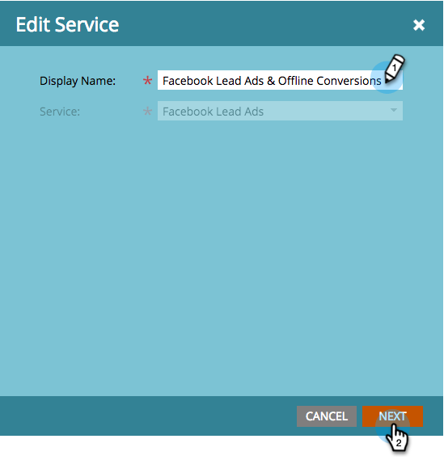
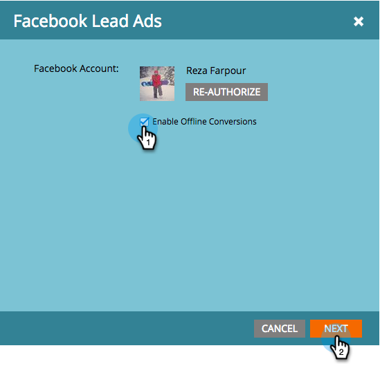

# Einrichten von Facebook-Offline-Konversionen {#set-up-facebook-offline-conversions}

Durch das Zurücksenden von Offline-Konversionsdaten an Facebook für Personen, die über Lead-Anzeigen erstellt wurden, kann Ihr Werbe-Team die Werbeausgaben besser als je zuvor optimieren. So richten Sie es ein.

>[!PREREQUISITES]
>
>* Sie müssen [Facebook-Lead-Anzeigen einrichten](/help/marketo/product-docs/demand-generation/facebook/set-up-facebook-lead-ads.md).
>* Sie müssen über ein genehmigtes Modell in [Umsatzzyklus-Modeler](/help/marketo/product-docs/reporting/revenue-cycle-analytics/revenue-cycle-models/understanding-revenue-models.md) verfügen.

## Admin-Konfiguration {#admin-configuration}

1. Wechseln Sie zu Marketo **Admin**.

   

1. Wechseln Sie **LaunchPoint** und doppelklicken Sie auf den zuvor erstellten Facebook-Lead-Anzeigen-Service.

   >[!NOTE]
   >
   >Wenn Sie das noch nicht getan haben, rufen Sie &quot;[ Facebook-Lead-Anzeigen einrichten](/help/marketo/product-docs/demand-generation/facebook/set-up-facebook-lead-ads.md) auf und kehren Sie hierher zurück.

   

1. Bearbeiten Sie bei Bedarf den **Anzeigename**, um Offline-Konversionen einzuschließen. Klicken Sie auf **Weiter**.

   

1. Markieren Sie **Offline-Konversionen aktivieren** und klicken Sie auf **Weiter**.

   

1. Klicken Sie auf **Weiter**.

   

1. Klicken Sie auf **Speichern**.

   

   Süß! Die Aktivierung von Facebook Offline-Konversionen ist zur Hälfte abgeschlossen. Gehen wir nun zum Umsatzzyklus Modeler , um die Stadien zu kartieren.

   

## Konfiguration von Modeler für den Umsatzzyklus {#revenue-cycle-modeler-configuration}

1. Navigieren Sie zu **Analytics**.

   

1. Wählen Sie Ihr Modell aus und klicken Sie auf **Entwurf bearbeiten**.

   

   >[!NOTE]
   >
   >Derzeit gibt es 10 Facebook-Ereignisse, denen Sie Umsatzzyklusphasen zuordnen können:
   >
   >* Hinzufügen von Zahlungsinformationen
   >* Zu Warenkorb hinzufügen
   >* Add to Wish List
   >* Registrierungen abgeschlossen
   >* Checkouts initiiert
   >* Person
   >* Andere
   >* Kauf
   >* Suchvorgänge
   >* Inhaltsanzeigen

1. Wählen Sie das Stadium aus, das Sie zuordnen möchten, und wählen Sie dann aus der **-Liste** Facebook-Konversion das Facebook-Ereignis aus, dem Sie es zuordnen möchten. Wiederholen Sie diesen Schritt, um alle Phasen in Ihrem RCM der Offline-Konvertierung in Facebook zuzuordnen.

   

1. Wenn Sie die Zuordnung abgeschlossen haben, schließen Sie das Modell.

   

1. Genehmigen Sie Ihr Modell und Sie sind fertig!

   

   Wenn nun Lead-Anzeigen-Leads die von Ihnen zugeordneten Stadien erreichen, werden die Konversionen zur Berichterstellung an Facebook gesendet.

   >[!CAUTION]
   >
   >Überprüfen Sie Ihr Facebook-Konto und stellen Sie sicher[ dass alle ](https://www.facebook.com/business/url/?href=%2Fbusiness%2Fhelp%2Fwww%2F1776828022605281&amp;cmsid&amp;creative=link&amp;creative_detail=advertiser-help-center&amp;create_type&amp;destination_cms_id&amp;orig_http_referrer) mit dem Marketo-Offline-Konversionsereignissatz verknüpft sind. Ist dies nicht der Fall, funktioniert die Attribution möglicherweise nicht.

   >[!NOTE]
   >
   >Offline-Konversionsdaten werden mehrmals täglich von Marketo an Facebook gesendet.

>[!MORELIKETHIS]
>
>[Grundlagen zu Facebook-Offline-Konversionen](/help/marketo/product-docs/demand-generation/facebook/understanding-facebook-offline-conversions.md)
