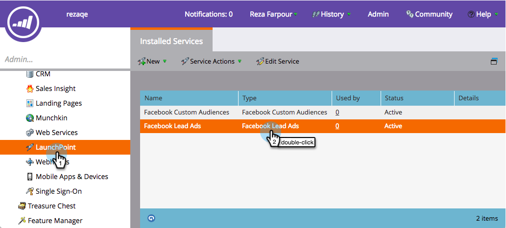

# Einrichten von Facebook-Offline-Konversionen {#set-up-facebook-offline-conversions}

Durch das Zurücksenden von Offline-Konversionsdaten an Facebook für Personen, die über Interessentenanzeigen erstellt wurden, kann Ihr Werbeteam ihre Anzeigenausgaben optimieren. So richten Sie es ein:

>[!PREREQUISITES]
>
>* Sie müssen [Facebook-Interessentenanzeigen](set-up-facebook-lead-ads.md)einrichten.
>* Sie müssen über ein genehmigtes Modell im [Umsatzzyklusmodell verfügen](http://docs.marketo.com/display/docs/revenue+cycle+models).

>

## Admin-Konfiguration {#admin-configuration}

1. Gehen Sie zu Marketing **Admin**.

   

1. Gehen Sie zu **LaunchPoint** und klicken Sie mit der Dublette auf den zuvor erstellten Facebook-Werbeanzeigedienst.

   >[!NOTE]
   >
   >Wenn Sie das noch nicht getan haben, fahren Sie fort und [richten Sie Facebook-Interessentenanzeigen](set-up-facebook-lead-ads.md)ein, und kommen Sie dann wieder hierher zurück.

   

1. Wenn Sie möchten, bearbeiten Sie den **Anzeigenamen** , um Offline-Konvertierungen einzuschließen. Klicken Sie auf **Weiter**.

   

1. Aktivieren Sie **Offline-Konversionen** aktivieren und klicken Sie auf **Weiter**.

   

1. Klicken Sie auf **Weiter**.

   

1. Klicken Sie auf **Speichern**.

   

   Süß! Die Aktivierung der Offline-Konvertierungen für Facebook ist in der Mitte abgeschlossen. Gehen wir zum &quot;Umsatz-Zyklus-Modeler&quot;, um die Phasen zuzuordnen.

   

## Konfiguration des Modells für den Umsatzzyklus {#revenue-cycle-modeler-configuration}

1. Gehen Sie zu **Analytics**.

   

1. Wählen Sie Ihr Modell aus und klicken Sie auf Entwurf **bearbeiten**.

   

   >[!NOTE]
   >
   >Derzeit gibt es 10 Facebook-Ereignis, denen Sie Umsatzzyklusphasen zuordnen können:
   >
   >    
   >    
   >    * Hinzufügen von Zahlungsinformationen
   >    * Zusatz zum Warenkorb
   >    * Hinzugefügt zur Liste &quot;Wünsche&quot;
   >    * Abgeschlossene Registrierungen
   >    * Checkouts gestartet
   >    * Person
   >    * Sonstiges
   >    * Kauf
   >    * Suchvorgänge
   >    * Content-Ansichten

1. Wählen Sie die Bühne aus, der Sie zuordnen möchten, und wählen Sie dann aus der Dropdownliste **Facebook-Konversion** das Facebook-Ereignis aus, dem Sie die Zuordnung zuordnen möchten. Wiederholen Sie diesen Schritt, um alle Phasen in Ihrem RCM Offline-Konversionsphasen auf Facebook zuzuordnen.

   

1. Wenn Sie die Zuordnung abgeschlossen haben, schließen Sie das Modell.

   

1. Genehmigen Sie Ihr Modell und Sie sind fertig!

   

   Wenn die Interessenten der Interessentenwerbung nun die von Ihnen zugeordneten Stufen erreichen, werden die Konversionen zum Berichte an Facebook gesendet.

   >[!CAUTION]
   >
   >Überprüfen Sie Ihr Facebook-Konto und stellen Sie sicher, dass alle [Anzeigen mit dem Ereignis &quot;Marketo-Offline-Konversionen&quot;verknüpft](https://www.facebook.com/business/url/?href=%2Fbusiness%2Fhelp%2Fwww%2F1776828022605281&amp;cmsid&amp;creative=link&amp;creative_detail=advertiser-help-center&amp;create_type&amp;destination_cms_id&amp;orig_http_referrer) sind. Wenn nicht, funktioniert die Anzeigenzuordnung möglicherweise nicht.

   >[!NOTE]
   >
   >Offline-Konversionsdaten werden mehrmals täglich von Marketing an Facebook gesendet.

>[!NOTE]
>
>**Verwandte Artikel**
>
>* [Offline-Konversionen in Facebook](understanding-facebook-offline-conversions.md)

>

