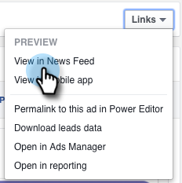
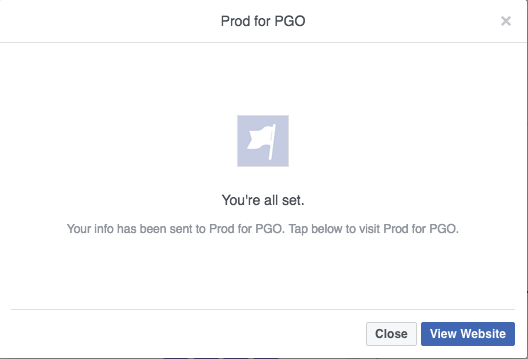

# Testen [!DNL Facebook] Lead-Anzeigen für die Desktop-Integration mit Marketo {#test-facebook-lead-ads-for-desktop-integration-with-marketo}

Nachdem Sie Ihre Lead-Anzeige erstellt haben, sollten Sie sie testen! So geht das auf dem Desktop.

>[!PREREQUISITES]
>
>Sie müssen [die [!UICONTROL Facebook-Lead-Anzeigen]-Integration ](/help/marketo/product-docs/demand-generation/facebook/set-up-facebook-lead-ads.md).

1. Wählen Sie im Facebook Power Editor eine Kampagne und eine Anzeige aus und klicken Sie auf **[!UICONTROL Bearbeiten]**.

1. Klicken **[!UICONTROL unter]** Links **[!UICONTROL auf den Link In Newsfeed]**.

   

1. Sie werden auf einer neuen Registerkarte in Ihrem Browser zu [!DNL Facebook] weitergeleitet. Klicken Sie auf die [!UICONTROL Call to action] in der [!DNL Facebook]-Lead-Anzeigeneinheit.

   

   >[!NOTE]
   >
   >Dies ist nur ein Beispiel, für das ein Call to action Weitere Infos verwendet wird. Ihr Lead-Anzeigenblock in Call to action ist möglicherweise anders.

1. Senden Sie Ihre Test-Lead-Anzeigeneinheit, indem Sie das Formular auf Ihrem Desktop ausfüllen. Klicken Sie auf **[!UICONTROL Senden]**.

   

1. Herzlichen Glückwunsch. Sie haben das Senden des Lead-Anzeigenformulars abgeschlossen.

   

1. Hier passiert der Zauber! Nachdem Sie Ihr Formular gesendet haben, erstellen [eine Smart List in Marketo](/help/marketo/product-docs/core-marketo-concepts/smart-lists-and-static-lists/creating-a-smart-list/create-a-smart-list.md) als Teil eines Programms oder in der Datenbank, die den Formularfilter Ausgefüllte [!DNL Facebook] Lead-Anzeigen verwendet. Fügen Sie den Namen des Lead-Werbeformulars für das soeben gesendete Formular ein.

   

1. Klicken Sie nun auf die **[!UICONTROL Personen]**, um zu überprüfen, ob die Synchronisierung ordnungsgemäß funktioniert.

   

   Ist das cool oder was?

>[!MORELIKETHIS]
>
>[Einrichten [!UICONTROL Facebook-Lead-Anzeigen]](/help/marketo/product-docs/demand-generation/facebook/set-up-facebook-lead-ads.md)
