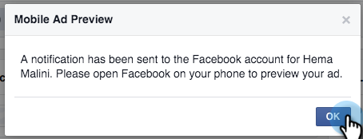

# Testen [!DNL Facebook] Lead-Anzeigen für die mobile Integration mit Marketo {#test-facebook-lead-ads-for-mobile-integration-with-marketo}

Nachdem Sie Ihre Lead-Anzeige erstellt haben, sollten Sie sie testen!

>[!PREREQUISITES]
>
>Sie müssen [die [!UICONTROL Facebook-Lead-Anzeigen]-Integration ](/help/marketo/product-docs/demand-generation/facebook/set-up-facebook-lead-ads.md).

1. Wählen Sie [!UICONTROL Facebook-]) eine Kampagne und eine Anzeige aus und klicken Sie auf **[!UICONTROL Bearbeiten]**.

1. Klicken **[!UICONTROL unter]** auf den Link **[!UICONTROL In App anzeigen]**.

   

1. Eine neue Benachrichtigung wird an das [!DNL Facebook]-Konto gesendet, auf das Sie mit dem autorisierten Konto auf dem Mobilgerät zugreifen können. Klicken Sie auf **[!UICONTROL OK]**.

   

1. Tippen Sie auf Ihrem Mobilgerät auf **[!UICONTROL Benachrichtigungen]** in der [!DNL Facebook] Mobile App.

   

1. Tippen Sie in den Benachrichtigungen auf **[!UICONTROL Ihre Anzeige ist für die Vorschau bereit]**.

   

1. Senden Sie Ihre Test-Lead-Anzeigeneinheit, indem Sie auf Ihre Call to action tippen und das von Ihnen erstellte Formular ausfüllen.

   

   >[!NOTE]
   >
   >Dies ist nur ein Beispiel, für das ein Call to action Weitere Infos verwendet wird. Ihr Lead-Anzeigenblock in Call to action ist möglicherweise anders.

1. Hier passiert der Zauber! Nachdem Sie Ihr Formular gesendet haben, [ Sie (eine Smart List in Marketo erstellen](/help/marketo/product-docs/core-marketo-concepts/smart-lists-and-static-lists/creating-a-smart-list/create-a-smart-list.md) als Teil eines Programms oder in der Lead-Datenbank, die den Filter **[!UICONTROL Ausgefülltes Facebook-Lead-Anzeigen-Formular]** verwendet. Fügen Sie den Namen des Lead-Werbeformulars für das soeben gesendete Formular ein.

   

1. Klicken Sie nun auf die Registerkarte Leads , um zu überprüfen, ob die Synchronisierung ordnungsgemäß funktioniert.

   

Ist das cool oder was?

>[!NOTE]
>
>[Aktivieren/Deaktivieren [!UICONTROL Facebook-Lead-Anzeigen]](/help/marketo/product-docs/demand-generation/facebook/set-up-facebook-lead-ads.md)
