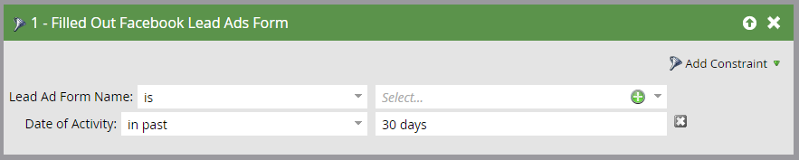

# Verwenden von Filtern und Auslösern für Lead-Anzeigen in einer intelligenten Kampagne {#use-lead-ads-filters-and-triggers-in-a-smart-campaign}

Wenn Sie [!UICONTROL Facebook-Lead-Anzeigen] aktiviert haben, können Sie diese in Ihren Smart-Kampagnen verwenden, um den Programmerfolg zu sehen. Wenn Personen ihre Informationen in einer [!DNL Facebook]-Lead-Anzeigeneinheit senden, werden die Informationen sofort an Marketo gesendet.

1. Verwenden Sie den **[!UICONTROL Facebook-Lead-Anzeigen-Formular ausfüllen]** -Filter oder -Trigger.

   

1. Fügen Sie Einschränkungen hinzu, um sie anzupassen.

   
